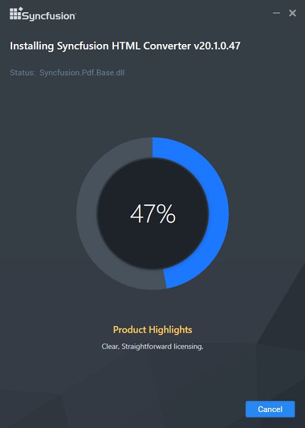

# WebKit HTML converter

Syncfusion introduces WebKit HTML converter from the version 13.1.0.21 of Essential Studio that supports HTML to PDF conversion by using the WebKit rendering engine. This converter works on both x86 and x64 environments and can be easily integrated into any application on .NET platforms such as Windows Forms, WPF, ASP.NET Web Forms, and ASP. NET MVC to convert URLs, HTML string, images, and SVG to PDF.

## Step-by-Step Installation

The following are the steps to install the WebKit installer.

1. Double-click the Syncfusion WebKit Installer. The installer Wizard opens and extracts the package automatically. 

   

   

   N> No key is required for Syncfusion WebKit HTML Converter.

2. Once the unzip operation is complete, License Agreement screen opens.

   

3. After reading the License Agreement, check the **I agree to the License Terms and Conditions** check box.

4. Click Next. Installation location will be displayed.

   

   N> You can also browse and choose a location by clicking Browse.

5. To install in the displayed default location, click Install.

   
   
   N> The Completed screen will be displayed once the WebKit is installed.
   
   

6. Click Finish. WebKit is installed in your system.

## Command Line 

The Syncfusion WebKit Installer supports Command Line Install and Uninstall. The following sections illustrate this ability. 

#### Command Line Installation

Follow the given steps to install through Command Line in Silent mode.

1. Double-click the Syncfusion WebKit Installer. The Self-Extractor Wizard opens and extracts the package automatically.
2. The syncfusionessentialwebkit _(version).exe file is extracted into the Temp folder. 
3. Run %temp%. The Temp folder opens. The syncfusionessentialwebkit _(version).exe file is available in one of the folders.
4. Copy the syncfusionessentialwebkit _(version).exe file in local drive. Example: D:\temp
5. Cancel the wizard.
6. Open Command Prompt in administrator mode and pass the following arguments:

   **Arguments:** “Installer file path\syncfusionessentialwebkit _(version).exe” /Install silent [/log “{Log file path}”] [/InstallPath:{Location to install}]

   N> [..] – Arguments inside the square brackets are optional.

   **Example:** “D:\Temp\syncfusionessentialwebkit_13.2.0.30.exe” /Install silent /log “C:\Temp\EssentialWebkit.log” /InstallPath:C:\Syncfusion\x.x.x.x 

7. WebKit is installed.
    
	N> * x.x.x.x needs to be replaced with the WebKit version installed on your machine.* Above steps applicable from the version 13.2.0.x.
   
### Command Line Uninstallation

Syncfusion WebKit Installer supports uninstalling through Command Line in Silent mode. The following steps help you uninstall the Webkit. 

1. When you do not have the extracted installer (syncfusionessentialwebkit _(version).exe) then follow the steps from 2 to 7.
2. Double-click the Syncfusion Essential Studio installer. The Self-ExtractorWizard opens and extracts the package automatically.
3. The syncfusionessentialwebkit _(version).exe file gets extracted into the Temp folder.
4. Run %temp%. The Temp folder opens. The syncfusionessentialwebkit _(version).exe file is available in one of the folders.
5. Copy the syncfusionessentialwebkit _(version).exe file in local drive. Example: D:\temp
6. Cancel the wizard.
7. Open the Command Prompt in administrator mode and pass the following arguments: 

   **Arguments:** “Installer file path\ syncfusionessentialwebkit _(version).exe” /uninstall silent 

    **Example:** “D:\Temp\ syncfusionessentialwebkit _13.2.0.30.exe" /uninstall silent

8. WebKit is uninstalled.
    
	N> * x.x.x.x need to be replaced with the WebKit version installed in your machine.* Above steps applicable from the version 13.2.0.x.		