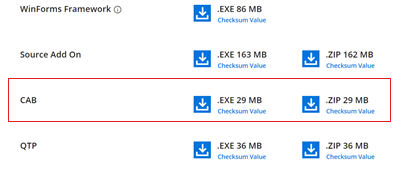

# CAB Add-on installer

## Downloading Syncfusion&reg; Essential Studio&reg; CAB Add-on installer

1. Essential Studio&reg; CAB Add On installer can be downloaded from your account’s [download](https://help.syncfusion.com/common/essential-studio/download) section. 

2. Syncfusion&reg; CAB Add On installer can be downloaded based on your license. Refer [this](https://www.syncfusion.com/kb/10442/who-can-access-source-license) KB for the CAB license.

3. CAB Add On installer can be downloaded from the setup downloads page by clicking the **More Download Option** button.

   

## Installing Syncfusion&reg; Essential Studio&reg; CAB Add-on installer

## Overview

The Syncfusion&reg; Essential&reg; CAB Enabling Kit extends support for working with CAB. It enables developers to improve the look and feel of their applications while also speeding up the development process through the use of customizable user interfaces. Workspaces are components or controls that encapsulate visual effects and layout strategies while not interfering with the business logic.

The Essential&reg; CAB Enabling Kit includes the workspaces and UI Elements listed below.

## Workspaces

* Dockable Workspace
* DockingClientPanel Workspace
* GroupBar Workspace
* PopupControlContainer Workspace
* SplashPanel Workspace
* SplitContainerAdv Workspace
* TabControlAdv Workspace
* TabbedMDIManagerWorkspace
* XPTaskPane workspace

## UIElements 

* XP Menus
* TreeViewAdv
* StatusBarAdv
* StatusStripEx
* ContextMenuStripEx
* RibbonControlAdv
* XPTaskBar

## Pre-Requisites 

* Visual Studio 2005/2008
* Microsoft Composite UI Application Block Framework
* Syncfusion&reg; Essential Studio&reg; (Essential&reg; Tools – Windows Forms)

## Framework Support

Essential&reg; CAB is compatible with Visual Studio Framework versions 4.0, 4.5, 4.5.1 and 4.6
