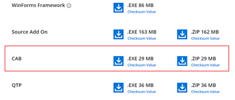

# CAB Add-on installer

## Downloading Syncfusion&reg; Essential Studio&reg; CAB Add-on installer

The Syncfusion&reg; Essential Studio&reg; CAB Add-on installer can be downloaded from your account's [Download](https://help.syncfusion.com/common/essential-studio/download) section or from the setup downloads page through **More Download Options**, based on your license.

   

## Installing Syncfusion&reg; Essential Studio&reg; CAB Add-on installer

## Overview

The Syncfusion&reg; Essential&reg; CAB Enabling Kit extends support for working with the Microsoft Composite UI Application Block (CAB). It enables developers to improve the look and feel of their applications while also speeding up the development process through the use of customizable user interfaces. Workspaces are components or controls that encapsulate visual effects and layout strategies without interfering with the business logic.

The Essential&reg; CAB Enabling Kit includes the workspaces and UI Elements listed below.

## Workspaces

* Dockable Workspace
* DockingClientPanel Workspace
* GroupBar Workspace
* PopupControlContainer Workspace
* SplashPanel Workspace
* SplitContainerAdv Workspace
* TabControlAdv Workspace
* TabbedMDIManager Workspace
* XPTaskPane Workspace

## UI Elements

* XP Menus
* TreeViewAdv
* StatusBarAdv
* StatusStripEx
* ContextMenuStripEx
* RibbonControlAdv
* XPTaskBar

## Prerequisites

Before installing the CAB Add-on, ensure the following:

* A valid Syncfusion license or trial(Unlock Key) is available.
* Visual Studio 2005 or 2008 is installed.
* Microsoft Composite UI Application Block (CAB) Framework is installed.
* The same version of Syncfusion&reg; Essential Studio&reg; (Essential&reg; Tools &mdash; Windows Forms) is installed.

## Framework Support

The Essential&reg; CAB Enabling Kit is compatible with the following .NET Framework versions: 4.0, 4.5, 4.5.1, 4.6 and 4.6.2.
