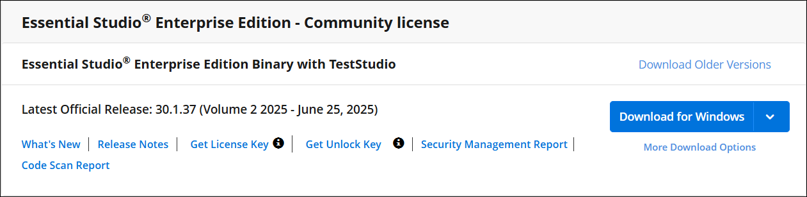
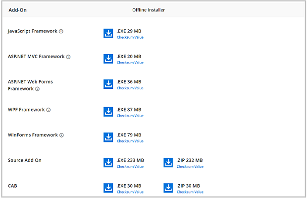
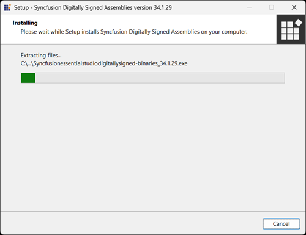
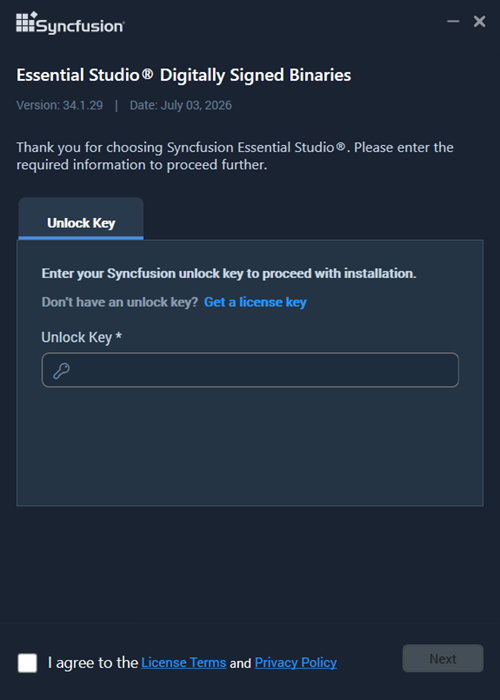
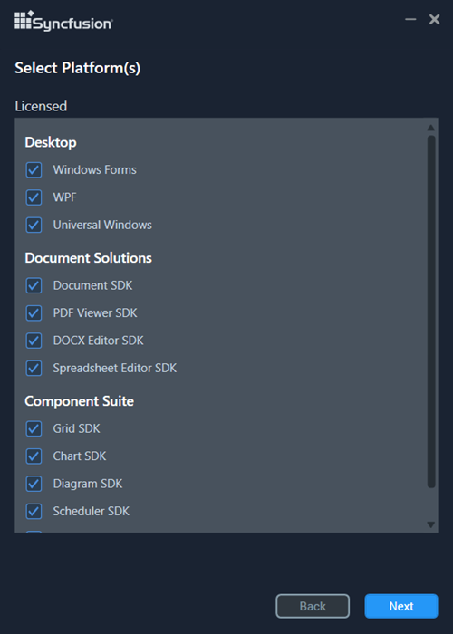
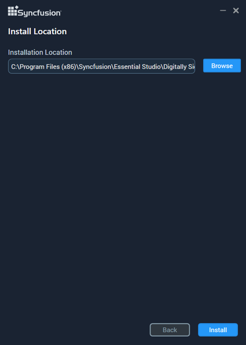
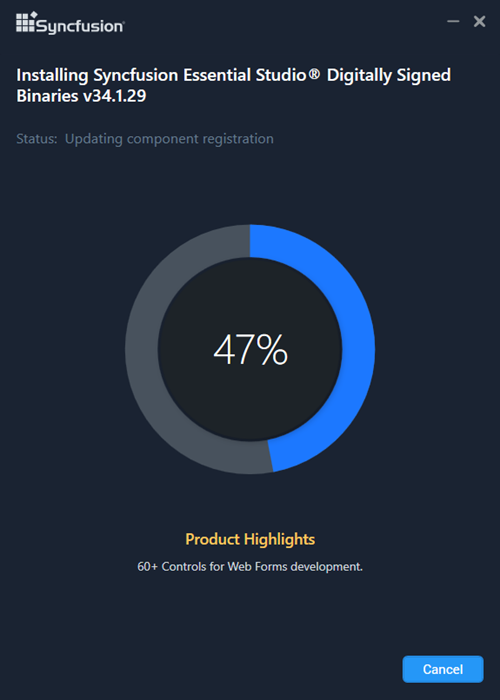
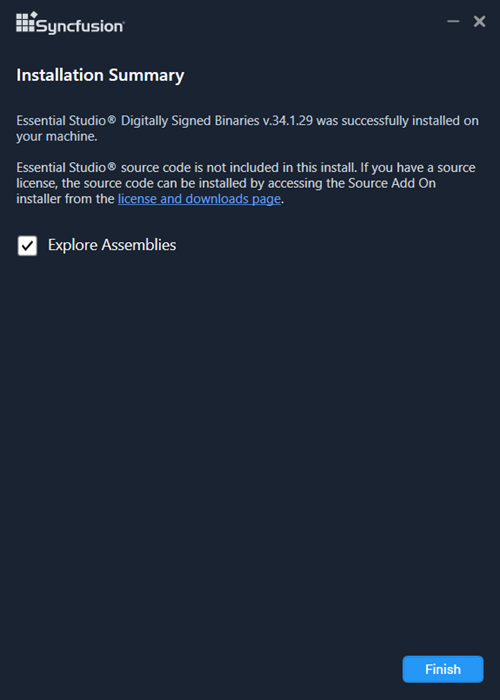

# Essential Studio - Digitally Signed Binaries

## Downloading Syncfusion&reg; Essential Studio&reg; Digitally Signed Binaries Add-On installer

1. The Digitally Signed Binaries Add-On installer is available under your registered Syncfusion&reg; account on the [License and Downloads](https://www.syncfusion.com/account/downloads) page.

   N> * The Digitally Signed Binaries Add-Ons can only be downloaded and installed by customers who have a valid license.
   * Trial users will not be able to access this.

2. Select the required Essential Studio&reg; version and then click **More Download Options**.

   N> Syncfusion&reg; has started providing Digitally Signed Binaries Add On installer from 2018 Volume 4 release (v16.4.0.42)

   

3. The Syncfusion&reg; Digitally Signed Binaries Add-On installer can be found in the **Add-On** section.

   

## Installing Syncfusion&reg; Essential Studio&reg; Digitally Signed Binaries Add-On installer

The Syncfusion installer includes Digitally Signed Binaries. It uses a `.pfx` file to sign the Syncfusion&reg; assemblies. See [Digitally Signed Binaries](https://www.syncfusion.com/support/kb/7671) for more information.

I>* Only customers with a valid license can install Essential Studio&reg; Digitally Signed Binaries
* Trial users will not be able to access this.

### Prerequisites

Before installing the Digitally Signed Binaries Add-On, ensure the following:

* A valid Syncfusion license (Unlock Key) is available. Trial users cannot install this add-on.
* .NET Framework 4.6.2 or later need to be present on the machine.

### Step-by-Step Installation

The steps below show how to install the Digitally Signed Binaries installer.

1. Open the Syncfusion&reg; Digitally Signed Binaries installer file by double-clicking it. The installer wizard automatically opens and extracts the package.

   

2. After the unzip operation finishes, the Unlock Key registration screen appears.

   

3. After reading the License Agreement, enter the **Unlock Key** in the corresponding text box and select the **I agree to the License Terms and Conditions** check box.

4. Click **Next**. The platform selection screen appears. Select the platforms on which you want to install the assemblies, and then click **Next**.

   

5. The **Installation Location** wizard appears. To select a custom location, click **Browse**; otherwise, use the default location.

    N> Select a location for installing the Essential Studio&reg; Binaries by clicking **Browse**.

6. Click **Next** to install in the default location.

   

7. The Digitally Signed Binaries installation begins.

   

    N> The Completed screen is displayed once the selected package is installed.

   

8. After installation, select the **Run Syncfusion&reg; Control Panel** check box to launch the Syncfusion&reg; Control Panel. To exit the installer wizard, click **Finish**. The Digitally Signed Binaries are now installed on your machine.

### Output Location

The signed assemblies are placed in the following default location:

**Location:** `{ProgramFilesFolder}\Syncfusion\Essential Studio\Digitally Signed Binaries\{version}\`

**Example:** `C:\Program Files (x86)\Syncfusion\Essential Studio\Digitally Signed Binaries\34.1.29\`

### Supported Platforms and Versions

The following support information applies to Syncfusion Essential Studio versions from **16.4.0.42** through **28.x.x**.

| Platform | Required Essential Studio Version | Supported .NET Framework |
| --- | --- | --- |
| Windows Forms | 16.4.0.42 or later | .NET Framework 4.5 or later |
| WPF | 16.4.0.42 or later | .NET Framework 4.5 or later |
| ASP.NET (Web Forms / MVC) | 16.4.0.42 or later | .NET Framework 4.5 or later |
| File Formats | 16.4.0.42 or later | .NET Framework 4.5 or later |

The following support information applies to Syncfusion Essential Studio versions from **29.x.x** or later.

| Platform | Required Essential Studio Version | Supported .NET Framework |
| --- | --- | --- |
| Windows Forms | 29.x.x or later | .NET Framework 4.6.2 or later |
| WPF | 29.x.x or later | .NET Framework 4.6.2 or later |
| UWP | 29.x.x or later | .NET Framework 4.6.2 or later |
| File Formats | 29.x.x or later | .NET Framework 4.6.2 or later |
| Scheduler SDK | 29.x.x or later | .NET Framework 4.6.2 or later |
| Diagram SDK | 29.x.x or later | .NET Framework 4.6.2 or later |
| Gantt SDK | 29.x.x or later | .NET Framework 4.6.2 or later |
| Charts SDK | 29.x.x or later | .NET Framework 4.6.2 or later |
| Grid SDK | 29.x.x or later | .NET Framework 4.6.2 or later |

> **Note:** The Add-On installer version must exactly match the version of the installed Essential Studio platform installer.

### Verification

To verify that the assemblies are digitally signed:

1. Navigate to the installation directory above.
2. Right-click any `.dll` file and choose **Properties**.
3. Open the **Digital Signatures** tab and confirm that the signature is issued to **Syncfusion, Inc.** and is valid.