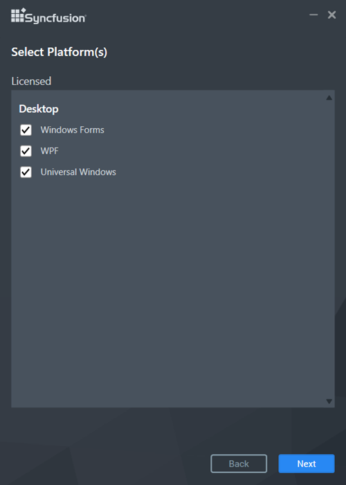
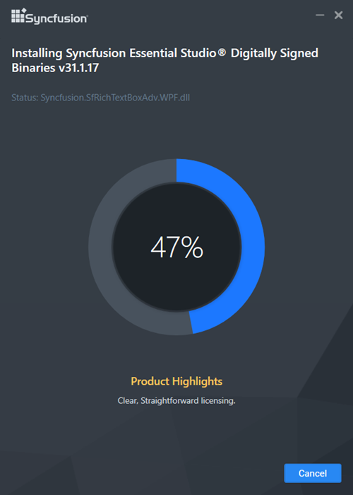
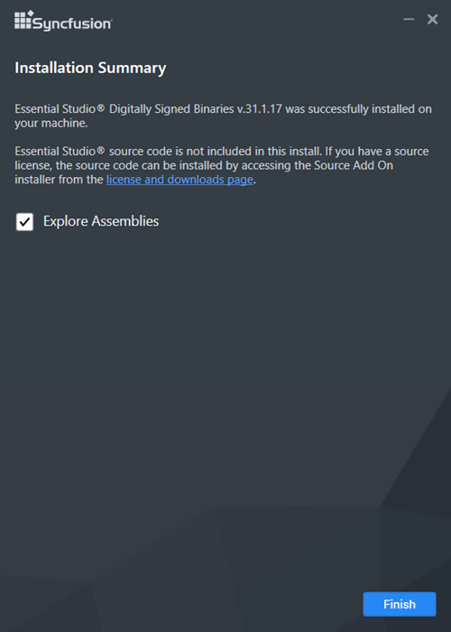

# Essential Studio&reg;  - Digitally Signed Binaries

## Downloading Syncfusion&reg;  Essential Studio&reg;  Digitally Signed Binaries Add-On installer

1. The Digitally Signed Binaries Add On installer is available under your registered Syncfusion&reg;  account in the [License and Downloads](https://www.syncfusion.com/account/downloads) page.

   N> * The Digitally Signed Binaries Add-Ons can only be downloaded and installed by customers who have a valid license.
   * Trial users will not be able to access this.

2. Select the required Essential Studio&reg;  version and then click **More Download Options**.

   N> Syncfusion&reg;  has started providing Digitally Signed Binaries Add On installer from 2018 Volume 4 release (v16.4.0.42)

   

3. The Syncfusion&reg;  Digitally Signed Binaries Add-On installer can be found in the **Add-On** section.

   

## Installing Syncfusion&reg;  Essential Studio&reg;  Digitally Signed Binaries Add-On installer

Syncfusion's installer includes Digitally Signed Binaries. It uses a.pfx file to sign the Syncfusion&reg;  assemblies. See [Digitally Signed Binaries](http://www.syncfusion.com/support/kb/7671) for more information. 

I>* Only customers with a valid license can install Essential Studio&reg;  Digitally Signed Binaries
* Trial users will not be able to access this.

The steps below show how to install Digitally Signed Binaries installer.

1.  Open the Syncfusion&reg;  Digitally Signed Binaries installer file by double-clicking it. The installer Wizard automatically opens and extracts the package
   
    

2.  The Unlock key registration screen appears, when the unzip operation is finished, .

    

3.  After reading the License Agreement, enter the Unlock Key in the corresponding text box and check the **I agree to the License Terms and Conditions** box.

4.  Next, Click the Next button. The platform selection screen appears. Select the platforms on which you want to install the assemblies and then click Next.

    

5.  The Installation Location wizard appears.
   
    N> Select a location for installing the Essential Studio&reg;  Binaries by clicking **Browse**.

6.  Click Next to install in the default location.

    
   
7.  Digitally Signed Binaries installation will begins.

    

    N> The Completed screen will be displayed once the selected package is installed.
    
    

8.  After installation, check the **Run Syncfusion&reg;  Control Panel** box to launch the Syncfusion&reg;  Control Panel. To exit the installer Wizard, click Finish. Digitally Signed Binaries is installed in your machine.