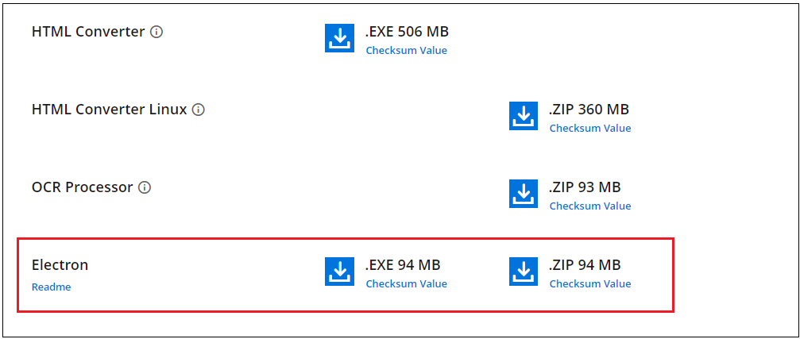
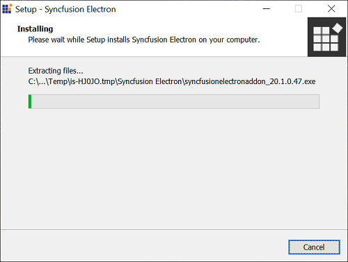
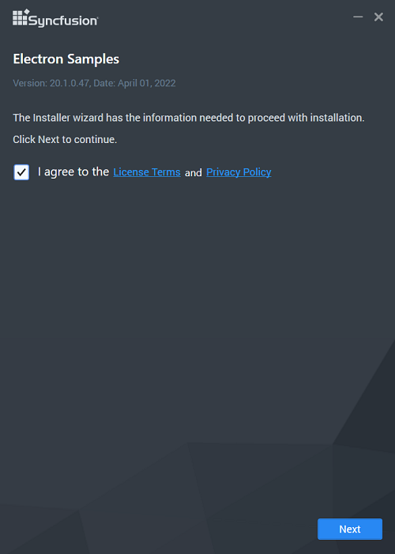
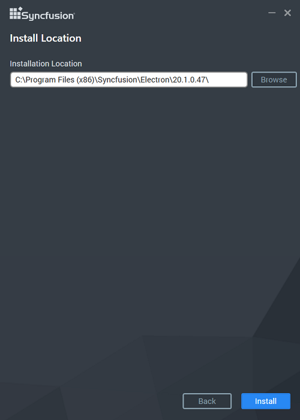
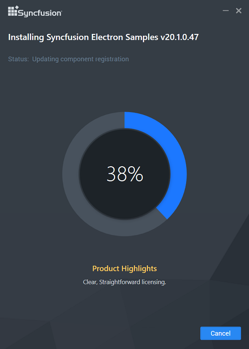
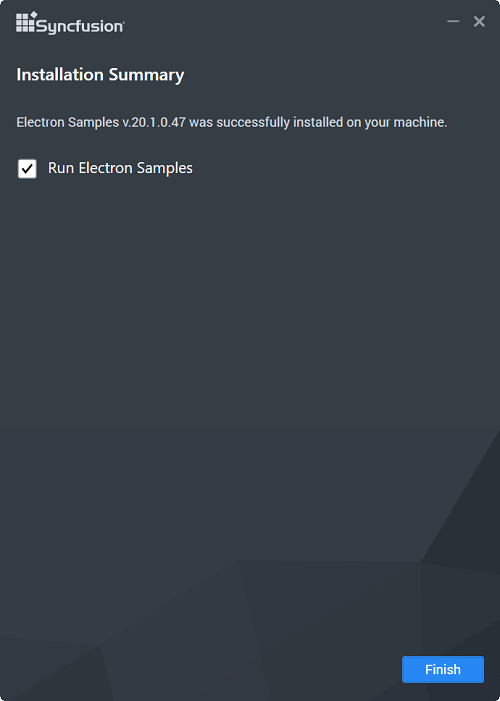

# Downloading Syncfusion Essential Studio Electron Add-on installer

## How to download Electron Add-on installer?

1. Essential Studio Electron Add-on installer can be downloaded from your account’s [download](https://help.syncfusion.com/common/essential-studio/download) section. 

2. Syncfusion Electron Add-on installer can be downloaded based on your license. Refer [this](https://www.syncfusion.com/kb/10442/who-can-access-source-license) KB for the Electron license.

3. Electron Add-on installer can be downloaded from the setup downloads page by clicking the **More Download Option** button.

   

# Installing Syncfusion Essential Studio Electron Add-on installer

Electron (formerly Atom Shell) is used to create a cross-platform desktop application for different operating systems such as Linux, Windows, and OS X by using JavaScript and being able to access platform specific native APIs.

## Step-by-Step Installation

The steps below show how to install the Electron installer.

1. Double-click the Syncfusion Electron installer to launch it. The installer Wizard automatically opens and extracts the package.

   
   

   N> Syncfusion Electron does not require a key..

2. The License Agreement screen appears, when the unzip operation is finished.

   

3. After reading the License Agreement, check the **I agree to the License Terms and Conditions** check box.

4. Click the Next button. The installation location screen will appear.

   

   N> By clicking **Browse**, you can also browse and select a location.

5. Click Install, To install in the displayed default location.

   
   
   N> The Completed screen will be displayed once the Electron is installed.
   
   

6. Click Finish. Electron is installed in your machine.
