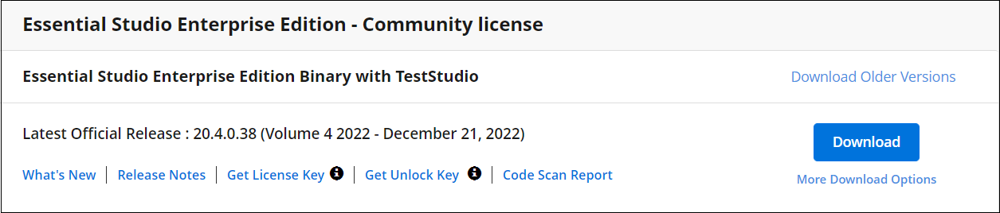
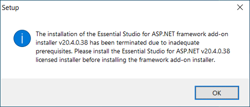
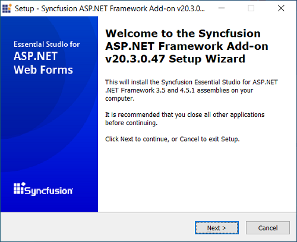
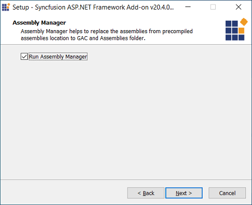
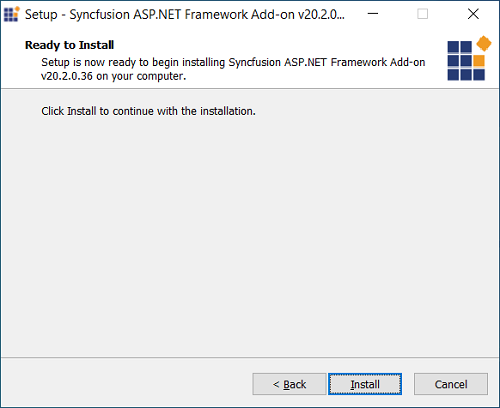
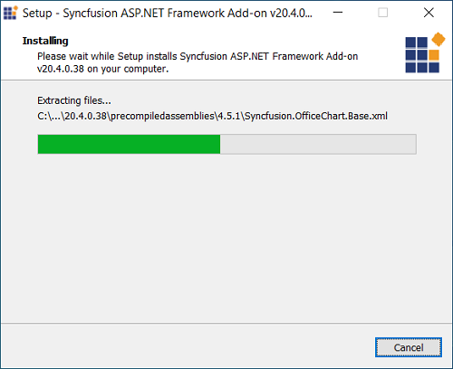
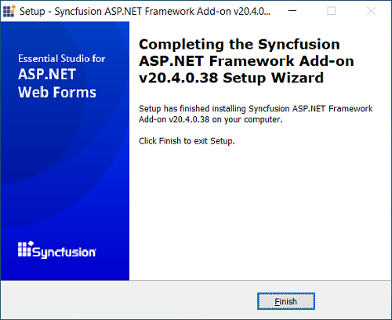

# Essential Studio&reg; Platform Framework Add-Ons

## Downloading Syncfusion&reg; Essential Studio&reg; Platform Framework Add-On installer

1. The Framework Add-On installer is available under your registered Syncfusion&reg; account on the [License and Downloads](https://www.syncfusion.com/account/downloads) page.

   N> * The Framework Add-Ons can only be downloaded and installed by customers who have a valid license.
   * Trial users will not be able to access this.

2. Select the required Essential Studio&reg; version and then click **More Download Options**.

   N> Syncfusion&reg; started providing the Framework Add-On installer from the 2018 Volume 4 release (v16.4.0.42).

   

3. The Syncfusion&reg; Framework Add-On installer can be found in the **Add-On** section.

   

## Installing Syncfusion&reg; Essential Studio&reg; Platform Framework Add-On installer

### Overview

Starting with version 16.4.0.* (2018 Volume 4), Syncfusion&reg; removed the .NET Framework 4.5.1 and MVC3 assemblies and provides a separate Framework Add-On installer for the following platforms:

* Windows Forms
* WPF
* File Formats

## Prerequisites

Before installing the Framework Add-On, ensure the following:

* The corresponding Essential Studio&reg; platform installer (Windows Forms, WPF, or File Formats) at the **same version** is already installed.
* You have a valid Syncfusion license (Trial users cannot access this add-on).

If the matching platform version is not detected, a prerequisite alert is displayed and the installation is blocked.

### Step-by-Step Installation

The steps below show how to install the Syncfusion&reg; Platform Framework Add-On installer.

1. Open the Syncfusion&reg; Platform Framework Add-On installer file by double-clicking it. The welcome wizard appears. Click **Next**.

   

2. The **Confirmation to Run the Assembly Manager** window appears. Click **Next**.

    N> Clear the **Run Assembly Manager** check box and click **Next** if you do not want the assemblies installed in the GAC.

   

3. The **Ready To Install** wizard appears. To proceed with the installation of the Syncfusion&reg; Framework Add-On, click **Install**.

   

4. The installation of the Syncfusion&reg; Framework Add-On begins.

   

5. The Completed screen is displayed once the installation is complete. Click **Finish** to exit the installer.

   

   The Framework 4.5.1 assemblies can now be found in the Syncfusion&reg; Essential Studio&reg; product installation directory.

   **Location:** `{ProgramFilesFolder}\Syncfusion\Essential Studio\{Platform}\{version}\precompiledassemblies`

   **Example:** `C:\Program Files (x86)\Syncfusion\Essential Studio\WPF\21.1.1\precompiledassemblies`

### Toolbox Configuration

After installing the Syncfusion&reg; Platform Framework Add-On, you can use the [Syncfusion&reg; Toolbox Installer](https://help.syncfusion.com/common/essential-studio/utilities#for-wpf-windows-forms-and-aspnet-web-forms-platforms) to configure the Framework 4.5.1 controls in the Visual Studio toolbox.