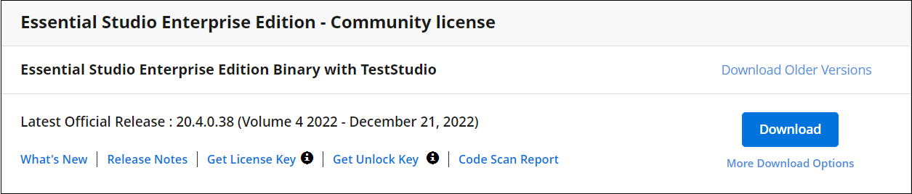

# Essential Studio Platform Framework Add-Ons

## Downloading Syncfusion Essential Studio Platform Framework Add-On installer

1. The Framework Add On installer is available under your registered Syncfusion account in the [License and Downloads](https://www.syncfusion.com/account/downloads) page.

   N> * The Framework Add-Ons can only be downloaded and installed by customers who have a valid license.
   * Trial users will not be able to access this.

2. Select the required Essential Studio version and then click **More Download Options**.

   N> Syncfusion has started providing Framework Add On installer from 2018 Volume 4 release (v16.4.0.42)

   

3. The Syncfusion Framework Add-On installer can be found in the **Add-On** section.

   

## Installing Syncfusion Essential Studio Platform Framework Add-On installer

## Overview

Starting with version 16.4.0.* (2018 Volume 4), Syncfusion has removed the .NET Framework 4.5.1 and MVC3 assemblies and provide the separate Framework Add-On installer for the following platforms. . 

* Windows Forms
* WPF
* File Formats

## Prerequisites

To install the above framework add-ons, the corresponding Essential Studio platform in the same version must be installed. If this is not the case, a prerequisite alert will be displayed.

## Step-by-Step Installation

The steps below show how to install the Syncfusion Platform Framework Add-On installer.

1.	Open the Syncfusion Platform Framework Add-On installer file by double-clicking it. The welcome wizard will appear. Click Next button.

    

2.  The Confirmation to Run the Assembly Manager Window will appear. Click the Next button.

    N> Uncheck the **Run Assembly Manager** checkbox and click Next if you do not want the assemblies to be installed in GAC.

    

3.  The **Ready To Install** wizard will appear. To proceed with the installation of the Syncfusion Framework Add-On installer, click **Install**.

    

4.  The installation of the Syncfusion Framework Add-On will begin.

    

5.  Completed screen will be displayed once the installation is completed. Click Finish to exit the installer.
  
    
	
    The Framework 4.5.1 assemblies can now be found in the Syncfusion Essential Studio Product installation directory.

    **Location:** {ProgramFilesFolder}\Syncfusion\Essential Studio\ {Platform}\ {version}\precompiledassemblies

    **Example:** C:\Program Files (x86)\Syncfusion\Essential Studio\WPF\21.1.1\precompiledassemblies

## Toolbox Configuration

After installing the Syncfusion Platform Framework Add-On, you can use the [Syncfusion Toolbox Installer](https://help.syncfusion.com/common/essential-studio/utilities#for-wpf-windows-forms-and-aspnet-web-forms-platforms) to configure the Framework 4.5.1 controls in the Visual Studio toolbox.

