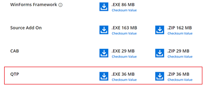

# QTP Add-on installer

## Downloading Syncfusion&reg; Essential Studio&reg; QTP Add-on installer

1. Essential Studio&reg; QTP Add On installer can be downloaded from your account’s [download](https://help.syncfusion.com/common/essential-studio/download) section. 

2. Syncfusion&reg; QTP Add On installer can be downloaded based on your license. Refer [this](https://www.syncfusion.com/kb/10442/who-can-access-source-license) KB for the QTP license.

3. QTP Add On installer can be downloaded from the setup downloads page by clicking the **More Download Option** button.

   

## Installing Syncfusion&reg; Essential Studio&reg; QTP Add-on installer

## Overview

Syncfusion&reg; supports Quick Test Professional software through Essential Test Studio, a QTP add-on that is specifically designed to meet the needs of professionals who need to test your controls. Essential Test Studio includes Custom Libraries, which allow Quick Test Professional to record and replay scripts from applications that contain Syncfusion&reg; controls. Quick Test Professional.NET Add-in extensibility is used to create these custom libraries. More information can be found at Mercury Quick Test Professional Help.  

Essential&reg; Test Studio supports the following Windows-based controls.

## Essential&reg; Grid

* Grid control
* Grid Grouping control
* GridDataBoundGrid control
* Grid List control
* TabBar Splitter control

## Essential Tools

* Docking Package
* Menus Package
* Command Bars Package
* Tree Package
* Editors Package
* Tabs Package
* Navigation Package
* Notification Package

N> Before installing this add-on, you must first install the same version of Syncfusion&reg; Essential Studio&reg; and Mercury QuickTestProfessional.

