# Source Code Add-on installer

## Downloading Syncfusion&reg; Essential Studio&reg; Source Code Add-on installer

The Syncfusion&reg; Essential Studio&reg; Source Code Add-on installer can be downloaded from your account's [Download](https://help.syncfusion.com/common/essential-studio/download) section. Depending on your license, you may also access it from the setup downloads page via **More Download Options**. For more details, refer to [this](https://www.syncfusion.com/kb/10442/who-can-access-source-license) KB article.

   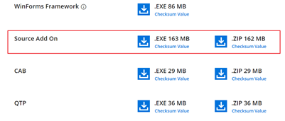

## Installing Syncfusion&reg; Essential Studio&reg; Source Code Add-on installer

## Overview

Syncfusion&reg; provides a Source Code Add-on installer that allows you to modify the Syncfusion&reg; source code and use customized assemblies and custom NuGet packages. This installer contains all of the Essential Studio&reg; sources, so you can easily build the customized source. A Source License is required in order to download and install the Source Code Add-on installer.

N> From 2022 Volume 1 release v20.1.0.47, Syncfusion&reg; has included the Blazor Build Manager utility to generate the Blazor NuGet packages along with dependency packages. This will allows you to generate the custom Blazor NuGet packages.

## Prerequisites

Before installing the Source-code Add-on, ensure the following:

* A valid Syncfusion license (Unlock Key) is available. Trial users cannot install this add-on.
* For the Build Manager (.NET): Visual Studio 2017 or later with the appropriate .NET SDK (4.6.2, 8.0, 9.0, or 10.0).
* For the Package Generator (EJ2 JavaScript): Node.js v16.20.0 or later and npm.
* For the Blazor Build Manager: .NET 8 SDK or later.

## Supported Platforms

Syncfusion&reg; provides sources for the following platforms in the source add-on setup.

**Web**

* ASP.NET MVC
* ASP.NET Core
* JavaScript
* Blazor

**Mobile**

* .NET MAUI
* Xamarin

**Desktop**

* Windows Forms
* WPF
* Universal Windows Platform
* WinUI

**Document Solutions**

* Document SDK
* PDF Viewer SDK
* DOCX Editor SDK
* Spreadsheet Editor SDK

**Standalone UI SDKS**

* Grid SDK
* Chart SDK
* File Manager SDK
* Diagram SDK
* Scheduler SDK
* Gantt SDK
* Rich Text Editor SDK

## Step-by-Step Installation

The steps below show how to install the Essential Studio&reg; Source Code Add-on installer.

1. Run the Syncfusion&reg; Essential Studio&reg; Source Code Add-on installer from the downloaded location by double-clicking it. The installer wizard automatically opens and extracts the package.

   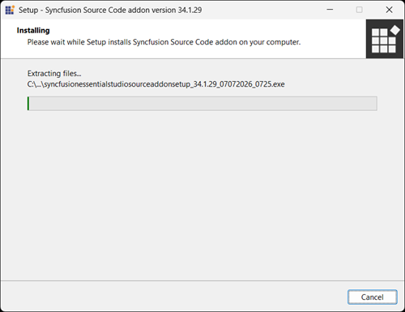

    N> The installer extracts the `syncfusionessentialsourcecodeaddon(version).exe` package and displays the unzip progress.

2. After reading the License Terms and Privacy Policy, enter the [Source Unlock Key](https://www.syncfusion.com/kb/10442/who-can-access-source-license) in the corresponding text box and check the **I agree to the License Terms and Privacy Policy** check box.

   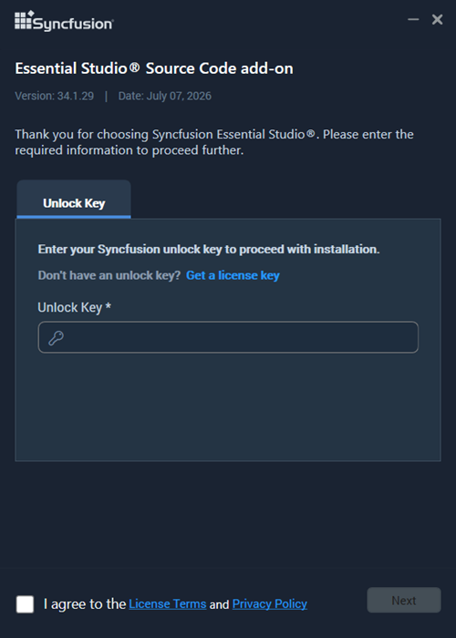

3. Click the **Next** button. The platform selection wizard appears. Choose the platforms that will be installed.

   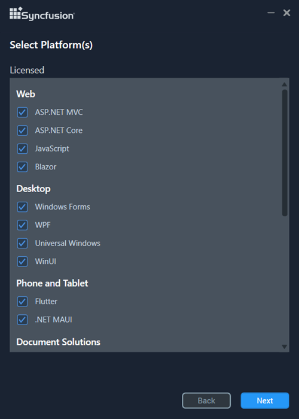

4. Click the **Next** button. The installation location of the Source Code Add-on is displayed.

   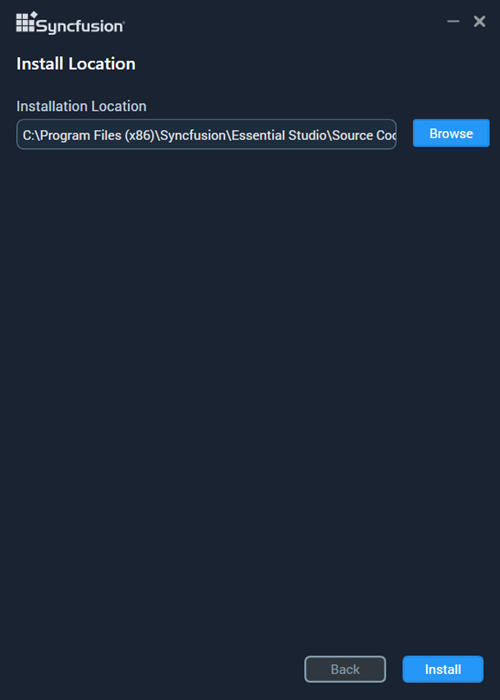

5. Click the **Install** button. The installation process begins.

   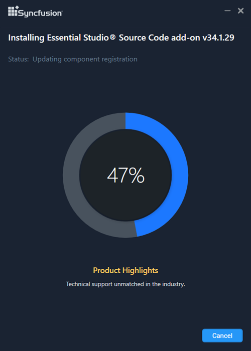

    N> The Completed screen is displayed once the selected platform is installed.

6.  Select the **Run Build Manager (Desktop and Web Platforms)** check box to launch the Build Manager for Desktop and EJ1 Web Platforms once installation completed. Select the **Run Blazor Build Manager** check box to launch the Blazor Build Manager for Blazor once installation completed. Select **Explore Source** check box to get into the source location.

    N> From the 2022 Volume 1 release (v20.1.0.47), Syncfusion&reg; provides the **Run Blazor Build Manager** check box to launch the Blazor Build Manager utility.

7. Click the **Finish** button. The Essential Studio&reg; Source Code Add-on is now installed on your machine.

   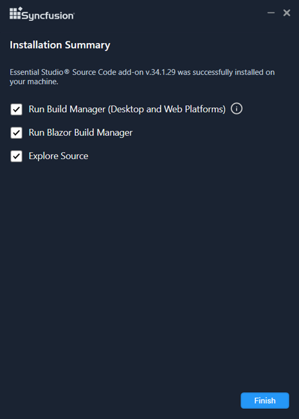

## Build Manager

### Package Generator for EJ2 JavaScript Web Platforms

The Package Generator for EJ2 Web Platforms enables you to modify the source code in Syncfusion&reg; Essential&reg; JS2 controls and generate custom NPM packages.

The Package Generator can be run from the following location through the command line.

1.Open the command prompt in the administrator mode and navigate to the below location.



cd ../../

cd {ProgramFilesFolder}\Syncfusion\Essential Studio\Source Code Add On\{version}\Web\JavaScript\pack-generator

 

**Location:** {ProgramFilesFolder}\Syncfusion\Essential Studio\Source Code Add On\{version}\Web\JavaScript\pack-generator

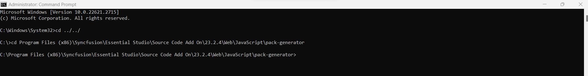

2.Make sure that you have installed **Node.js v16.20.0** or later on your machine. If not, install Node.js from [here](https://nodejs.org/en/download).

3.Run the following command in the command prompt to install the required packages:



npm install



4.To generate a specific component package, pass the component name and version as arguments to the package generation Gulp command.



gulp generate-pack --{componentName}@{version} 

 

5.The `componentName` must match the corresponding folder name in the JavaScript EJ2 controls directory.

   **Location:** `{ProgramFilesFolder}\Syncfusion\Essential Studio\Source Code Add On\{version}\Web\JavaScript\`

   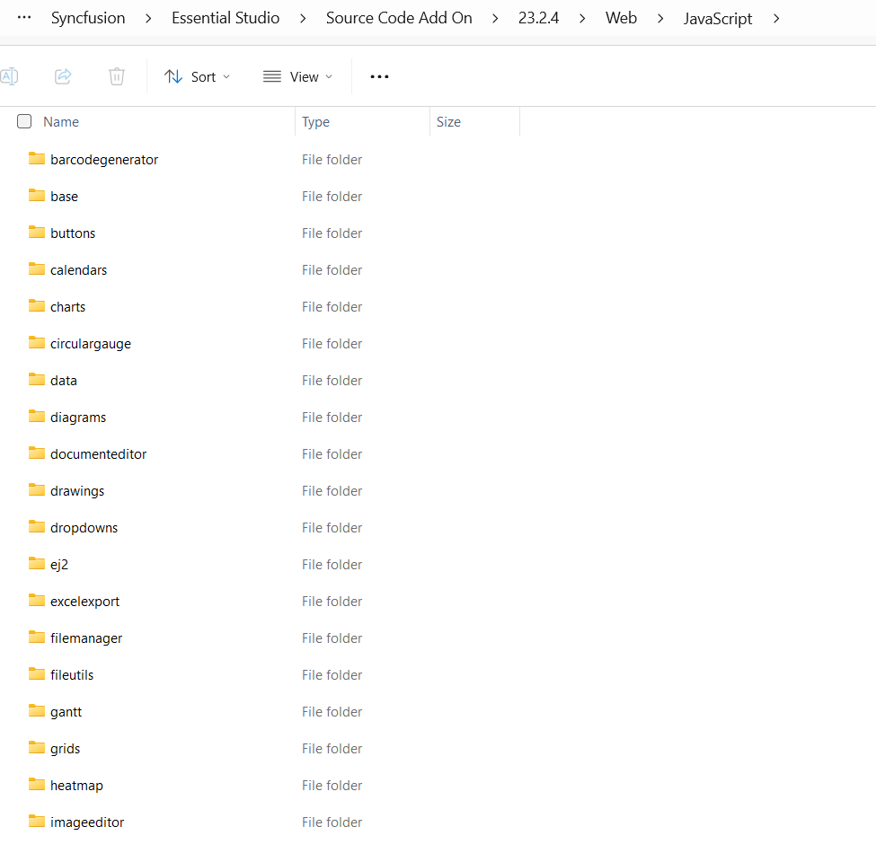

6.If you want to generate a package at a specific version, pass that version as an argument; otherwise the default version from the controls source `package.json` file is used.

7.For example, to generate the package for the Grid component, run the following command in the command prompt:




gulp generate-pack --grids@23.2.4




8.The generated package is placed in the following output location. To use the generated package in your application, reference it in the `package.json` file and install it through the `npm install` command.

   **Output Location:** `{ProgramFilesFolder}\Syncfusion\Essential Studio\Source Code Add On\{version}\Web\JavaScript\pack-generator\packages`

   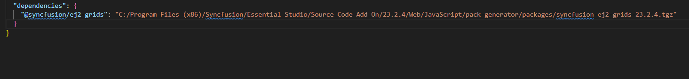

N> You can modify and generate all packages except the `ej2` and `base` packages. Also, ensure that the package version matches the version used in your project; otherwise duplicate packages will be created in the `node_modules` folder.

### For Desktop and Web Platforms

The Build Manager enables you to build and debug assemblies written in Syncfusion&reg; source code. The Build Manager can be launched from the following location.

**Location:** `{ProgramFilesFolder}\Syncfusion\Essential Studio\Source Code Add On\{version}\Utilities\Build Manager\Buildmanagerwindows.exe`

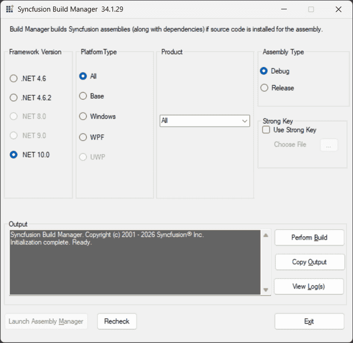

The output assemblies of the Build Manager are placed in the following location.

**Output Location:** `{ProgramFilesFolder}\Syncfusion\Essential Studio\Source Code Add On\{version}\UserAssemblies\{version}\{framework}\{Debug\Release}`

The required settings can be selected in the **Syncfusion&reg; Build Manager x.x.x.x** window.

#### Build Manager Settings

This window contains the following sections.

**1. Framework Version**

The Framework Version group box has five options: .NET 4.6.2, .NET 8.0, .NET 9.0, and .NET 10.0.

* When .NET 8.0 is installed on your system, the **.NET 8.0** option is selected by default.
* When .NET 9.0 is installed on your system, the **.NET 9.0** option is selected by default.
* When .NET 10.0 is installed on your system, the **.NET 10.0** option is selected by default.
* When Visual Studio 2026 is installed on your system, the **.NET 10.0** option is selected by default.
* When Visual Studio 2022 is installed on your system, the **.NET 9.0** option is selected by default.
* When Visual Studio 2017 is installed on your system, the **.NET 4.6** option is selected by default.

You can change the default option by selecting another button. The .NET version specified here is used to rebuild the assemblies.

**2. Product**

The Product group box has a drop-down list box. By default, **All** is selected. You can change the default option by selecting one of the products from the drop-down list.

**3. Platform Type**

Syncfusion&reg; products typically share a base library that serves as the foundation for both the Windows and Web variants. The Platform Type specifies the library category to be built. This frame comes with eight different options. By default, everything is selected. To perform the build operation, click the button for the required product.

   N> For assemblies that are not built and pre-compiled, the assemblies shipped with the product are used automatically.

**4. Assembly Type**

This frame has two options: **Debug** and **Release**. **Debug** is selected by default. To choose the Release mode for assembly, select **Release**.

You can switch between the Debug and Release modes of product configurations. Building the Debug version of the assemblies allows you to step into the Syncfusion&reg; assemblies when debugging applications.

**5. Strong Key**

This enables you to install the compiled assemblies in the GAC. Select the **Use Strong Key** check box and choose a `.snk` file to achieve this. You can debug the assembly only when it is compiled with the Strong Key.

**6. Output**

This frame shows the output, that is, the status of the build operation, in a text area.

After selecting the required options in the above-mentioned frames, click **Perform Build** inside the Output frame.

N> The Build operation is performed and the status is updated in the text area inside the Output frame. On completion of the Build operation, an information message is displayed stating that the Build operation has been completed. It also asks you to review the Build output and log files for additional information.

#### Assembly Manager

The Assembly Manager, which is included in the Source Code Add-on, is used to install or remove the **Debug/Release** assemblies from the GAC and has its own set of features. The Assembly Manager can be launched from the following location.

**Location:** `{ProgramFilesFolder}\Syncfusion\Essential Studio\Source Code Add On\{version}\Utilities\Assembly Manager\AssemblyManagerWindows.exe`

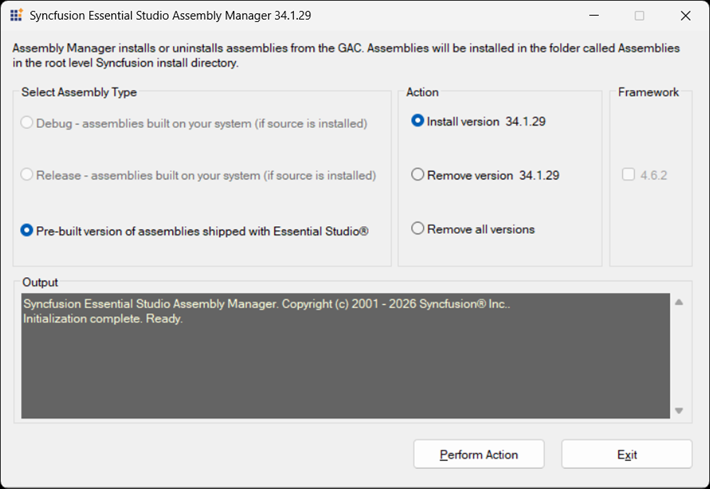

* **Pre-built Assemblies** - These are the assemblies that come standard with Essential Studio&reg;. You can only remove pre-built assemblies from the Assembly Manager that comes with the Source Code Add-on.
* **Debug and Release Assemblies** - This mode instructs the Assembly Manager to install custom assemblies created from source code using the Build Manager. The Debug/Release option is enabled during compilation based on the **Assembly Type** selected in the Build Manager.

Refer to [this](https://help.syncfusion.com/common/essential-studio/utilities#assembly-manager) link for more information on the Assembly Manager's functionalities.

### Blazor Build Manager

1. The Blazor Build Manager enables you to build or compile and generate Syncfusion&reg; Blazor NuGet packages along with their dependent packages.

   **Location:** `{ProgramFilesFolder}\Syncfusion\Essential Studio\Source Code Add On\{version}\Utilities\Blazor Build Manager\BlazorBuildManager.exe`

   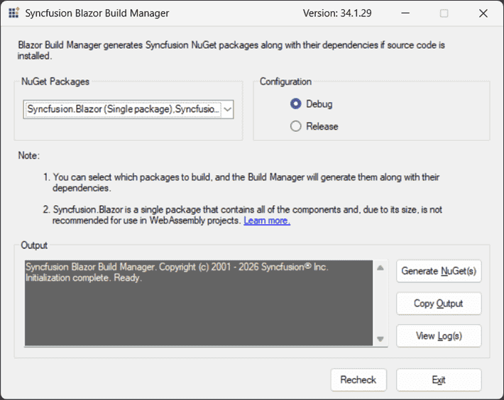

2. The output NuGet packages of the Blazor Build Manager are placed in the following location.

   **Output Location:** `{ProgramFilesFolder}\Syncfusion\Essential Studio\Source Code Add On\{version}\Custom NuGet Packages\`

3. The required settings can be selected in the **Syncfusion&reg; Blazor Build Manager x.x.x.x** window. This window contains the following sections.

   **1. NuGet packages**

   The NuGet packages group allows you to select from the list of available Syncfusion&reg; Blazor NuGet packages to generate.

   **2. Configuration**

   This frame has two options. You can switch between the Debug and Release modes of product configurations. **Debug** is selected by default. To choose the Release mode for assembly, select **Release**.

   **Debug:**

   * Building the Debug version of the assemblies allows you to step into the Syncfusion&reg; assemblies when debugging applications.

   **Release:**

   * Building the Release version of the assemblies builds the Syncfusion&reg; Blazor assemblies in Release configuration and generates the corresponding NuGet packages.

   **3. Output**

   This frame shows the output, that is, the status of the build operation, in a text area.

4. After selecting the required options in the above-mentioned frames, click **Generate NuGet(s)** inside the Output frame.

   N> The Build operation is performed and the status is updated in the text area inside the Output frame. On completion of the Build operation, an information message is displayed stating that the Build operation has been completed. It also asks you to review the Build output and log files for additional information.

   I> Blazor custom NuGet packages are placed in the output location shown below. You should add this location to your `NuGet.config` feed in order to use these packages in your projects.

   **NuGet Feed:** 

   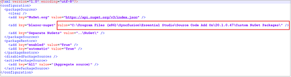