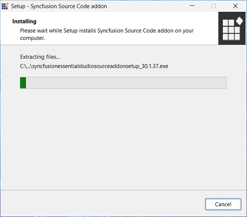
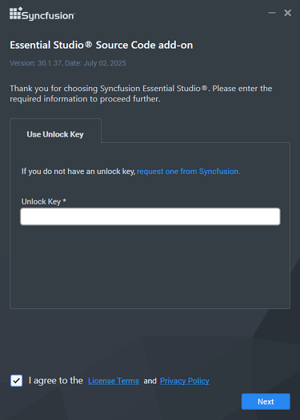
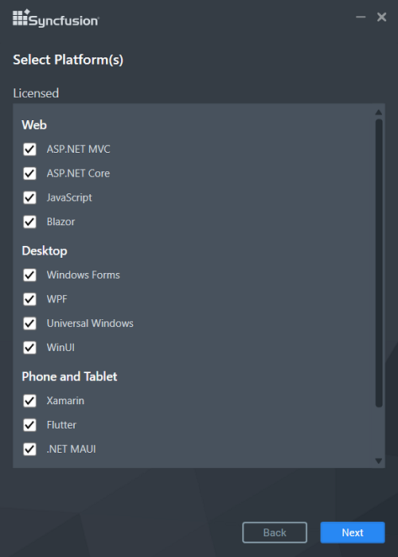
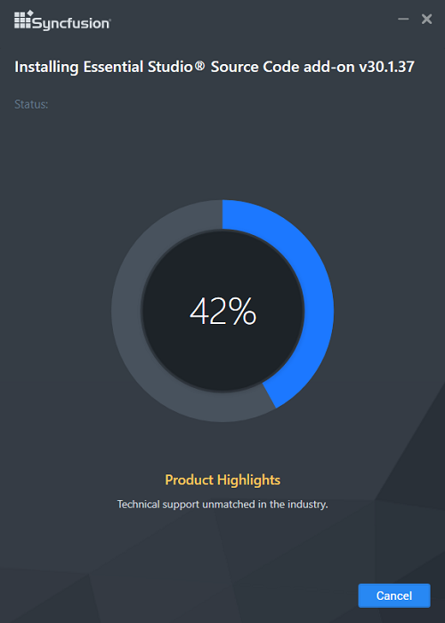
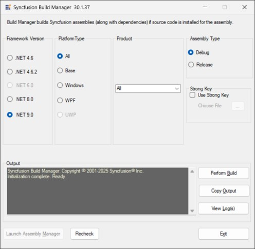
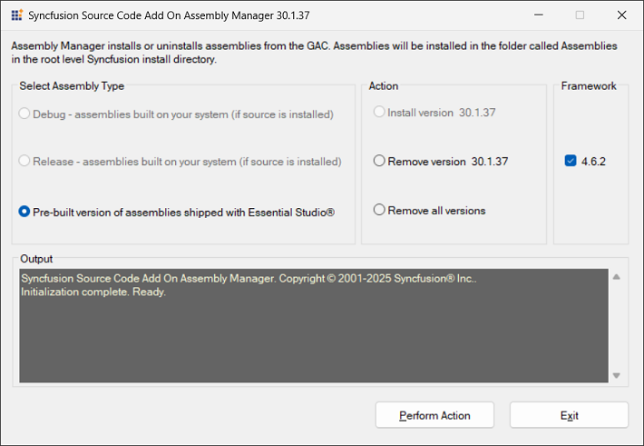
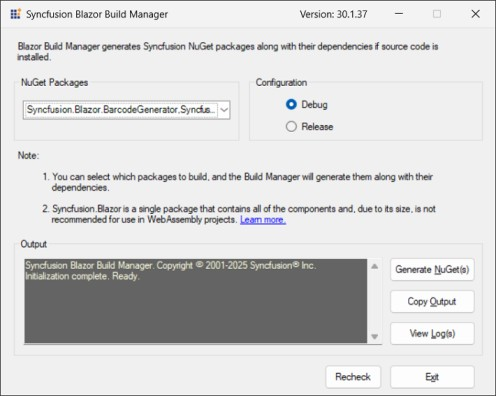

# Source Code Add-on installer

## Downloading Syncfusion Essential Studio Source Code Add-on installer

1. Essential Studio Source Add On installer can be downloaded from your account’s [download](https://help.syncfusion.com/common/essential-studio/download) section. 

2. Syncfusion Source Add On installer can be downloaded based on your license. Refer [this](https://www.syncfusion.com/kb/10442/who-can-access-source-license) KB for the source license.

3. Source Add On installer can be downloaded from the setup downloads page by clicking the **More Download Option** button.

   

## Installing Syncfusion Essential Studio Source Code Add-on installer

## Overview

Syncfusion provides a Source Code Add On installer that allows you to modify the Syncfusion source code and use customized assemblies and custom NuGet packages. This installer contains all of the Essential Studio sources, and you can easily build the customized source. The Source License is required in order to download and install the Source Code Add-on installer.

N> From 2022 Volume 1 release v20.1.0.47, Syncfusion has included the Blazor Build Manager utility to generate the Blazor NuGet packages along with dependency packages. This will allows you to generate the custom Blazor NuGet packages.

## Supported Platforms

Syncfusion provide sources for the following platforms in the source add-on setup.

**Web**

* ASP.NET MVC
* ASP.NET Core
* JavaScript
* Blazor

**Mobile**

* .NET MAUI
* Xamarin
* Flutter

**Desktop**

* Windows Forms
* WPF
* Universal Windows Platform
* WinUI

## Step-by-Step Installation

The steps below show how you can install the Essential Studio Source Code Add-on installer.

1. 	Run the Syncfusion Essential Studio Source code add-on installer from downloaded location by double-clicking it. The installer Wizard automatically opens and extracts the package.
   
    

    N> The installer extracts the syncfusionessentialsourcecodeaddon(version).exe dialogue, which displays the package's unzip operation.
	
   

2.  After reading the License terms and Privacy Policy, enter the [Source Unlock Key](https://www.syncfusion.com/kb/10442/who-can-access-source-license) in the corresponding text box and check the **I agree to the License Terms and Privacy Policy** check box.
   
    
   

3.  Click the Next button. The Platform selection wizard will appear. Choose the platforms that will be installed.

    
   

4.  Click the Next button. The installation location of the Source Code Add On will be displayed.

    

5.  Click the Install button. The Installation process begins. 

    

    N> The Completed screen will be displayed once the selected platform is installed.
	

6.  Select the **Run Build Manager (Desktop and EJ1 Web Platforms)** check box to launch the Build Manager for Desktop and EJ1 Web Platforms once installation completedonce installation completed. Select the **Run Blazor Build Manager** check box to launch the Blazor Build Manager for Blazor once installation completed. Select **Explore Source** check box to get into the source location.

    N> From 2022 Volume 1 release v20.1.0.47, Syncfusion has provided a new option to **Run Blazor Build Manager** check box to launch the Blazor Build Manager Utility.

7.  Click the Finish button. Essential Studio Source Code Add On is installed in your machine.

    
  
   
## Build Manager

### Package Generator for EJ2 JavaScript Web Platforms

Package Generator for EJ2 Web Platforms enables you to modify the source code in Syncfusion Essential JS2 Controls and generate the custom NPM packages.

The Package Generator can be run from the following location through command line.

1.Open the command prompt in the administrator mode and navigate to the below location.



cd ../../

cd {ProgramFilesFolder}\Syncfusion\Essential Studio\Source Code Add On\{version}\Web\JavaScript\pack-generator

 

**Location:** {ProgramFilesFolder}\Syncfusion\Essential Studio\Source Code Add On\{version}\Web\JavaScript\pack-generator

2.Make sure that you have installed **Node.js version 16.20.0** or above on your machine. If not, install Node.js from [here](https://nodejs.org/en/download/).

3.Run the below command in the command prompt to install the required packages.



npm install



4.To generate a specific component package. Pass the component name and version as arguments to the package generation gulp command.  



gulp generate-pack --{componentName}@{version} 

 

5.`ComponentName` should be given the same name as the corresponding folder in the JavaScript EJ2 controls directory below."

**Location:** {ProgramFilesFolder}\Syncfusion\Essential Studio\Source Code Add On\{version}\Web\JavaScript\
      

6.If you want to generate a package in a specific version, then pass that version as argument otherwise it will take the default version from the controls source `package.json` file.

7.For example, to generate the package for the Grid component. Run the below command in the command prompt.




gulp generate-pack --grids@23.2.4




8.The package will be generated in the below location. To utilize the generated package in your application, refer to it in the `package.json` file and install it through the `npm install` command.

**Output Location:** {ProgramFilesFolder}\Syncfusion\Essential Studio\Source Code Add On\{version}\Web\JavaScript\pack-generator\packages

N> Users can modify and generate all packages except for the ej2 and base packages. Also, ensure that you have generated the package in the same version used in your project. Otherwise, it will create duplicate packages in the `node_modules` folder.

### For Desktop and EJ1 Web Platforms

Build Manager enables you to build and debug assemblies written in Syncfusion source code. The Build Manager can be launched from the following location.

**Location:**{ProgramFilesFolder}\Syncfusion\Essential Studio\Source Code Add On\{version}\Utilities\Build Manager\Buildmanagerwindows.exe

   
   

The output assemblies of the Build Manager will be placed in the below location.

**Output Location:** {ProgramFilesFolder}\Syncfusion\Essential Studio\Source Code Add On\{version}\UserAssemblies\{version}\{framework}\{Debug\Release}

The required setting can be selected in the Syncfusion Build Manager x.x.x.x window.

#### Build Manager Settings

This window contains several sections.

**1. Framework Version**

   The Framework Version group box has five options: .NET 4.0, .NET 4.5, .NET 4.5.1, .NET 4.6 and NET 6.0. 
   
   * When .NET 6.0 is installed in your system, the NET 6.0 option is selected by default.
   
   * When Visual Studio 2017 is not installed in your system, the .NET 4.6 option is selected by default. 
    
   * When Visual Studio 2012 is not installed in your system, the .NET 4.0 option is selected by default.
   
   You can change the default option by clicking the other button. The version of the .NET Framework that the assemblies should be built with is specified here and is used automatically to rebuild the assemblies.

**2. Product**

   The Product group box has a drop-down list box. By default, All is selected. You can change the default option by selecting one of the products from the drop-down list box. 

**3. Platform Type** 

   Syncfusion products typically share a base library that serves as the foundation for both the Windows and Web variants. The Platform Type specifies the library category to be built. This frame comes with eight different options. By default, everything is selected. To perform the build operation, click the button for the required product.

   N> For assemblies that are not built and pre-compiled, assemblies that shipped with the product is automatically used.

**4. Assembly Type**

   This frame has two options: Debug and Release. Debug is selected by default. To choose the Release mode for assembly, select Release.

   You can switch between the Debug and Release mode of product configurations. Building the Debug version of the assemblies allows you to step into the Syncfusion assemblies when debugging applications. 

**5. Strong Key**

   This enables you to install the compiled assemblies in GAC. Select the **Use Strong Key** check box and choose a .snk file to achieve this. You can debug the assembly only when it is complied with the Strong Key. 

**6. Output**

   This frame shows the output, that is, the status of the build operation, in a text area. 

   After selecting the required options in the above-mentioned frames, click Perform Build inside the output frame.

N> The Build operation is performed and the status is updated in the text area, inside the output frame. On completion of the Build operation, an information message is displayed stating that the Build operation has been completed. It also asks you to review the Build output and log files for additional information.

#### Assembly Manager

   Assembly Manager, which is included in the Source Code Add On, is used to **InstallRemove** the **DebugRelease** assemblies from the GAC and has its own set of features. The Assembly Manager can be launched from the Source Code Add On installation location listed below.
   
   **Location:**{ProgramFilesFolder}\Syncfusion\Essential Studio\Source Code Add On\{version}\Utilities\Assembly Manager\AssemblyManagerWindows.exe 
   

   * Pre-built Assemblies - These are the assemblies that come standard with Essential Studio. You can only remove pre-built assemblies from the Assembly Manager that comes with the Source Code Add-on.

   * Debug and Release Assemblies - This mode instructs the Assembly Manager to install custom assemblies created from source code using Build Manager. The Debug\Release option will be enabled during compilation based on the **Assembly Type** selected in Build Manager.
   
   

   Refer to [this](https://help.syncfusion.com/common/essential-studio/utilities#assembly-manager) link for more information on Assembly Manager's functionalities.
   
### Blazor Build Manager

1. Blazor Build Manager enables you to build\compile and generate Syncfusion Blazor NuGet packages along with their dependent packages.

   **Location:**{ProgramFilesFolder}\Syncfusion\Essential Studio\Source Code Add On\{version}\Utilities\Blazor Build Manager\BlazorBuildManager.exe

   
   

2. The output NuGet of the Blazor Build Manager will be placed in the below location.

   **Output Location:** {ProgramFilesFolder}\Syncfusion\Essential Studio\Source Code Add On\{version}\Custom NuGet Packages\}

3. The required setting can be selected in the Syncfusion Blazor Build Manager x.x.x.x.

   This window contains the following sections. 

   **1. NuGet packages**

   The NuGet packages group will allow selecting from the list of available Syncfusion Blazor NuGet packages to generate. 

   **2. Configuration**

   This frame has two options. You can switch between the Debug and Release modes of product configurations. Debug is selected by default. To choose the Release mode for assembly, select Release.
   
   **Debug:**
   
   * Building the Debug version of the assemblies allows you to step into the Syncfusion assemblies when debugging applications.

   **Release:**
   
   * Building the Release version of the assemblies will build the Syncfusion Blazor assemblies in Release configuration and generate the NuGet packages Building the Release version of the assemblies will build the Syncfusion Blazor assemblies in Release configuration and generate the NuGet packages

   **3. Output**

   This frame shows the output, that is, the status of the build operation, in the text area 

4. After selecting the required options in the above-mentioned frames, click Generate NuGet(s) inside the output frame.

   N> The Build operation is performed and the status is updated in the text area, inside the output frame. On completion of the Build operation, an information message is displayed stating that the Build operation has been completed. It also asks you to review the Build output and log files for additional information.

   I> Blazor custom NuGet packages will be present in the following output location. You should use this location in your Nuget.config feed to use these packages in your projects.

   **NuGet Feed:** 

   
