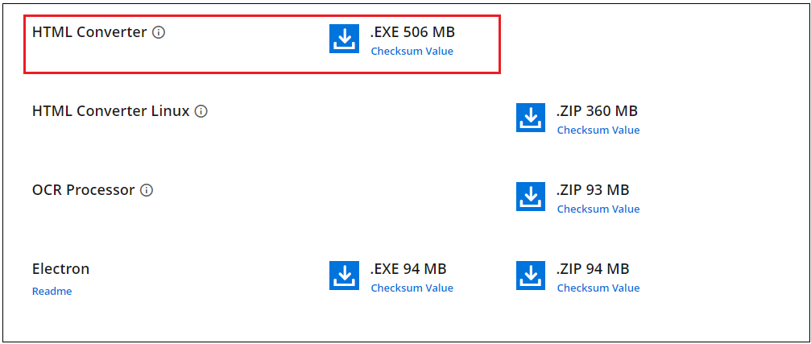
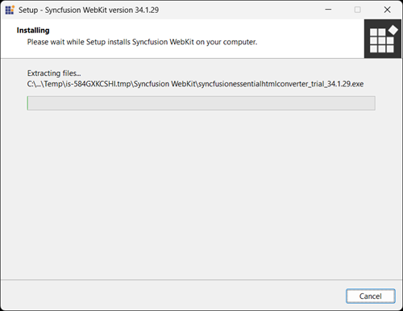
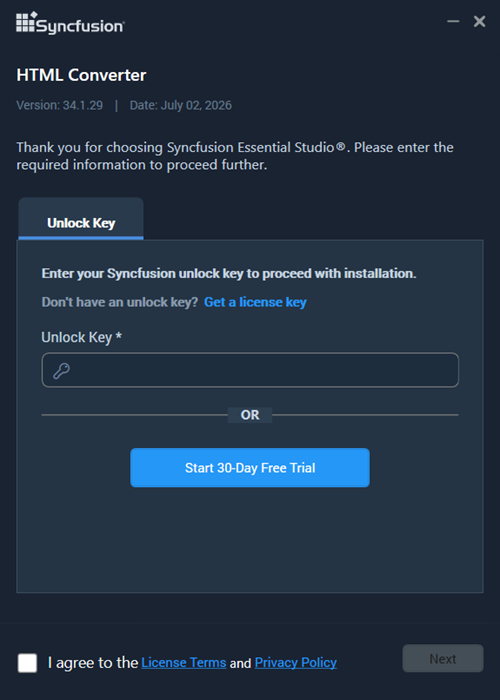
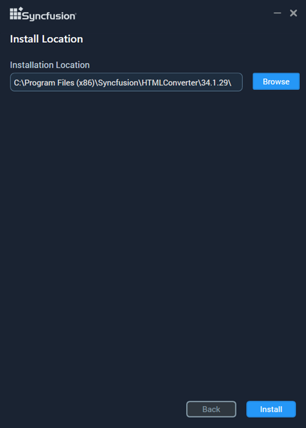
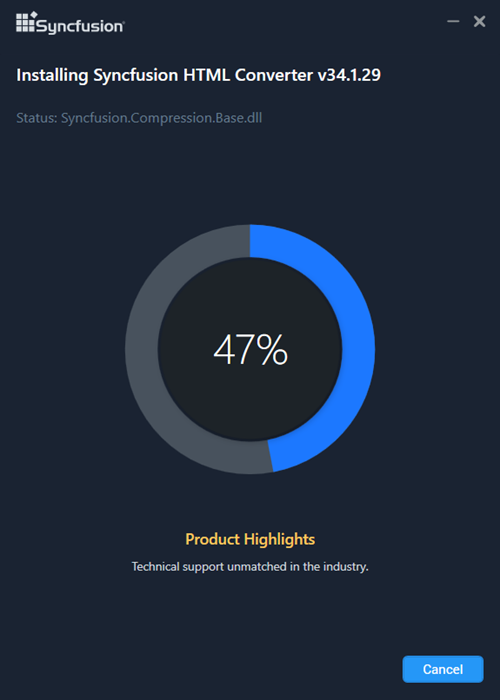
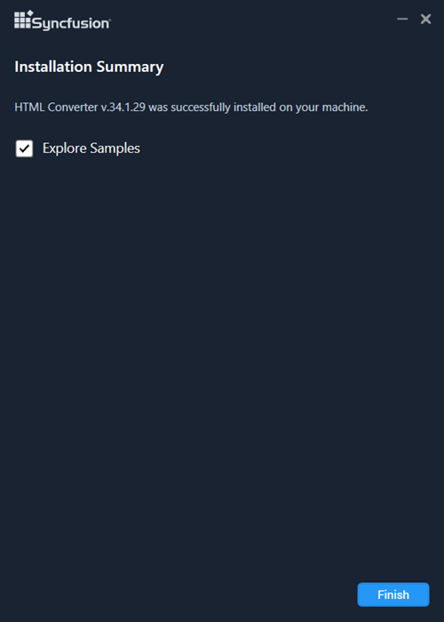

# WebKit HTML Converter

## Downloading Syncfusion&reg; Essential Studio&reg; WebKit HTML Converter Add-on installer

The Syncfusion&reg; Essential Studio&reg; WebKit HTML Converter Add-on installer can be downloaded from your account's [Download](https://help.syncfusion.com/common/essential-studio/download) section or from the setup downloads page through **More Download Options**, based on your license.

   

## Installing Syncfusion&reg; Essential Studio&reg; WebKit HTML Converter Add-on installer

### Overview

Syncfusion&reg; introduced the HTML Converter in Essential Studio&reg; 13.1.0.21. It supports HTML-to-PDF conversion by using the advanced Qt WebKit rendering engine. This converter can be easily integrated into any .NET application&mdash;such as Windows Forms, WPF, ASP.NET, ASP.NET MVC, and ASP.NET Core&mdash;to convert URLs, HTML strings, SVG, and MHTML to PDF, as well as HTML to MHTML, HTML to SVG, and HTML to image.

### Prerequisites

Before installing the WebKit HTML Converter Add-on, ensure the following:

* A valid Syncfusion license or trial(Unlock Key) is available.
* .NET Framework 4.6.2 or later is installed.

### Step-by-Step Installation

The steps for installing the HTML Converter installer are as follows.

1. Run the Syncfusion&reg; HTML Converter installer by double-clicking it. The installer wizard automatically opens and extracts the package.

   

   N> The installer extracts the syncfusionessentialhtmlconverter_(version).exe dialogue, which displays the package's unzip operation.

2. After reading the License Terms and Privacy Policy, enter the [Essential Studio&reg; Unlock Key](https://www.syncfusion.com/kb/2326/how-to-generate-syncfusion-setup-unlock-key-from-syncfusion-support-account) in the corresponding text box and select the **I agree to the License Terms and Privacy Policy** check box.

   

3. Click **Next**. The Installation Location screen appears.

   

   N> By clicking **Browse**, you can also browse and select a location

4. Click **Install** to install the converter in the displayed default location.

   

   N> The Completed screen is displayed once the HTML Converter is installed.

   

5. Click **Finish**. The HTML Converter is now installed on your machine.

N> Starting with v20.1.0.x, if you reference Syncfusion&reg; HTML converter assemblies from trial setup or from the NuGet feed, include a license key in your projects. Refer to the [link](https://help.syncfusion.com/file-formats/licensing/overview) to learn about generating and registering Syncfusion&reg; license key in your application to use the components without trail message.

### Output Location

The HTML Converter assemblies are placed in the following default location:

**Location:** `{ProgramFilesFolder}\Syncfusion\Essential Studio\HTML Converter\{version}\`

**Example:** `C:\Program Files (x86)\Syncfusion\Essential Studio\HTML Converter\34.1.29\`

## Command Line

Command-line install and uninstall are supported by the Syncfusion&reg; HTML Converter installer. The following sections demonstrate this ability.

### Command-Line Installation

Follow the steps below to install through the command line in silent mode.

1. Double-click the Syncfusion&reg; HTML Converter installer to launch it. The Self-Extractor wizard automatically opens and extracts the package.
2. The `syncfusionessentialhtmlconverter_(version).exe` file is extracted into the `%temp%` folder.
3. Run `%temp%` from the **Run** dialog (Win+R). The Temp folder opens. The `syncfusionessentialhtmlconverter_(version).exe` file is available in one of the folders.
4. Copy the `syncfusionessentialhtmlconverter_(version).exe` file to a local drive. Example: `D:\temp`.
5. Cancel the wizard.
6. Open Command Prompt in administrator mode and pass the following arguments:

   **Arguments:** `"Installer file path\syncfusionessentialhtmlconverter_(version).exe" /Install silent [/log "{Log file path}"] [/InstallPath:{Location to install}]`

   N> [..] – Arguments inside the square brackets are optional.

   **Example:** “D:\Temp\syncfusionessentialhtmlconverter13.2.0.30.exe” /Install silent /log “C:\Temp\EssentialWebkit.log” /InstallPath:C:\Syncfusion\x.x.x.x 

7. The HTML converter is installed.
    
	N> * x.x.x.x needs to be replaced with the HTML Converter version installed on your machine.* Above steps applicable from the version 13.2.0.x.

### Command-Line Uninstallation

Uninstalling the Syncfusion&reg; HTML Converter installer via the command line in silent mode is supported. The steps below will assist you in uninstalling the HTML Converter.

1. If you do not have the extracted installer (`syncfusionessentialhtmlconverter_(version).exe`), follow steps 2 to 7.
2. Double-click the Syncfusion&reg; Essential Studio&reg; installer. The Self-Extractor wizard opens and extracts the package automatically.
3. The `syncfusionessentialhtmlconverter_(version).exe` file is extracted into the `%temp%` folder.
4. Run `%temp%` from the **Run** dialog (Win+R). The Temp folder opens. The `syncfusionessentialhtmlconverter_(version).exe` file is available in one of the folders.
5. Copy the `syncfusionessentialhtmlconverter_(version).exe` file to a local drive. Example: `D:\temp`.
6. Cancel the wizard.
7. Open Command Prompt in administrator mode and pass the following arguments:

   **Arguments:** `"Installer file path\syncfusionessentialhtmlconverter_(version).exe" /uninstall silent`

   **Example:** `"D:\Temp\syncfusionessentialhtmlconverter_13.2.0.30.exe" /uninstall silent`

8. The HTML Converter is uninstalled.
    
	N> * x.x.x.x need to be replaced with the HTML Converter version installed in your machine.* Above steps applicable from the version 13.2.0.x.		