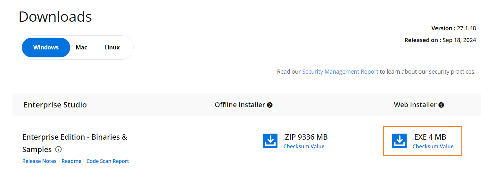

---
layout: post
title: Downloading Syncfusion Essential Studio Enterprise Edition installer - Syncfusion
description: Learn here about the how to download Syncfusion Essential Studio Enterprise Edition installer from our syncfusion website with license.
platform: common
documentation: ug
--- 

# Download Syncfusion&reg; Essential Studio&reg; Enterprise Edition Installer

1. Syncfusion&reg; provides the Essential Studio&reg; Enterprise Edition installer to licensed customers. 

2. You can get the most recent version of Essential Studio&reg; Installer [here](https://www.syncfusion.com/downloads/latest-version).

    

2. Click the More Download Options (in the above screenshot) button to get the Essential Studio&reg; Enterprise Edition installer installer which is available in ZIP format.

   

You can also refer to the [**Enterprise Edition installer**](https://help.syncfusion.com/common/essential-studio/installation/essential-studio-enterprise-edition-installer/how-to-install) links for step-by-step installation guidelines.	
