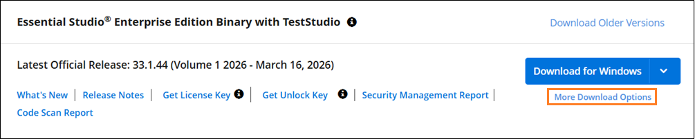
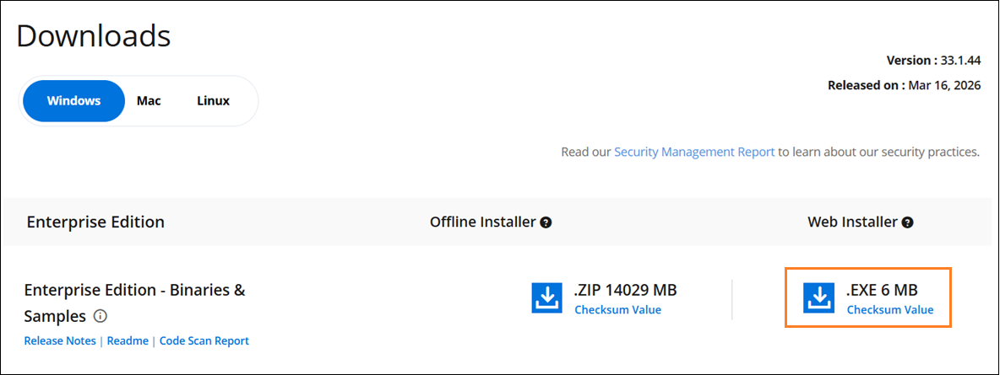

---
layout: post
title: Downloading Syncfusion Essential Studio Enterprise Edition Installer
description: Learn how to download the Syncfusion Essential Studio Enterprise Edition installer from the Syncfusion website using your license.
platform: common
documentation: ug
--- 

# Download Syncfusion&reg; Essential Studio&reg; Enterprise Edition Installer

1. Syncfusion&reg; provides the Essential Studio&reg; Enterprise Edition installer to licensed customers. To download the installer, you must have a valid Syncfusion&reg; account with an active Enterprise license. An active internet connection is also required to authenticate and access the download page.

2. You can get the most recent version of Essential Studio&reg; Installer [here](https://www.syncfusion.com/downloads/latest-version).
    

3. Click the **More Download Options** button (shown in the screenshot above) to open the additional downloads page, then select **Offline Installer (ZIP)** to download the Essential Studio&reg; Enterprise Edition installer, which is provided in ZIP format. After the ZIP download completes, extract it to a local folder before running the installer. The extracted folder will contain the `syncfusionessentialstudiosetup_{version}.exe` used in the [installation steps](https://help.syncfusion.com/common/essential-studio/installation/essential-studio-enterprise-edition-installer/how-to-install).

   

You can also refer to the [**Enterprise Edition installer**](https://help.syncfusion.com/common/essential-studio/installation/essential-studio-enterprise-edition-installer/how-to-install) links for step-by-step installation guidelines.	
