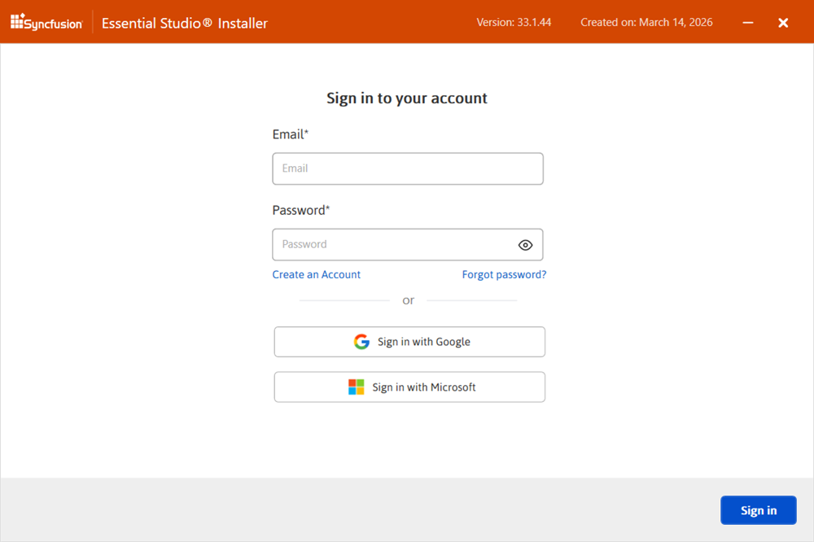
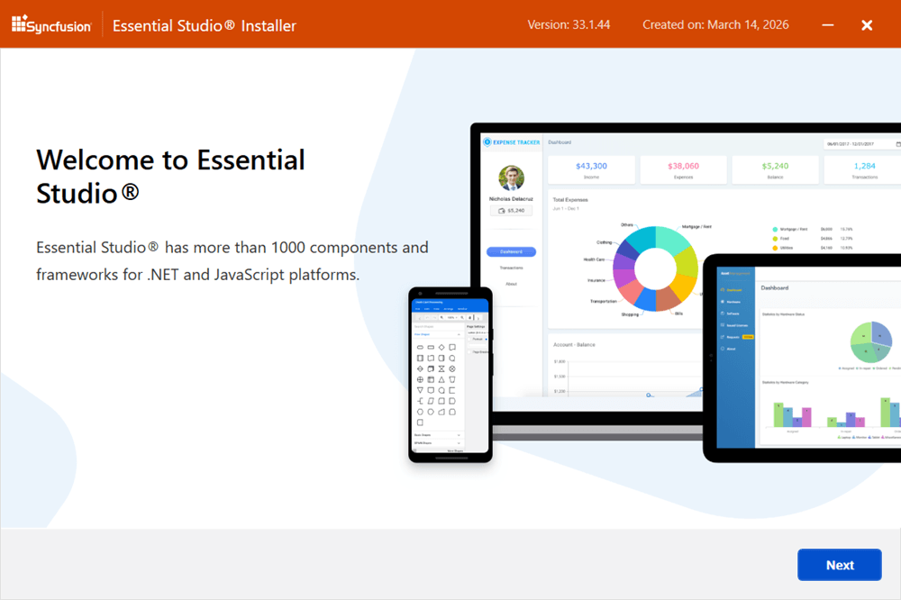
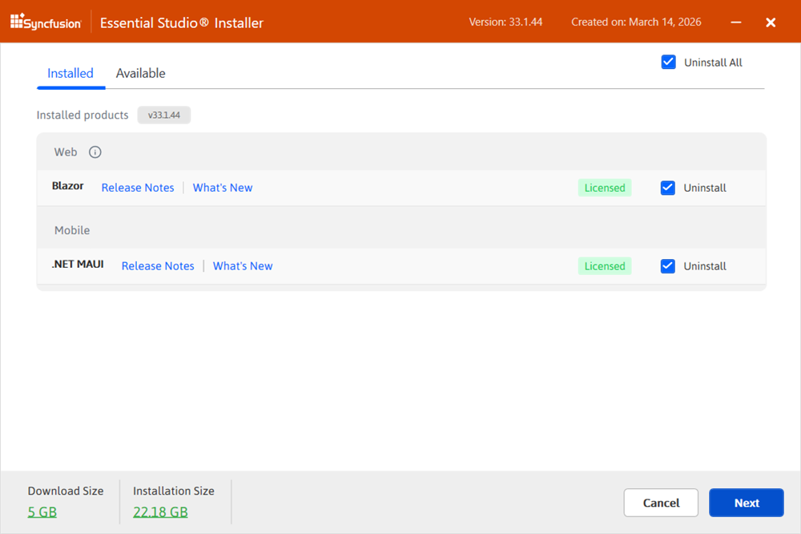
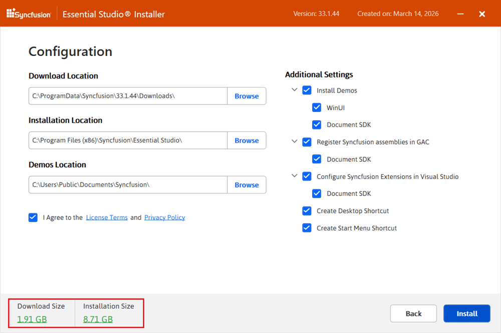
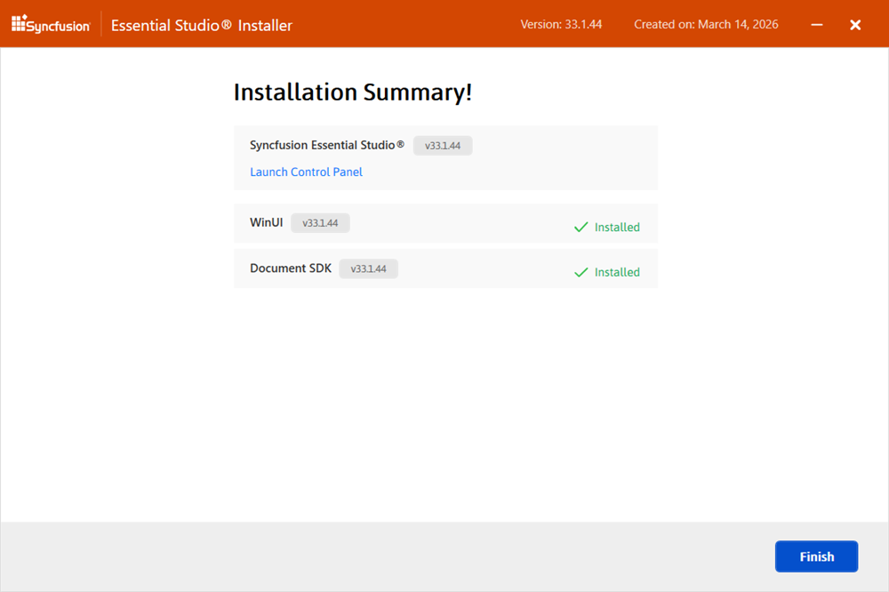

# Installing Syncfusion Essential Studio Enterprise Edition

## Overview

The Essential Studio&reg; Enterprise Edition Installer includes the platforms listed below.

The Syncfusion&reg; Essential Studio&reg; Enterprise Edition installer supports both the installation and uninstallation of the platforms for that version.

### Prerequisites

Before you begin, confirm the following:

* You have a valid Syncfusion&reg; account with an active Enterprise license.
* You have downloaded and extracted the Essential Studio&reg; Enterprise Edition offline installer ZIP from the [Download](how-to-download) page.
* You are running the installer with administrator privileges. Right-click the setup file and choose **Run as administrator** if User Account Control (UAC) is enabled.
* If you are using an Unlock Key (offline activation), ensure the key file is available on the local machine.

I> * The Essential Studio&reg; Enterprise Edition Installer can be installed with either the Login or Unlock key.

**Web**

* ASP.NET MVC
* ASP.NET Core
* JavaScript
* Blazor

**Mobile**

* .NET MAUI

**Desktop**

* Windows Forms
* WPF
* Universal Windows Platform
* WinUI

**Document Processing**

* Document SDK
* PDF Viewer SDK
* Spreadsheet Editor SDK
* DOCX Editor SDK

**Standalone UI SDKS**

* Scheduler SDK
* Gantt SDK
* Rich Text Editor SDK
* Grid SDK
* Chart SDK
* Diagram SDK
* File Manager SDK

N> Universal Windows Platform will be installed in Windows 8.1 and later.

N> Offline (Unlock Key) installations do not require an internet connection during install, but the installer must be able to read the license key file from the local disk.

The steps below show how to install the Essential Studio&reg; Enterprise Edition Installer.

1.  Locate the extracted installer folder from the downloaded ZIP and double-click `syncfusionessentialstudiosetup_{version}.exe` to launch it. If User Account Control (UAC) prompts for permission, click **Yes** to allow the installer to run with administrator privileges. The Installer Wizard automatically opens and extracts the package.

    

    N> The installer wizard extracts the `syncfusionessentialstudiosetup_{version}.exe` package and displays the unzip progress.

2.  The login wizard will appear. You must enter your Syncfusion&reg; email address and password. If you do not already have a Syncfusion&reg; account, you can create one by clicking on **Create an Account**. If you have forgotten your password, click **Forgot Password** to create a new one. Click the Sign in button.
    

    N> If sign-in fails with "Invalid credentials", verify the email/password, ensure your account has an active Enterprise license, and confirm that the machine has an active internet connection. Contact [Syncfusion Support](https://www.syncfusion.com/support) if the issue persists.
    
3.  The Syncfusion&reg; Offline Installer's welcome wizard will be displayed. Click the **Next** button to continue.

    

  
4.  The Platform Selection Wizard will appear. From the **Available** tab, select the products to be installed. Select the **Install All** checkbox to install all products.

    <em>**Available**</em>
	
    

    If you have multiple products installed in the same version, they will be listed under the **Installed** tab. You can also select which products to uninstall from the same version. Click the **Next** button to continue.
	
    <em>**Installed**</em>

    From here, you can select the already installed platforms to uninstall it.	

    

    I> If the required software of the selected platform was not already installed, the **Additional Software Required** alert will be displayed. Use the links in the alert to install the missing prerequisites, then return to the wizard and click **Next** to retry.

    <em>**Required Software**</em>

    
	
5.  If previous version(s) for the selected products are installed, the **Uninstall previous version** wizard will be displayed. You can see the list of previously installed versions for the products you have chosen here. To remove all versions, check the **Uninstall All** checkbox. Click the **Next** button.

    N> From the 2021 Volume 1 release (v18.1), Syncfusion&reg; provides the option to uninstall the previous versions of selected products while installing the new version.

6.  A confirmation pop-up screen will be displayed to confirm the uninstallation of the selected previous versions. Click **Yes** to proceed or **No** to cancel the uninstallation.

7.  The Confirmation Wizard will appear with a list of products to be installed and uninstalled. 

    I> The confirmation list reflects the selections made in Steps 4 and 5. Expanding a product node allows you to view or modify individual components before the installation begins. You can view and modify the list of products that will be installed or uninstalled on this page. Click Next to continue.

    
	
    N> By clicking the **Download Size and Installation Size** links, you can determine the approximate size of the download and installation.
	
   
8.  The **Configuration Wizard** will be displayed. Here you can change the **Install** and **Samples** location. You can also change the **Additional Settings** on a per-platform basis. To install using the default configuration, click **Next**.

    
	
    **Additional settings**
   
    * Select the **Install Demos** check box to install Syncfusion&reg; samples, or leave the check box unchecked, if you do not want to install Syncfusion&reg; samples.
    * Select the **Register Syncfusion&reg; Assemblies in GAC** check box to install the latest Syncfusion&reg; assemblies in GAC or clear this check box when you do not want to install the latest assemblies in GAC.
    * Select the **Configure Syncfusion&reg; controls in Visual Studio** check box to configure the Syncfusion&reg; controls in the Visual Studio toolbox or clear this check box when you do not want to configure the Syncfusion&reg; controls in the Visual Studio toolbox during installation. Note that you must also select the Register Syncfusion&reg; assemblies in GAC check box when you select this check box.
    * Select the **Configure Syncfusion&reg; Extensions in Visual Studio** checkbox to configure the Syncfusion&reg; Extensions in Visual Studio or clear this check box when you do not want to configure the Syncfusion&reg; Extensions in Visual Studio.
    * Check the **Create Desktop Shortcut** checkbox to add a desktop shortcut for Syncfusion&reg; Control Panel
    * Check the **Create Start Menu Shortcut** checkbox to add a shortcut to the start menu for Syncfusion&reg; Control Panel

9.  After reading the License Terms and Conditions, check the **I agree to the License Terms and Privacy Policy** check box. Click the **Next** button to proceed.

10. The download and installation/uninstallation progress will be displayed as shown below. Do not close the wizard or turn off the machine while the progress bar is active.

    

11. When the installation is finished, the **Summary** wizard will appear. Here you can see the list of products that have been installed successfully and those that have failed. To close the Summary wizard, click **Finish**.

    

    * To open the Syncfusion&reg; Control Panel, click **Launch Control Panel**.

## Troubleshooting

If you encounter any of the following issues during installation, try the suggested resolution:

* **Sign-in fails with "Invalid credentials"** — Verify your email and password, confirm that your account has an active Enterprise license, and ensure the machine has internet access. To reset your password, use the **Forgot Password** link on the login wizard.
* **Additional Software Required alert is shown** — Install the missing prerequisites (for example, the appropriate .NET SDK, Visual Studio workload, or Node.js) , then return to the wizard and click **Next**.
* **Installer does not start / UAC blocks the installer** — Right-click the setup `.exe` and choose **Run as administrator**. Confirm that the user account has local administrator rights on the machine.
* **Installation fails midway** — Review the Summary step for the failed product, check the Windows Event Viewer for setup errors, and re-run the installer. For persistent issues, contact [Syncfusion Support](https://www.syncfusion.com/support).
* **WinUI or UWP platform cannot be selected** — Verify the OS meets the platform requirements (Windows 10 1809+ for WinUI, Windows 8.1+ for UWP) and that the required Visual Studio workloads are installed.   

