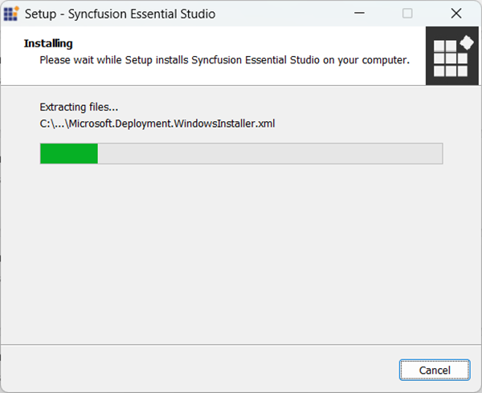
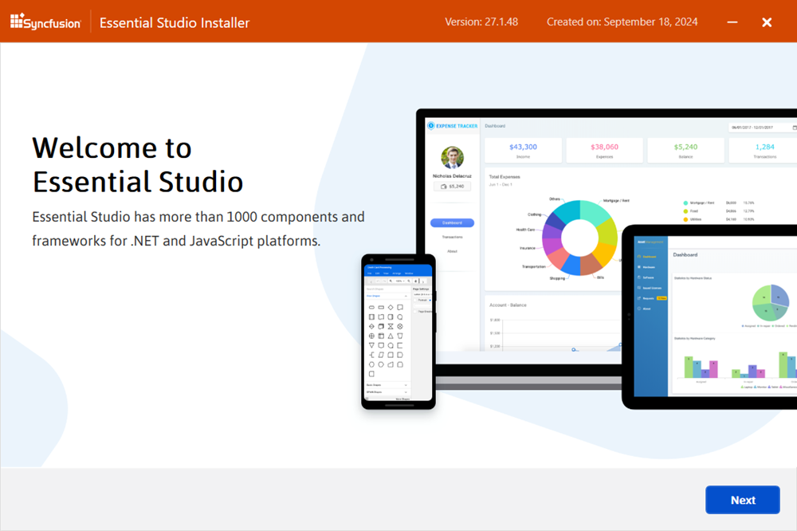
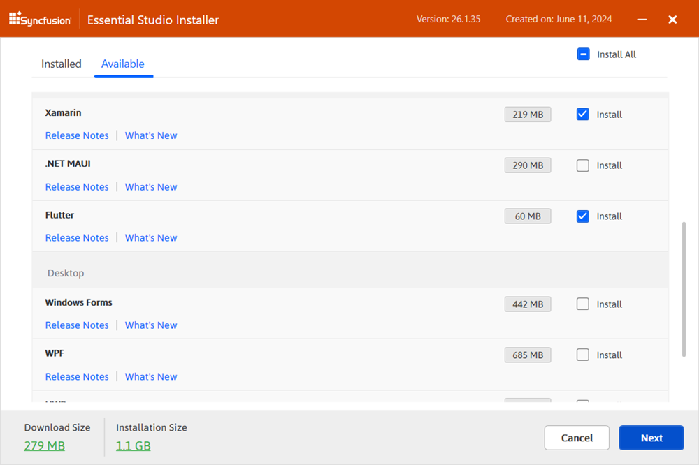
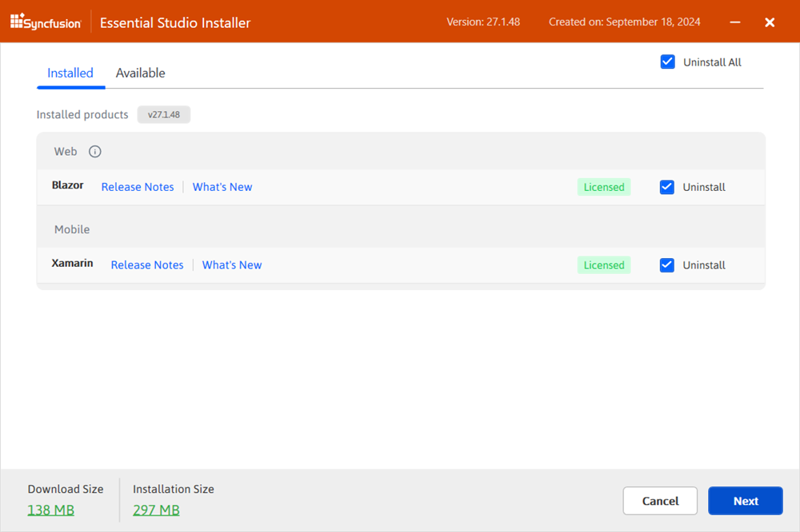
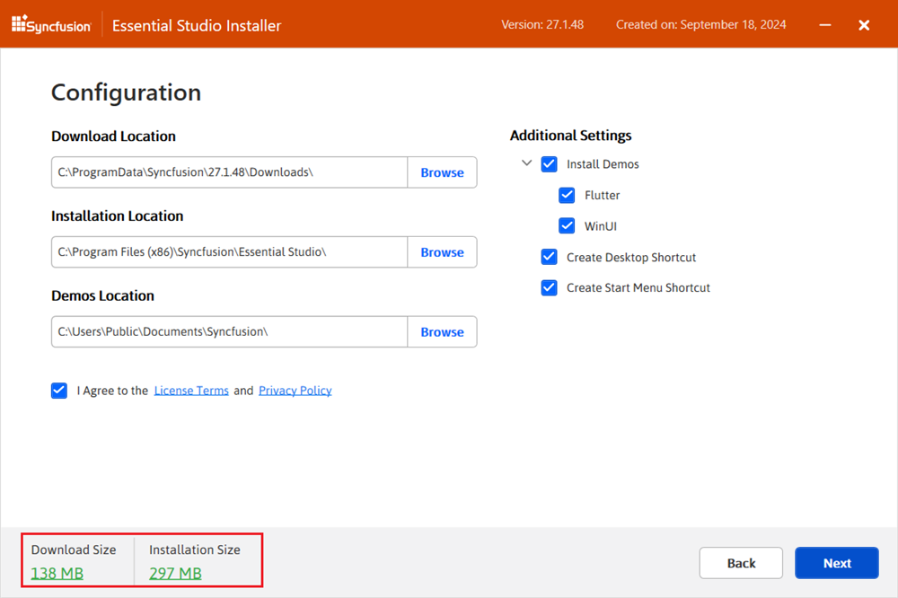
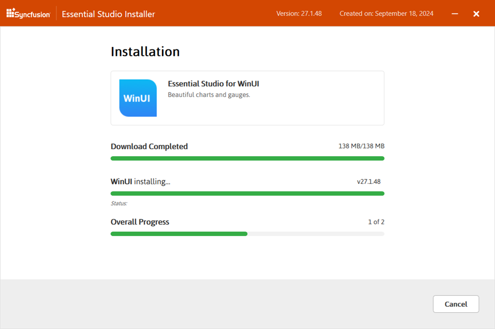
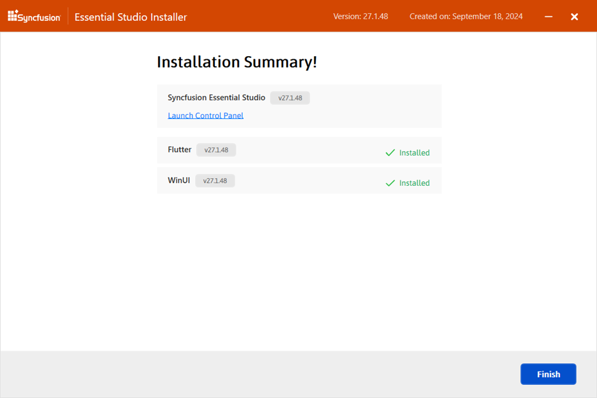
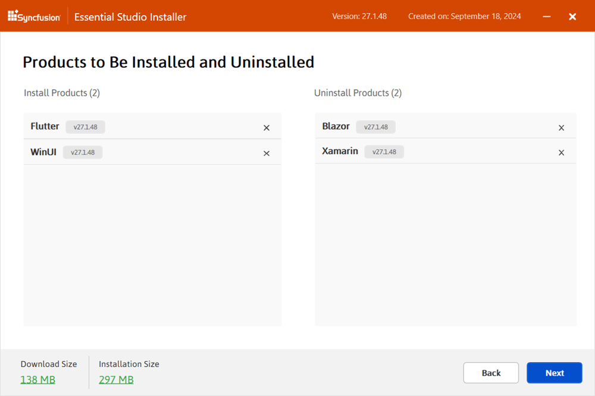

# Installing Syncfusion Essential Studio Enterprise Edition installer

## Overview

The Syncfusion Essential Studio Enterprise Edition installer supports both the installation and uninstallation of the platforms for that version.

I> * The Essential Studio Enterprise Edition Installer can be installed with either the Login or Unlock key.

**Web**

* ASP.NET MVC
* ASP.NET Core
* JavaScript
* Blazor

**Mobile**

* Xamarin
* Flutter

**Desktop**

* Windows Forms
* WPF
* Universal Windows Platform
* WinUI

**Web (Essential JS 1)**

* ASP.NET Web Forms
* ASP.NET MVC
* ASP.NET Core
* JavaScript
* PHP
* JSP
 
 
The steps below show how to install Essential Studio Enterprise Edition Installer.

1.  Open the Syncfusion Essential Studio Enterprise Edition Installer file from downloaded location by double-clicking it. The Installer Wizard automatically opens and extracts the package.

    

    
    N> The installer wizard extracts the syncfusionessentialstudiosetup_{version}.exe dialog, displaying the unzip operation of the package.
    
2.  The Syncfusion Offline Installer’s welcome wizard will be displayed. Click the Next button.

    

  
3.  The Platform Selection Wizard will appear. From the **Available** tab, select the products to be installed. Select the **Install All** checkbox to install all products.

    <em>**Available**</em>
	
    

    If you have multiple products installed in the same version, they will be listed under the **Installed** tab. You can also select which products to uninstall from the same version. Click the Next button.
	
    <em>**Installed**</em>

    From here, you can select the already installed platforms to uninstall it.	

    
	
    I> If the required software of the selected platform was not already installed, **Additional Software Required** alert will be displayed.
	
    <em>**Required Software**</em>
	
    
	
4.  If previous version(s) for the selected products are installed, the Uninstall previous version wizard will be displayed. You can see the list of previously installed versions for the products you’ve chosen here. To remove all versions, check the Uninstall All checkbox. Click the Next button

    N> From the 2021 Volume 1 release, Syncfusion has provided option to uninstall the previous versions from 18.1 while installing the new version.
   
5.  Pop up screen will be displayed to get the confirmation to uninstall selected previous versions.

6.  The Confirmation Wizard will appear with the list of products to be installed/uninstalled. You can view and modify the list of products that will be installed and uninstalled from this page.

    
	
    N> By clicking the **Download Size and Installation Size** links, you can determine the approximate size of the download and installation.
	
   
7.  Configuration wizard will be displayed. Here you can change the Install and samples location. Also, you can change the Additional settings by platform basis. To install using the default configuration, click Next.

    
	
    **Additional settings**
   
    * Select the **Install Demos** check box to install Syncfusion samples, or leave the check box unchecked, if you do not want to install Syncfusion samples.
    * Select the **Register Syncfusion Assemblies in GAC** check box to install the latest Syncfusion assemblies in GAC or clear this check box when you do not want to install the latest assemblies in GAC.
    * Select the **Configure Syncfusion controls in Visual Studio** check box to configure the Syncfusion controls in the Visual Studio toolbox or clear this check box when you do not want to configure the Syncfusion controls in the Visual Studio toolbox during installation. Note that you must also select the Register Syncfusion assemblies in GAC check box when you select this check box.
    * Select the **Configure Syncfusion Extensions in Visual Studio** checkbox to configure the Syncfusion Extensions in Visual Studio or clear this check box when you do not want to configure the Syncfusion Extensions in Visual Studio.
    * Check the **Create Desktop Shortcut** checkbox to add a desktop shortcut for Syncfusion Control Panel
    * Check the **Create Start Menu Shortcut** checkbox to add a shortcut to the start menu for Syncfusion Control Panel

8.  After reading the License Terms and Conditions, check the **I agree to the License Terms and Privacy Policy** check box. Click the Next button.

9.  The Login wizard will be displayed. You have two options for unlocking the Syncfusion Essential Studio Enterprise Edition installer.
    
    * Login To Install
    
	* Use Unlock Key
    
    <b>Login To Install</b>
    
    You should enter your Syncfusion Direct-Trac login credentials. If you don’t have Syncfusion Direct-Trac login credentials, then you can click on Create an Account. Else if you forgot your password, click on Forgot Password to create new password. Click Install.
    
    
    
    <b>Use Unlock Key</b>
   
    You should use the Syncfusion Unlock key. Licensed customer can generate the unlock key from here.
    
    
    
10. The download and installation\uninstallation progress will be displayed as shown below.

    

11. When the installation is finished, the **Summary** wizard will appear. Here you can see the list of products that have been installed successfully and those that have failed. To close the Summary wizard, click Finish

    
	
    * To open the Syncfusion Control Panel, click **Launch Control Panel**   

