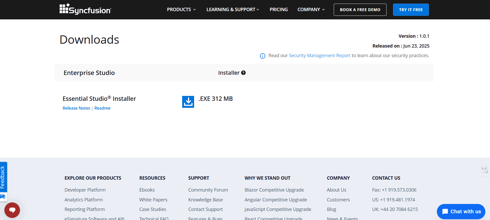
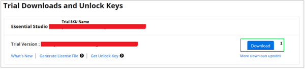

---
layout: post
title: Downloading Syncfusion Essential Studio installer - Syncfusion
description: Learn here about the how to download Syncfusion Essential Studio installer from our syncfusion website with license.
platform: common
documentation: ug
--- 

# Download Syncfusion® Essential Studio® Installer

The Syncfusion® Essential Studio® Installer is available for download from the official [Syncfusion&reg;](https://www.syncfusion.com/) website. Access to the installer is based on the type of credentials you use:

   -	Trial Access – Trial credentials allow access to the latest version of Syncfusion products for a 30-day evaluation period.
   -	Licensed Access – Licensed credentials allow access to the latest version and the previous seven versions of the Syncfusion products during your active subscription.

   N> You cannot log in or use the installer without valid trial or licensed credentials.

## Trial Access

1. You can evaluate our 30-day free trial by visiting the [Download Free Trial](https://www.syncfusion.com/downloads) page and select the product
2. After completing the required form or logging in with your registered Syncfusion&reg; account, you can download the installer from the confirmation page. (as shown in below screenshot.)

   
   
3. After downloading, the Syncfusion&reg; installer can be unlocked using either registered trial credentials or a Syncfusion&reg; registered account with Microsoft or Google login.
4. You can download the installer at any time from your registered account’s [Trials & Downloads](https://www.syncfusion.com/account/manage-trials/downloads) page before the trial period expires.
5. Click the **Download** button (element 1 in the screenshot below) to get the Syncfusion&reg; Essential Studio&reg; installer, or use the **More Download Options** menu to access additional downloads.
 
   

To explore Syncfusion components during the trial period, you can do the following:

Use the Installer – Download and install the Syncfusion Essential Studio Installer from the [Syncfusion&reg;](https://www.syncfusion.com/) website, then log in using your trial credentials to begin your 30-day evaluation.

## Licensed Access

1. Syncfusion&reg; licensed products will be available in the [License & Downloads](https://www.syncfusion.com/account/downloads) page under your registered Syncfusion&reg; account.
2. You can view all the licenses—**both active and expired**— associated with your account.

   N> If your license has expired, you can still install and use the Syncfusion&reg; Essential Studio&reg; installer using **trial credentials**. However, with a trial, you will only have access to the **latest version** of the product.

3. Click the **Download** button(element 1 in the screenshot below) to download the Syncfusion&reg; Essential Studio&reg; Installer.
4. The most recent version of the installer will be downloaded from this page.
5. As long as your **trial** or **license** is active, you can download the Syncfusion&reg; Essential Studio&reg; installer at any time from your registered account’s [License & Downloads](https://www.syncfusion.com/account/downloads) page.
   
    
   
6. After downloading, the Syncfusion&reg; Essential Studio&reg; installer can be unlocked using Syncfusion&reg; account credentials or via Microsoft or Google login.

   N> There is only one Syncfusion&reg; Essential Studio&reg; installer, which can be accessed using either **trial** or **licensed** credentials. 
      * **Trial** users can install only the latest version of a product.
      * **Licensed** users can install the latest version and the previous seven versions (total 8 versions).
	

You can also refer to the [**Installer**](https://help.syncfusion.com/common/essential-studio/installation/Essential-Studio-Installer/how-to-install) links for step-by-step installation guidelines.	
