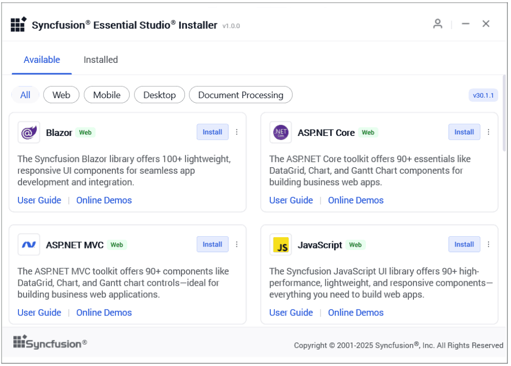
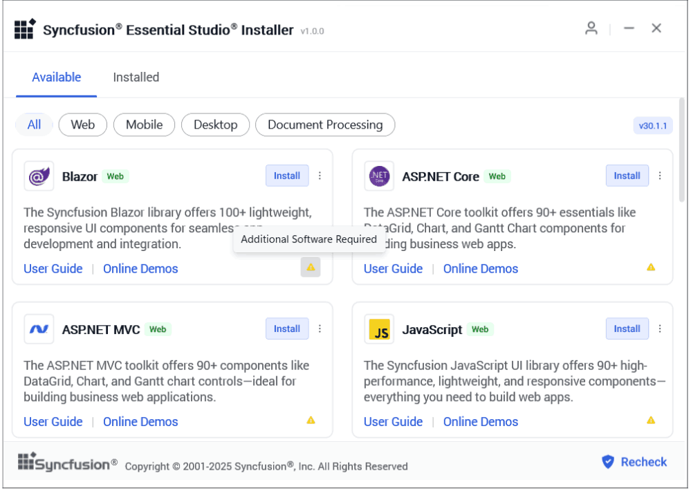
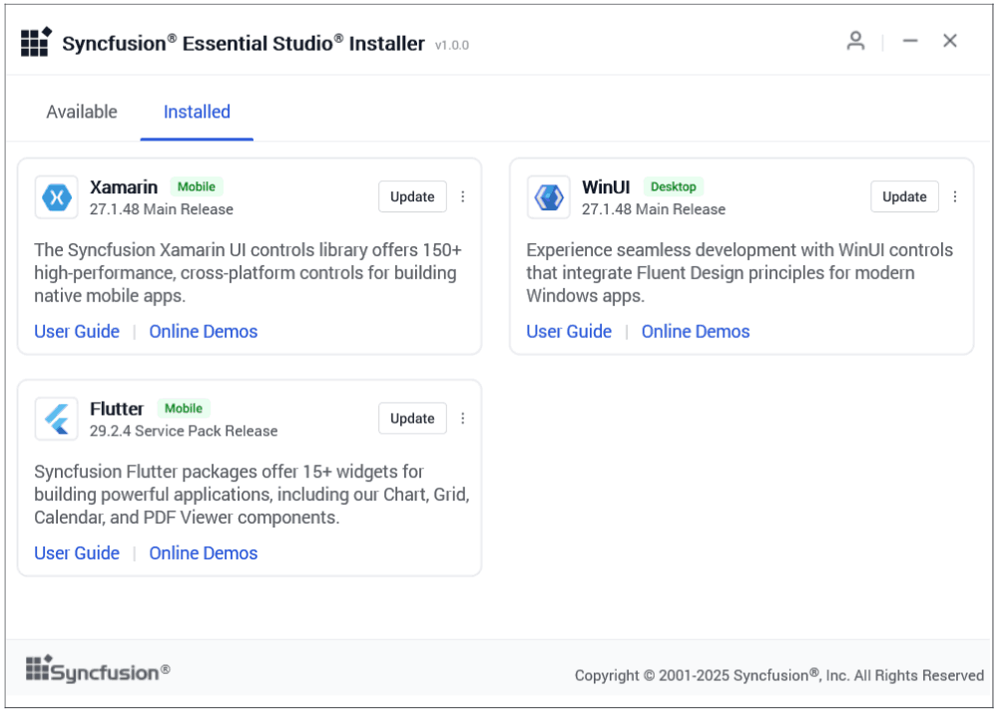
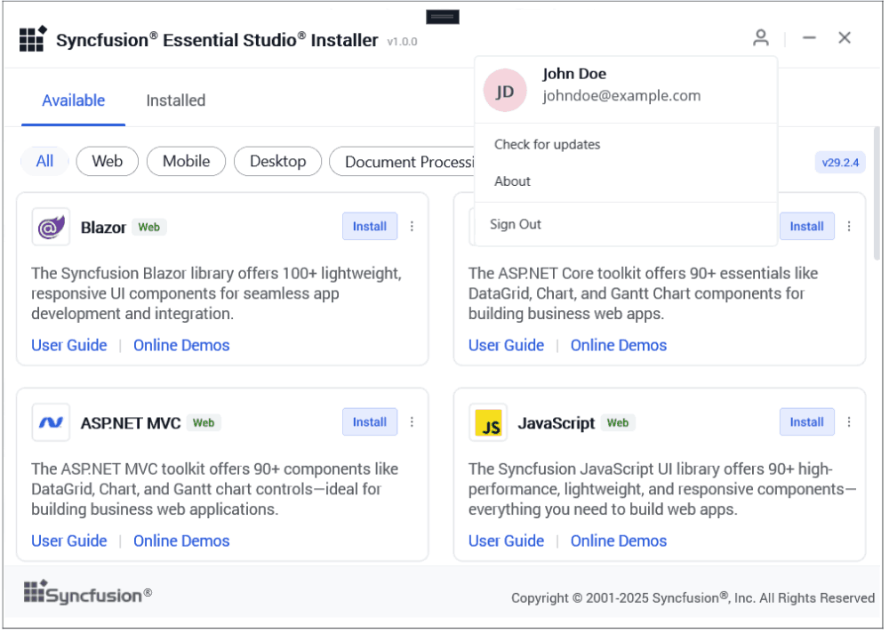

# Installing Syncfusion&reg; Essential Studio&reg; Installer

## Overview

Syncfusion&reg; provides Installer for Essential Studio&reg; products. This installer simplifies the setup process by allowing you to select and install only the required products and components. Instead of downloading a large package, the installer is lightweight and downloads the selected products during installation. You can get the most recent version of Essential Studio&reg; Installer [here](https://www.syncfusion.com/downloads/latest-version).

Syncfusion&reg; Essential Studio&reg; Installer also allows both installation and uninstallation of the products for that specific version.
	
**Web**

* ASP.NET MVC
* ASP.NET Core
* JavaScript
* Blazor

**Mobile**

* .NET MAUI
* Xamarin
* Flutter

**Desktop**

* Windows Forms
* WPF
* Universal Windows Platform
* WinUI

**FileFormats**

* Word
* PDF
* Powerpoint
* Excel

## Installation

The steps below show how to install Essential Studio&reg; installer.

1.  Open the Syncfusion&reg; Essential Studio&reg; Installer file from downloaded location by double-clicking it. The Installer Wizard automatically opens and extracts the package.

    

    
    N> The installer wizard extracts the SyncfusionEssentialStudioInstaller_{version}.exe package and displays a dialog indicating the progress of the extraction process.

2. The login wizard will appear, where you must enter your Syncfusion® email and password (or sign in with Google or Microsoft), sign up if you don’t have an account, agree to the license terms and privacy policy by selecting the checkbox before clicking Sign In.

    
	 

	I> All Syncfusion® products are available for both trial and licensed users. Trial users can install only the latest version, while licensed users have access to the latest version and the 7 previous versions (a total of 8 versions).

### Platform Wizard

1.  After signing in, the Platform Wizard will appear with the **Available** tab showing all latest version products, you can install individual product by clicking Install next to each one or perform multiple installations simultaneously.
    
	<em>**Available**</em>
	
    
	

	I> If the required software of the selected platform was not already installed, **Additional Software Required** alert will be displayed. However, you can continue the installation and install the required software later.

    <em>**Required Software**</em>
	
	

    
    N> If the required software has been installed, click the **Recheck** button. This will verify the presence of the required software and remove the alert icon if the required software is found.

2.  All installed products will be displayed under the Installed tab, where you can also choose specific products to uninstall. If an older version of a product is installed, you can click **Update** to install the latest version from the **Installed** tab.
    	
	<em>**Installed**</em>
	
	

3.  If you click the **Update** button, a license terms and privacy policy pop-up will appear; once you agree to it, the product will be updated to the latest version.

     

     <em>**Three-Dot Menu Options**</em>
	
	

4.  In the three-dot menu options for each product, you can access the Control Panel, Settings tab, Available Version tab, What's New site, Release Notes, and API Reference for quick navigation and detailed information.

### Settings Wizard

1.  You can navigate to the **Settings Wizard** through the three-dot menu options in either the **Available** or **Installed** tab. In the Settings Wizard, you can customize various paths such as the download location, installation location, and demo location using the **Browse** button, then click **Install** to proceed with the product installation using the updated configuration.

	<em>**Settings**</em>

    

    <em>**Available Version**</em>

2.  The **Available Version** tab displays the **latest version** and the **previous 7 versions** of each product for installation.

    

    N> For **trial users**, only the **latest version** is displayed. For **licensed users**, the **latest version** along with the **previous 7 versions** is available.
    
    <em>**About**</em>

3.  The **About** page contains an **overview** of the product and links to its **resources**.

    

## Uninstallation

1.  To uninstall a product, click the **three-dot menu** next to the product, select **Uninstall**, and when the uninstall pop-up appears, click **Uninstall** again to begin the uninstallation process.

    

2.  You can uninstall a product from the **Available Version** tab, where installed versions are shown with an **Installed** tag.

    

    N> You can perform simultaneous uninstallation processes from both the **Installed** tab and the **Available Version** tab.

## User Profile Menu

1. The **User Profile Menu**, accessed by clicking the user icon, provides options to view your name and email, **check for updates**, access the **about** section, and **sign out**.

    

    I> You can view the latest updates available for the Installer using the **Check for Updates** option and To install the update, you can proceed either from the **Check for Updates** pop-up or the **About** section.

## Launch Control Panel

1.  To launch the Control Panel, click the **three-dot menu** next to the installed product and select **Launch Control Panel**.

    

    N> You can launch the Control Panel for installed products from the **Installed** tab or the **Available Version** tab via the three-dot menu options.
