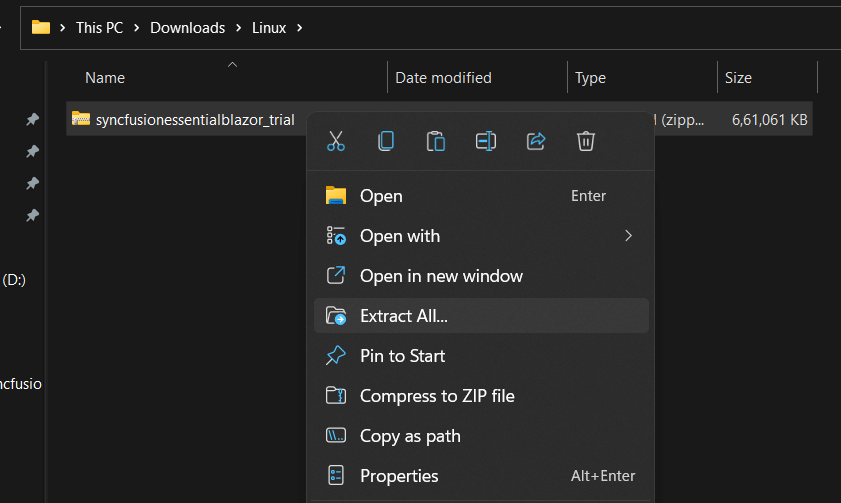
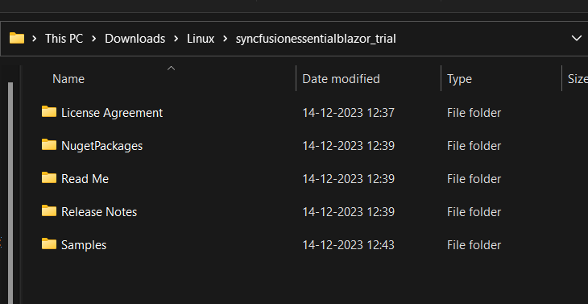

# Installing Syncfusion Essential Studio Linux installer

## Step-by-Step Installation

The steps below show how to install Essential Studio Linux installer.

1. Extract the Syncfusion Essential Studio Linux installer(.zip) file. The files are extracted in your machine.

   
   

2. The Linux zip file contains the following folders.

      
   
   N> The Unlock key is not required to install the Linux installer.

4. You can launch the demo source and use the NuGet packages included in the Linux installer.

5. Run the following command in linux machine to deploy the ASP.NET Core samples
 
  **dotnet restore projectname -s \nuget** in order to restore.

## License key registration in samples

After the installation, the license key is required to register the demo source that is included in the Linux installer. To learn about the steps for license registration for each Linux installer, please refer to the following table.

<table>
<tr>
<th>Linux Installer</th>
<th>Registration steps</th>
</tr>
<tr>
<td>ASPNET CORE (Essential JS 2)</td>
<td>Register the license key in Configure method of {{ '[Startup.cs](https://help.syncfusion.com/common/essential-studio/licensing/how-to-register-in-an-application#aspnet-core)' | markdownify }}</td>
</tr>
<tr>
<td>Blazor</td>
<td>For server side application register the license key in Configure method of {{ '[Startup.cs](https://help.syncfusion.com/common/essential-studio/licensing/how-to-register-in-an-application#server-side-application)' | markdownify }}  Register the license key in the {{ '[Program.cs](https://help.syncfusion.com/common/essential-studio/licensing/how-to-register-in-an-application#server-side-application-using-net-60)' | markdownify }} file if you created the Blazor server side application with Visual Studio 2022 and .NET 6.0.  For client side application register the license key in main method of {{ '[Program.cs](https://help.syncfusion.com/common/essential-studio/licensing/how-to-register-in-an-application#client-side-application)' | markdownify }}</td>
</tr>
<tr>
<td>Flutter</td>
<td>If you are using Syncfusion controls prior to version 18.3.0.x, please follow the following steps to register your license key.  Register the license key in the {{ '[main method](https://help.syncfusion.com/common/essential-studio/licensing/how-to-register-in-an-application#flutter)' | markdownify }} of your example and import the ‘syncfusion_flutter_core/core.dart’ library.</td>
</tr>
<tr>
<td>JavaScript (Essential JS 2)</td>
<td>Only from 2022 Vol 1 v20.1.0.47, {{ '[license key registration](https://help.syncfusion.com/common/essential-studio/licensing/how-to-register-in-an-application#javascript-essential-js-2)' | markdownify }} required for Essential JavaScript 2 products.</td>
</tr>
<tr>
<td>.NET MAUI</td>
<td>Register the license key in {{ '[App.xaml.cs](https://help.syncfusion.com/common/essential-studio/licensing/how-to-register-in-an-application#net-maui)' | markdownify }} constructor before InitializeComponent().</td>
</tr>
</table>

N> Syncfusion provides the Linux installer for the following Essential Studio products.

* Blazor
* Flutter
* ASP.NET Core
* JavaScript
* File Formats
* PDF Framework
* Word Framework
* Excel Framework
* PowerPoint Framework