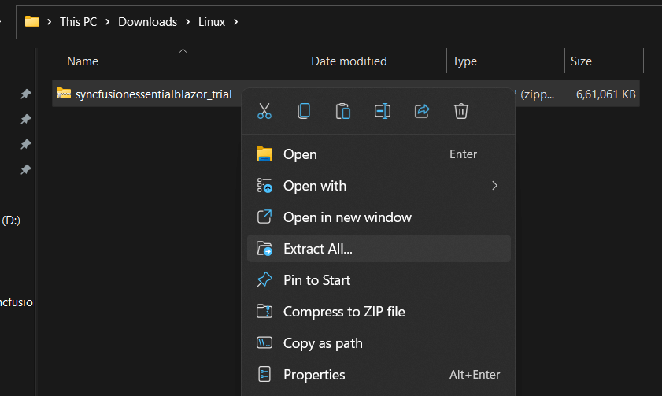
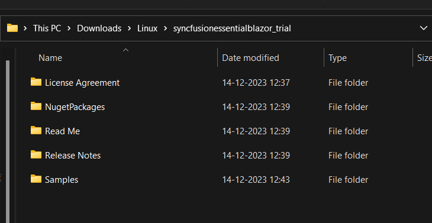

# Installing Syncfusion® Essential Studio® Linux installer

## Step-by-Step Installation

The steps below show how to install Essential Studio<sup style="font-size:70%">&reg;</sup> Linux installer.

1. Extract the Syncfusion<sup style="font-size:70%">&reg;</sup> Essential Studio<sup style="font-size:70%">&reg;</sup> Linux installer (.zip) file. The files are extracted to your machine.

   


2. The extracted Linux installer contains the following folders.

   

   N> An unlock key is not required to install the Linux installer.


3. You can launch the demo source and use the NuGet packages included in the Linux installer.

4. Run the following command on the Linux machine to restore the NuGet packages for the ASP.NET Core samples:

   ```bash
   dotnet restore <projectname> -s <nuget-source>
   ```

## License key registration in samples

After the installation, the license key is required to register the demo source that is included in the Linux installer. To learn about the steps for license registration for each Linux installer, please refer to the following table.

N> The license key registration is not required when using samples from the licensed Linux installer.

<table>
<tr>
<th>Linux Installer</th>
<th>Registration steps</th>
</tr>
<tr>
<td>ASPNET CORE (Essential<sup style="font-size:70%">&reg;</sup> JS 2)</td>
<td>Register the license key in Configure method of {{ '[Startup.cs](https://help.syncfusion.com/common/essential-studio/licensing/how-to-register-in-an-application#aspnet-core)' | markdownify }}</td>
</tr>
<tr>
<td>Blazor</td>
<td>For server side application register the license key in Configure method of {{ '[Startup.cs](https://help.syncfusion.com/common/essential-studio/licensing/how-to-register-in-an-application#server-side-application)' | markdownify }}<br /><br />Register the license key in the {{ '[Program.cs](https://help.syncfusion.com/common/essential-studio/licensing/how-to-register-in-an-application#server-side-application-using-net-60)' | markdownify }} file if you created the Blazor server side application with Visual Studio 2022 and .NET 6.0.<br /><br />For client side application register the license key in main method of {{ '[Program.cs](https://help.syncfusion.com/common/essential-studio/licensing/how-to-register-in-an-application#client-side-application)' | markdownify }}</td>
</tr>

<tr>
<td>JavaScript (Essential<sup style="font-size:70%">&reg;</sup> JS 2)</td>
<td>Only from 2022 Vol 1 v20.1.0.47, {{ '[license key registration](https://help.syncfusion.com/common/essential-studio/licensing/how-to-register-in-an-application#javascript-essential-js-2)' | markdownify }} required for Essential<sup style="font-size:70%">&reg;</sup> JavaScript 2 products.</td>
</tr>
<tr>
<td>.NET MAUI</td>
<td>Register the license key in {{ '[App.xaml.cs](https://help.syncfusion.com/common/essential-studio/licensing/how-to-register-in-an-application#net-maui)' | markdownify }} constructor before InitializeComponent().</td>
</tr>
</table>


N> Syncfusion<sup style="font-size:70%">&reg;</sup> provides the Linux installer for the following Essential Studio<sup style="font-size:70%">&reg;</sup> products:

* Blazor
* ASP.NET Core
* JavaScript
* Document SDK
* PDF Viewer SDK
* Spreadsheet Editor SDK
* DOCX Editor SDK
* Scheduler SDK
* Gantt SDK
* Rich Text Editor SDK
* Grid SDK
* Chart SDK
* Diagram SDK
* File Manager SDK