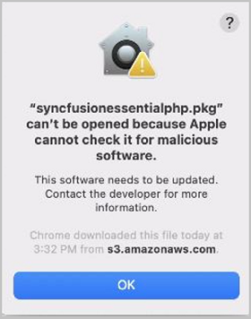
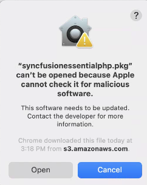
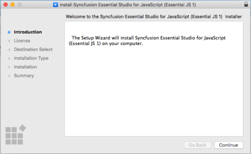
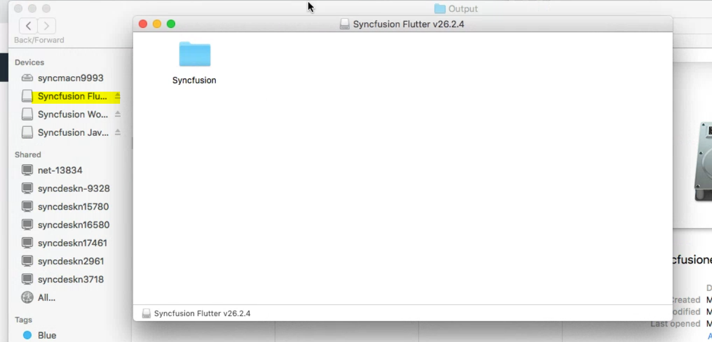
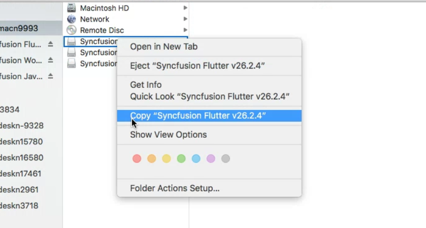
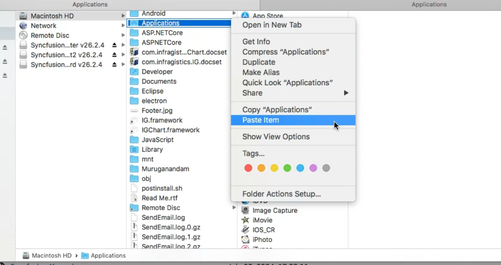
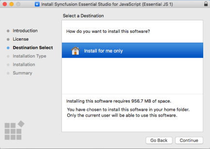
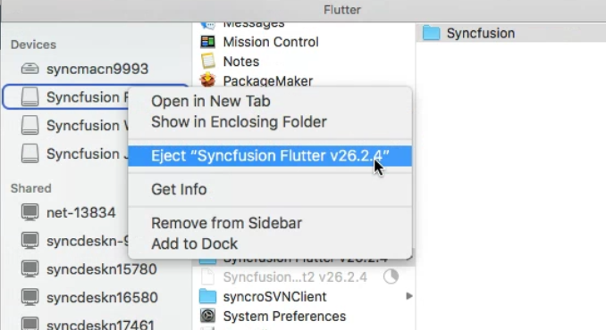

# Installing Syncfusion&reg; Essential Studio&reg; Mac installer

## Overview

Syncfusion&reg; provides the Mac installer for the following Essential Studio&reg; products.

* ASP.NET Core
* Blazor
* Flutter
* JavaScript
* WebKit HTML Converter
* Xamarin
* .NET MAUI
* FileFormats
* PDF Framework
* Excel Framework
* Word Framework
* PowerPoint Framework 

## Steps to resolve the warning message in Catalina OS or later

   While running Essential Studio&reg; Mac Installers on Catalina MacOS or later, the below alert will be displayed.

     
     
   If you receive this alert, follow the below steps for the easiest solution.   

   1.	Right-click the downloaded dmg file.
   2.	Select the "Open With" option and choose "DiskImageMounter (Default)". The following pop-up appears.

		

   3.	When you click "Open" the installer window will be opened.

## Step-by-Step Installation

The steps below show how to install Essential Studio&reg; Mac installer.

1. Locate the downloaded dmg file and open the file by double click on it.

   
   

2. This action will automatically mount the disk image and create a virtual drive on your desktop or in the Finder sidebar.

      
   

3. Copy the mounted disk file.

   
   
   
4. And paste it in "Applications" folder shortcut.

   
   
   N> The Unlock key is not required to install the Mac installer. The Syncfusion&reg; Mac installer can be used for development purposes without registering the Unlock key.

5. Now you can open the folder to explore the Syncfusion&reg; Essential Studio&reg; Mac installer.

   
   

6. To remove the DMG file, right-click on the virtual drive on your desktop or in the Finder sidebar and select "Eject." Also delete the folder from the Applications

   

## License key registration in samples

After the installation, the license key is required to register the demo source that is included in the Mac installer. To learn about the steps for license registration for each Mac installer, please refer to the following table.

<table>
<tr>
<th>Mac Installer</th>
<th>Registration steps</th>
</tr>
<tr>
<td>ASPNET CORE (Essential&reg; JS 2)</td>
<td>Register the license key in Configure method of {{ '[Startup.cs](https://help.syncfusion.com/common/essential-studio/licensing/how-to-register-in-an-application#aspnet-core)' | markdownify }}</td>
</tr>
<tr>
<td>Blazor</td>
<td>For server side application register the license key in Configure method of {{ '[Startup.cs](https://help.syncfusion.com/common/essential-studio/licensing/how-to-register-in-an-application#server-side-application)' | markdownify }}  Register the license key in the {{ '[Program.cs](https://help.syncfusion.com/common/essential-studio/licensing/how-to-register-in-an-application#server-side-application-using-net-60)' | markdownify }} file if you created the Blazor server side application with Visual Studio 2022 and .NET 6.0.  For client side application register the license key in main method of {{ '[Program.cs](https://help.syncfusion.com/common/essential-studio/licensing/how-to-register-in-an-application#client-side-application)' | markdownify }}</td>
</tr>
<tr>
<td>Flutter</td>
<td>If you are using Syncfusion&reg; controls prior to version 18.3.0.x, please follow the following steps to register your license key.  Register the license key in the {{ '[main method](https://help.syncfusion.com/common/essential-studio/licensing/how-to-register-in-an-application#flutter)' | markdownify }} of your example and import the ‘syncfusion_flutter_core/core.dart’ library.</td>
</tr>
<tr>
<td>JavaScript (Essential&reg; JS 2)</td>
<td>Only from 2022 Vol 1 v20.1.0.47, {{ '[license key registration](https://help.syncfusion.com/common/essential-studio/licensing/how-to-register-in-an-application#javascript-essential-js-2)' | markdownify }} required for Essential&reg; JavaScript 2 products.</td>
</tr>
<tr>
<td>.NET MAUI</td>
<td>Register the license key in {{ '[App.xaml.cs](https://help.syncfusion.com/common/essential-studio/licensing/how-to-register-in-an-application#net-maui)' | markdownify }} constructor before InitializeComponent().</td>
</tr>
<tr>
<td>Xamarin</td>
<td>For Xamarin.Forms, register the license key in {{ '[App.xaml.cs](https://help.syncfusion.com/common/essential-studio/licensing/how-to-register-in-an-application#xamarinforms)' | markdownify }} constructor before InitializeComponent().  For Xamarin.Android, register the license key in {{ '[OnCreate](https://help.syncfusion.com/common/essential-studio/licensing/how-to-register-in-an-application#xamarinandroid)' | markdownify }} override method of your main activity class before initializing any Syncfusion control.  For Xamarin.iOS, register the license key in FinishedLaunching override method of {{ '[AppDelegate.cs](https://help.syncfusion.com/common/essential-studio/licensing/how-to-register-in-an-application#xamarinios)' | markdownify }}</td>
</tr></table>