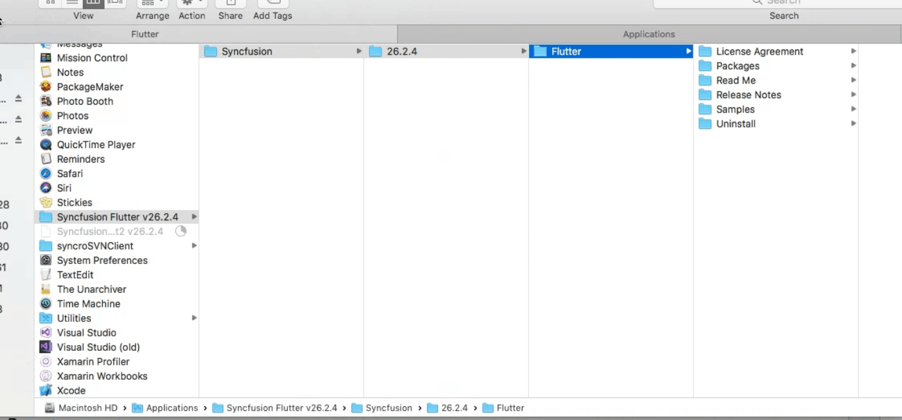

# Installing Syncfusion Essential Studio Mac installer

## Overview

Syncfusion provides the Mac installer for the following Essential Studio products.

* ASP.NET Core
* Blazor
* Flutter
* JavaScript
* WebKit HTML Converter
* Xamarin
* .NET MAUI

## Steps to resolve the warning message in Catalina OS or later

   While running Essential Studio Mac Installers on Catalina MacOS or later, the below alert will be displayed.

     
     
   If you receive this alert, follow the below steps for the easiest solution.   

   1.	Right-click the downloaded pkg file.
   2.	Select the "Open With" option and choose "Installer (Default)". The following pop-up appears.

		

   3.	When you click "Open" the installer window will be opened.

## Step-by-Step Installation

The steps below show how to install Essential Studio Mac installer. 

1. Open the Syncfusion Essential Studio Mac installer(.pkg) file. The installer Wizard opens. Click Continue.

   
   

2. The Software License Agreement wizard will appear. Click the Continue button.

      
   

3. The License Agreement's Confirmation window will appear. If you have read the Software License Agreement, click **Agree**.

   
   
   N> The Unlock key is not required to install the Mac installer. The Syncfusion Mac installer can be used for development purposes without registering the Unlock key.

4. The Destination select wizard will appear. You can choose which disc to install the Syncfusion Essential Studio Mac installer on here.

   

5. The Installation Type wizard will appear. Click Install to begin the standard installation of the Syncfusion Essential Studio Mac installer.

   

6. The Authentication window will appear. To begin the installation, enter the Mac machine's password and click **Install Software**.

   

7. The installation process will begin on your machine. 
   
   
   
8. Once the installation is complete, the completed screen will be displayed. To exit the installation wizard, click Close. 

   
   
   By default, Mac installer will install the files in following location.

   **Location:** {Documents}\Syncfusion\ {version}\ {platform}
   
   

## License key registration in samples

After installation, the license key is required to register the samples included in the Mac installer. To learn about the steps for license registration for each platform, please refer to the following table.

<table>
<tr>
<th>Mac Platform</th>
<th>Registration steps</th>
</tr>
<tr>
<td>ASPNET CORE (Essential JS 2)</td>
<td>Register the license key in Configure method of [Startup.cs](https://help.syncfusion.com/common/essential-studio/licensing/how-to-register-in-an-application#aspnet-core)</td>
</tr>
<tr>
<td>Blazor</td>
<td>Register the license key in Configure method of [Startup.cs](https://help.syncfusion.com/common/essential-studio/licensing/how-to-register-in-an-application#aspnet-core) for server side application. Register the license key in the [Program.cs](https://help.syncfusion.com/common/essential-studio/licensing/how-to-register-in-an-application#server-side-application-using-net-60) file if you created the Blazor server side application with Visual Studio 2022 and .NET 6.0. Register the license key in main method of [Program.cs](https://help.syncfusion.com/common/essential-studio/licensing/how-to-register-in-an-application#client-side-application)</td>
</tr>
<tr>
<td>Flutter</td>
<td>If you are using Syncfusion controls prior to version 18.3.0.x, please follow the following steps to register your license key. Register the license key in the [main method](https://help.syncfusion.com/common/essential-studio/licensing/how-to-register-in-an-application#flutter) of your example and import the ‘syncfusion_flutter_core/core.dart’ library.</td>
</tr>
<tr>
<td>JavaScript (Essential JS 2)</td>
<td>Only from 2022 Vol 1 v20.1.0.47, [license key registration](https://help.syncfusion.com/common/essential-studio/licensing/how-to-register-in-an-application#javascript-essential-js-2) required for Essential JavaScript 2 products.</td>
</tr>
<tr>
<td>.NET MAUI</td>
<td>Register the license key in [App.xaml.cs](https://help.syncfusion.com/common/essential-studio/licensing/how-to-register-in-an-application#net-maui) constructor before InitializeComponent().</td>
</tr>
<tr>
<td>Xamarin</td>
<td>For Xamarin.Forms, register the license key in [App.xaml.cs](https://help.syncfusion.com/common/essential-studio/licensing/how-to-register-in-an-application#xamarinforms) constructor before InitializeComponent(). For Xamarin.Android, register the license key in [OnCreate](https://help.syncfusion.com/common/essential-studio/licensing/how-to-register-in-an-application#xamarinandroid) override method of your main activity class before initializing any Syncfusion control. For Xamarin.iOS, register the license key in FinishedLaunching override method of [AppDelegate.cs](https://help.syncfusion.com/common/essential-studio/licensing/how-to-register-in-an-application#xamarinios)</td>
</tr></table>