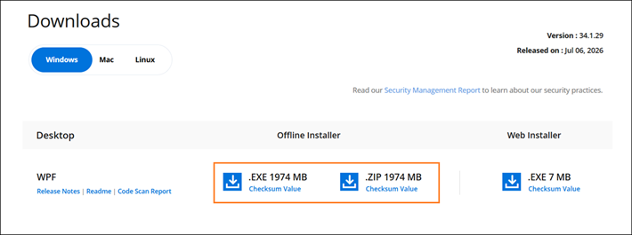
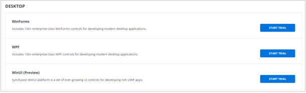

---
layout: post
title: Downloading Syncfusion Essential Studio offline installer - Syncfusion
description: Learn how to download the Syncfusion Essential Studio offline installer from our website with a license.
platform: common
documentation: ug
--- 

# Download Syncfusion&reg; Essential Studio&reg; Offline Installer

The Syncfusion&reg; installer can be downloaded from the [Syncfusion&reg;](https://www.syncfusion.com/) website. You can either download the licensed installer or try our trial installer depending on whether you have a license or want to evaluate the product.

## Prerequisites

Before downloading the offline installer, ensure the following:

- A valid Syncfusion&reg; account (sign up for free if you do not have one).
- Sufficient disk space: at least 10 GB free.
- Administrator privileges on the machine where you plan to install.

You can download the Syncfusion&reg; installer from the [Syncfusion.com](https://www.syncfusion.com/) website.

## Download the Trial Version

Our 30-day trial can be downloaded in two ways.

* Download Free Trial Setup
* Start Trials if using components through [NuGet.org](https://www.nuget.org/packages?q=syncfusion)

### Download Free Trial Setup

1. Sign in to your Syncfusion&reg; account on the [Download Free Trial](https://www.syncfusion.com/downloads) page and select the product.
2. After completing the required form or logging in with your registered Syncfusion&reg; account, verify your email address if prompted, and download the trial installer from the confirmation page (as shown in the screenshot below).

   
   
3. With a trial license, only the latest version's trial installer can be downloaded.
4. Before the trial expires, you can download the trial installer at any time from your registered account's [Trials & Downloads](https://www.syncfusion.com/account/manage-trials/downloads) page (as shown in the screenshot below).
 
   

5. Click the More Download Options (element 2 in the screenshot shown above) button to get the Essential Studio&reg; Product Offline trial installer, which is available in EXE and ZIP format.

   

6. After downloading, the Syncfusion&reg; trial installer can be unlocked using either the trial unlock key or the Syncfusion&reg; registered login credential. More information on generating an unlock key can be found in [this](https://www.syncfusion.com/kb/8069/how-to-generate-unlock-key-for-essentials-studio-products) article.

### Start Trials if using components through [NuGet.org](https://www.nuget.org/packages?q=syncfusion)

You should initiate an evaluation if you have already obtained our components through [NuGet.org](https://www.nuget.org/packages?q=syncfusion).

1. Sign in to your Syncfusion&reg; account, then visit the [Start Trial](https://www.syncfusion.com/account/manage-trials/start-trials) page.

   N> You can generate the license key for your active trial products from the [Trials & Downloads](https://www.syncfusion.com/account/manage-trials/downloads) page. This license key will be mandatory to use our trial products in your application. To know more about the License key, refer to this [help topic](https://help.syncfusion.com/common/essential-studio/licensing/overview).
	
   
   
2. To access this page, you must sign up/log in with your Syncfusion&reg; account.
3. Begin your trial by selecting the Syncfusion&reg; product.

   N> If you've already used the trial products and they haven't expired, you won't be able to start the trial for the same product again.

4. After you've started the trial, go to the [Trials & Downloads](https://www.syncfusion.com/account/manage-trials/downloads) page to get the latest version's trial installer. You can generate the [unlock key](https://www.syncfusion.com/kb/8069/how-to-generate-unlock-key-for-essentials-studio-products) and [license key](https://help.syncfusion.com/common/essential-studio/licensing/how-to-generate) here at any time before the trial period expires (as shown in the screenshot below).

   

5. You can find your current active trial products on the [Trials & Downloads](https://www.syncfusion.com/account/manage-trials/downloads) page.
   

## Download the License Version

1. Sign in to your Syncfusion&reg; account. The licensed products will be available on the [License & Downloads](https://www.syncfusion.com/account/downloads) page.
2. You can view all the licenses (both active and expired) associated with your account.
3. For Windows OS, EXE and ZIP formats are available for download. They are both offline installers.

    

4. Click the Download (element 1 in the screenshot above) button to download the respective product's installer. The most recent version of the installer will be downloaded from this page.
5. To download older version installers, go to [Downloads Older Versions](https://www.syncfusion.com/account/downloads/studio) (element 2 in the screenshot above).
6. You can download other platform/add-on installers by going to More Downloads Options (element 3 in the screenshot above).

	

## Troubleshooting

- **Installer fails to download:** Check your internet connection and retry. If the issue persists, clear your browser cache or try a different browser.
- **Older version not listed:** Use the [Downloads Older Versions](https://www.syncfusion.com/account/downloads/studio) page to access installers for prior releases.

## See Also

You can also refer to the [Offline Installer installation guide](https://help.syncfusion.com/common/essential-studio/installation/offline-installer/how-to-install) for step-by-step installation guidelines.
