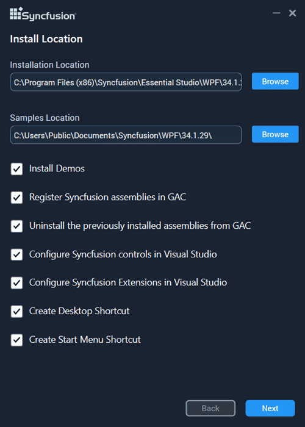
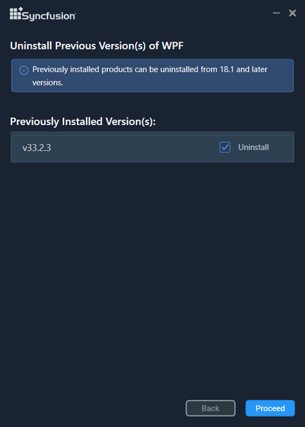
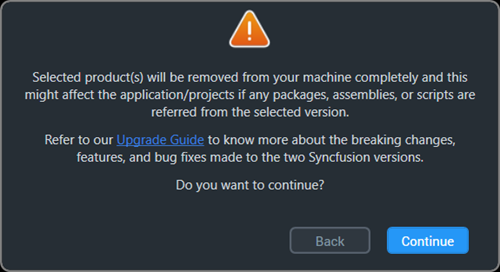
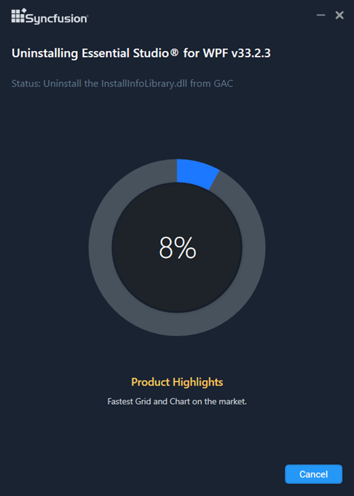
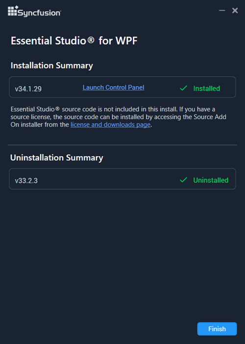

# Installing Syncfusion<sup style="font-size:70%">&reg;</sup> Essential Studio<sup style="font-size:70%">&reg;</sup> Offline Installer

## Prerequisites

Before you begin, ensure the following:

- You have downloaded the Syncfusion<sup style="font-size:70%">&reg;</sup> Essential Studio<sup style="font-size:70%">&reg;</sup> offline installer (EXE or ZIP) for your platform.
- You have administrator privileges on the machine.
- All Visual Studio instances and Syncfusion<sup style="font-size:70%">&reg;</sup> applications are closed during installation.
- At least 10 GB of free disk space.
- A valid Syncfusion<sup style="font-size:70%">&reg;</sup> account or unlock key.

## Overview

Syncfusion<sup style="font-size:70%">&reg;</sup> provides separate installers for all the Essential Studio<sup style="font-size:70%">&reg;</sup> products. You can download the latest version platforms Installer [here](https://www.syncfusion.com/downloads/latest-version).

**Web**

* ASP.NET MVC
* ASP.NET Core
* JavaScript
* Blazor

**Mobile**

* .NET MAUI

**Desktop**

* Windows Forms
* WPF
* Universal Windows Platform
* WinUI

**Document Processing**

* Document SDK
* PDF Viewer SDK
* Spreadsheet Editor SDK
* DOCX Editor SDK

**Standalone UI SDKS**

* Scheduler SDK
* Gantt SDK
* Rich Text Editor SDK
* Grid SDK
* Chart SDK
* Diagram SDK
* File Manager SDK

N> * Universal Windows Platform can be installed in Windows 8.1 and later.
## Step-by-Step Installation

The steps below show how to install the Essential Studio<sup style="font-size:70%">&reg;</sup> Product installer.

1.  Open the Syncfusion<sup style="font-size:70%">&reg;</sup> Product offline installer file from the downloaded location by double-clicking it. The Installer Wizard automatically opens and extracts the package.

    
2.  To unlock the Syncfusion<sup style="font-size:70%">&reg;</sup> offline installer, you have two options:

    * *Login To Install*

    * *Use Unlock Key*

    **Login To Install**

    You must enter your Syncfusion<sup style="font-size:70%">&reg;</sup> email address and password. If you don't already have a Syncfusion<sup style="font-size:70%">&reg;</sup> account, you can sign up for one by clicking **"Create an account"**. If you have forgotten your password, click on **"Forgot Password"** to create a new one. Once you've entered your Syncfusion<sup style="font-size:70%">&reg;</sup> email and password, click **Next**.

        

    **Use Unlock Key**

    Unlock keys are used to unlock the Syncfusion<sup style="font-size:70%">&reg;</sup> offline installer, and they are platform- and version-specific. You should use either a Syncfusion<sup style="font-size:70%">&reg;</sup> licensed or trial unlock key to unlock the Syncfusion<sup style="font-size:70%">&reg;</sup> Product installer.

    The trial unlock key is only valid for 30 days, and the installer will not accept an expired trial key. 

    To learn how to generate an unlock key for both trial and licensed products, see [this](https://www.syncfusion.com/kb/2326) Knowledge Base article.

        

3.  After reading the License Terms and Privacy Policy, select the **"I agree to the License Terms and Privacy Policy"** check box. Click **Next** to continue.

4.  Change the install and sample locations here. You can also change the additional settings. Click **Next** to proceed, then click **Install** on the Ready to Install screen.

    

    **Additional Settings**

    * Select the **Install Demos** check box to install Syncfusion<sup style="font-size:70%">&reg;</sup> samples, or leave the check box unchecked if you do not want to install Syncfusion<sup style="font-size:70%">&reg;</sup> samples.
    * Select the **Register Syncfusion<sup style="font-size:70%">&reg;</sup> Assemblies in GAC** check box to install the latest Syncfusion<sup style="font-size:70%">&reg;</sup> assemblies in GAC, or clear this check box when you do not want to install the latest assemblies in GAC.
    * Select the **Configure Syncfusion<sup style="font-size:70%">&reg;</sup> controls in Visual Studio** check box to configure the Syncfusion<sup style="font-size:70%">&reg;</sup> controls in the Visual Studio toolbox, or clear this check box when you do not want to configure the Syncfusion<sup style="font-size:70%">&reg;</sup> controls in the Visual Studio toolbox during installation. Note that you must also select the Register Syncfusion<sup style="font-size:70%">&reg;</sup> Assemblies in GAC check box.
    * Select the **Configure Syncfusion<sup style="font-size:70%">&reg;</sup> Extensions in Visual Studio** check box to install the Syncfusion<sup style="font-size:70%">&reg;</sup> Visual Studio extensions (project templates, converters, and toolbox helpers), or clear this check box when you do not want to configure the Syncfusion<sup style="font-size:70%">&reg;</sup> extensions in Visual Studio.
    * Select the **Create Desktop Shortcut** check box to add a desktop shortcut for the Syncfusion<sup style="font-size:70%">&reg;</sup> Control Panel.
    * Select the **Create Start Menu Shortcut** check box to add a shortcut to the start menu for the Syncfusion<sup style="font-size:70%">&reg;</sup> Control Panel.

5.  If any previous versions of the current product are installed, the Uninstall Previous Version(s) wizard will open. Select the check boxes for the previous versions you want to uninstall, then click **Proceed**.

    

    N> Starting with the 2021 Volume 1 release (v18.1), Syncfusion<sup style="font-size:70%">&reg;</sup> has added the option to uninstall previous versions while installing the new version.

    N> If any version is selected to uninstall, a confirmation screen will appear. If you confirm, the Progress screen will display the uninstall and install progress, respectively. If none of the versions are chosen to be uninstalled, only the installation progress will be displayed.

    **Confirmation Alert**

    

    **Uninstall Progress**

    

    **Install Progress**

    

    N> The Completed screen is displayed once the product is installed. If any version was selected to uninstall, the Completed screen will display both install and uninstall status.

    

6.  After installing, click the **Launch Control Panel** link to open the Syncfusion<sup style="font-size:70%">&reg;</sup> Control Panel.

7.  Click **Finish**. Your system has been installed with the Syncfusion<sup style="font-size:70%">&reg;</sup> Essential Studio<sup style="font-size:70%">&reg;</sup> Product.

## Installing in silent mode

Silent mode is useful for scripted or unattended deployments across multiple machines. The Syncfusion<sup style="font-size:70%">&reg;</sup> Essential Studio<sup style="font-size:70%">&reg;</sup> Product Installer supports installation and uninstallation via the command line.

N> The offline installer is a self-extracting wrapper. When you run it, it extracts an inner `SyncfusionEssentialStudio(platform)_(version).exe` to the `%temp%` directory, which is the actual installer used in silent mode.

### Extract the inner installer

1.  Run the Syncfusion<sup style="font-size:70%">&reg;</sup> Product installer by double-clicking it. The Installer Wizard automatically opens and extracts the package.
2.  The `syncfusionessential(product)_(version).exe` file will be extracted into the Temp directory.
3.  Open the Run dialog (`Win+R`) and enter `%temp%`. The Temp folder will open. The `syncfusionessential(product)_(version).exe` file will be located in one of the folders.
4.  Copy the extracted `syncfusionessential(product)_(version).exe` file to a local drive.
5.  Exit the Wizard.

### Command Line Installation

The Syncfusion<sup style="font-size:70%">&reg;</sup> Essential Studio<sup style="font-size:70%">&reg;</sup> Product can be installed silently using the command line. First, follow the steps in [Extract the inner installer](#extract-the-inner-installer) to obtain the inner EXE.

1.  Run Command Prompt in administrator mode.
2.  Enter the following arguments:

    **Arguments:**

    ```text
    "installer file path\SyncfusionEssentialStudio(platform)_(version).exe" /install silent /UNLOCKKEY:"(product unlock key)" [/log "{Log file path}"] [/InstallPath:{Location to install}] [/InstallSamples:{true/false}] [/InstallAssemblies:{true/false}] [/UninstallExistAssemblies:{true/false}] [/InstallToolbox:{true/false}]
    ```

    N> Arguments inside square brackets are optional.

    **Parameter reference**

    | Parameter | Required | Description |
    |---|---|---|
    | `installer file path\SyncfusionEssentialStudio(platform)_(version).exe` | Yes | Path to the extracted inner installer. Replace `(platform)` with the target platform (e.g., `WinUI`, `WPF`). |
    | `/install silent` | Yes | Runs the installer in silent (unattended) mode. |
    | `/UNLOCKKEY` | Yes | The licensed or trial unlock key. |
    | `/log` | No | Path to a log file that captures install output. |
    | `/InstallPath` | No | Target installation directory. |
    | `/InstallSamples` | No | `true` installs the demo samples; `false` skips them. |
    | `/InstallAssemblies` | No | `true` installs Syncfusion<sup style="font-size:70%">&reg;</sup> assemblies. |
    | `/UninstallExistAssemblies` | No | `true` removes existing assemblies before installing the new ones. |
    | `/InstallToolbox` | No | `true` configures the Syncfusion<sup style="font-size:70%">&reg;</sup> controls in the Visual Studio toolbox. |

    N> Exit code `0` indicates success; any non-zero value indicates failure. Check the log file (when supplied) for details.

    **Example:**

    ```text
    "D:\Temp\syncfusionessential(product)_x.x.x.x.exe" /install silent /UNLOCKKEY:"product unlock key" /log "C:\Temp\EssentialStudio_Platform.log" /InstallPath:C:\Syncfusion\x.x.x.x /InstallSamples:true /InstallAssemblies:true /UninstallExistAssemblies:true /InstallToolbox:true
    ```

3.  The Essential Studio<sup style="font-size:70%">&reg;</sup> Product is installed.

    N> `x.x.x.x` should be replaced with the Essential Studio<sup style="font-size:70%">&reg;</sup> version, and `product unlock key` must be replaced with the unlock key for that version.

### Command Line Uninstallation

The Syncfusion<sup style="font-size:70%">&reg;</sup> Essential Studio<sup style="font-size:70%">&reg;</sup> Product can be uninstalled silently using the command line. First, follow the steps in [Extract the inner installer](#extract-the-inner-installer) to obtain the inner EXE.

1.  Run Command Prompt in administrator mode.
2.  Enter the following arguments:

**Arguments:**

```text
"Copied installer file path\syncfusionessential(product)_(version).exe" /uninstall silent [/log "{Log file path}"]
```

**Example:**

```text
"D:\Temp\syncfusionessential(product)_x.x.x.x.exe" /uninstall silent /log "C:\Temp\EssentialStudio_Uninstall.log"
```

The Essential Studio<sup style="font-size:70%">&reg;</sup> Product is uninstalled.

## Troubleshooting

- **Installer fails to extract:** Run the EXE as administrator and confirm the destination `%temp%` folder is writable.
- **"Invalid unlock key" error:** Verify the unlock key matches the platform and version of the installer (see the [Knowledge Base article](https://www.syncfusion.com/kb/2326)).
- **Visual Studio not detected:** Close all Visual Studio instances, then run the installer again. The Configure Toolbox option requires a supported Visual Studio version.
- **Installation hangs or fails silently:** Re-run with the `/log` parameter to capture detailed output, then review the log for errors.
- **Trial expired:** Generate a new trial from the [Start Trial](https://www.syncfusion.com/account/manage-trials/start-trials) page or use a licensed unlock key.
