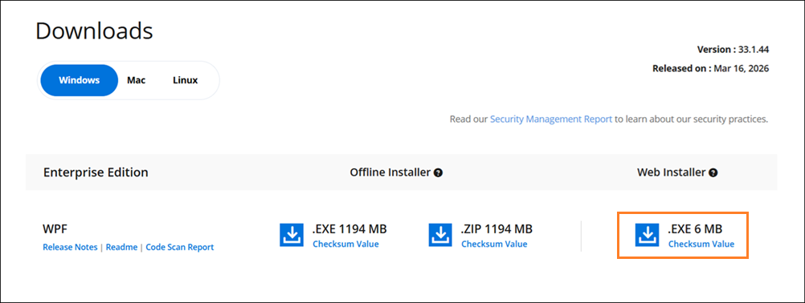
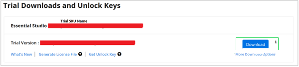
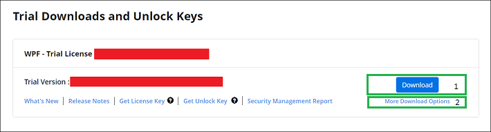

---
layout: post
title: Downloading Syncfusion Essential Studio Web Installer
description: Learn how to download the Syncfusion Essential Studio Web Installer from the Syncfusion website using your license.
platform: common
documentation: ug
keywords: download, web installer, trial, license, Essential Studio
--- 

# Download Syncfusion&reg; Essential Studio&reg; Web Installer

The Syncfusion&reg; installer can be downloaded from the [Syncfusion&reg;](https://www.syncfusion.com/) website. You can either download the licensed installer or try our trial installer depending on your license.

   -	Trial Installer
   -	Licensed Installer

You can download the Syncfusion&reg; installer from the [Syncfusion.com](https://www.syncfusion.com/) website.

N> You must have a registered Syncfusion&reg; account to download the installer. If you do not have one, you can [create a new account](https://www.syncfusion.com/account/register) on the Syncfusion&reg; website.

## Download the Trial Version

Our 30-day trial can be downloaded in two ways.

* Download Free Trial Setup
* [Start Trials if using components through NuGet.org](https://www.nuget.org/packages?q=syncfusion)

N> With a trial license, only the latest version of the trial installer can be downloaded.

### Download Free Trial Setup

1. Visit the [Download Free Trial](https://www.syncfusion.com/downloads) page.
2. Select the product (for example, **Syncfusion&reg; Essential Studio&reg;**) that you want to evaluate.
3. Complete the required form or log in with your registered Syncfusion&reg; account to download the trial installer from the confirmation page (as shown in the screenshot below).

   

4. After downloading, the Syncfusion&reg; trial installer can be unlocked using either the trial unlock key or your Syncfusion&reg; registered login credentials. For more information on generating an unlock key, refer to [this](https://www.syncfusion.com/kb/8069/how-to-generate-unlock-key-for-essentials-studio-products) article. To learn how to use the unlock key in your application, refer to the [License Key generation](https://help.syncfusion.com/common/essential-studio/licensing/how-to-generate) help topic.
5. Before the trial expires, you can download the trial installer at any time from your registered account's [Trials & Downloads](https://www.syncfusion.com/account/manage-trials/downloads) page (as shown in the screenshot below).
6. Click the **Download** (element 1 in the screenshot below) button to get the Syncfusion&reg; Essential Studio&reg; web installer.
 
   

### Start Trials if using components through [NuGet.org](https://www.nuget.org/packages?q=syncfusion)

You should initiate an evaluation if you have already obtained our components through [NuGet.org](https://www.nuget.org/packages?q=syncfusion).

1. Sign up or log in to access the [Start Trial](https://www.syncfusion.com/account/manage-trials/start-trials) page in your account.

   

2. Begin your trial by selecting the Syncfusion&reg; product.

   N> If you've already used the trial products and they haven't expired, you won't be able to start the trial for the same product again.

3. After you've started the trial, go to the [Trials & Downloads](https://www.syncfusion.com/account/manage-trials/downloads) page to get the latest version of the trial installer. You can generate the [unlock key](https://www.syncfusion.com/kb/8069/how-to-generate-unlock-key-for-essentials-studio-products) and [license key](https://help.syncfusion.com/common/essential-studio/licensing/how-to-generate) here at any time before the trial period expires (as shown in the screenshot below).

   

4. Click the **Download** button to get the Syncfusion&reg; Essential Studio&reg; web installer for the trial product you started.
5. You can find your current active trial products on the [Trials & Downloads](https://www.syncfusion.com/account/manage-trials/downloads) page.

   N> You can generate the license key for your active trial products from the [Trials & Downloads](https://www.syncfusion.com/account/manage-trials/downloads) page. This license key will be mandatory to use our trial products in your application. To know more about the License key, refer to this [help topic](https://help.syncfusion.com/common/essential-studio/licensing/overview).
   

## Download the License Version

1. Sign in to your registered Syncfusion&reg; account and open the [License & Downloads](https://www.syncfusion.com/account/downloads) page.
2. You can view all the licenses (active, expired, and pending) associated with your account.
3. Click the **Download** (element 1 in the screenshot below) button to download the respective product's installer.
4. The most recent version of the installer will be downloaded from this page.
5. To download older version installers, go to [Downloads Older Versions](https://www.syncfusion.com/account/downloads/studio) (element 2 in the screenshot below).
6. To download platform-specific or add-on installers, go to **More Downloads Options** (element 3 in the screenshot below).
   
    

7. Click the **Download** button to get the Syncfusion&reg; Essential Studio&reg; web installer (as shown in the screenshot below).
   
   

8. After downloading, the Syncfusion&reg; Essential Studio&reg; web installer can be unlocked using your Syncfusion&reg; registered login credentials. For more information, refer to the [License Key generation](https://help.syncfusion.com/common/essential-studio/licensing/how-to-generate) help topic.
   N> For Syncfusion&reg; trial and licensed products, the same web installer is used. Based on your account license (Trial or Licensed), the installed product will be activated accordingly.

## Troubleshooting

* **Download fails or is interrupted:** Retry the download from the [License & Downloads](https://www.syncfusion.com/account/downloads) or [Trials & Downloads](https://www.syncfusion.com/account/manage-trials/downloads) page. If the issue persists, clear your browser cache and disable any download managers.
* **Account locked or password issues:** Use the **Forgot Password** link on the sign-in page or contact [Syncfusion Support](https://www.syncfusion.com/support).
* **Trial expired:** Renew your trial from the [Start Trial](https://www.syncfusion.com/account/manage-trials/start-trials) page or [purchase a license](https://www.syncfusion.com/sales/products).

You can also refer to the [**Web installer installation guide**](https://help.syncfusion.com/common/essential-studio/installation/web-installer/how-to-install) for step-by-step installation guidelines.	
