# Installing Syncfusion&reg; Essential Studio&reg; Web Installer

## Overview

Syncfusion&reg; provides a Web Installer for Essential Studio&reg; products. This installer alleviates the burden of downloading a larger installer. You can simply download and run the online installer, which will be smaller in size and will download and install the Essential Studio&reg; products you have chosen. The most recent version of the Essential Studio&reg; Web Installer is available [here](https://www.syncfusion.com/downloads/latest-version).

The Syncfusion&reg; Web Installer also supports both installation and uninstallation of the products for a specific version.

N> The following prerequisites are required:
> * A registered Syncfusion&reg; account (Trial or Licensed). If you do not have one, [create a new account](https://www.syncfusion.com/account/register).
> * Administrator privileges on the machine where the installer will run.
> * The web installer file downloaded from the [Syncfusion&reg; website](https://www.syncfusion.com/downloads/latest-version). For download instructions, refer to the [Download Syncfusion Essential Studio Web Installer](how-to-download) guide.
> * Supported platform: Windows 8.1 or later (Windows 10/11 recommended) with the required .NET Framework / .NET runtime installed for the selected products.

**Web**

* ASP.NET MVC
* ASP.NET Core
* JavaScript
* Blazor

**Mobile**

* .NET MAUI

**Desktop**

* Windows Forms
* WPF
* Universal Windows Platform
* WinUI

**Document Processing**

* Document SDK
* PDF Viewer SDK
* Spreadsheet Editor SDK
* DOCX Editor SDK

**Standalone UI SDKS**

* Scheduler SDK
* Gantt SDK
* Rich Text Editor SDK
* Grid SDK
* Chart SDK
* Diagram SDK
* File Manager SDK

N> Universal Windows Platform is supported only on Windows 8.1 and later.
 
## Installation

The steps below show how to install Essential Studio&reg; Product Web installer.

1.  Open the Syncfusion&reg; Essential Studio&reg; Web Installer file from downloaded location by double-clicking it. The Installer Wizard automatically opens and extracts the package.

    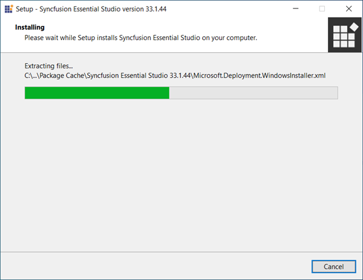

    
    N> The installer wizard extracts the syncfusionessential{platform}webinstaller_{version}.exe dialog, displaying the unzip operation of the package.

2.  The login wizard will appear. You must enter your Syncfusion&reg; email address and password. If you do not already have a Syncfusion&reg; account, you can create one by clicking on **Create an Account**. If you have forgotten your password, click **Forgot Password** to create a new one. Click the Sign in button.

    
    
3.  The Syncfusion&reg; Web Installer’s welcome wizard will be displayed. Click the Next button.

    

  
4.  The Platform Selection Wizard will appear. From the **Available** tab, select the products to be installed. Select the **Install All** checkbox to install all products.
    
	<em>**Available**</em>
	
	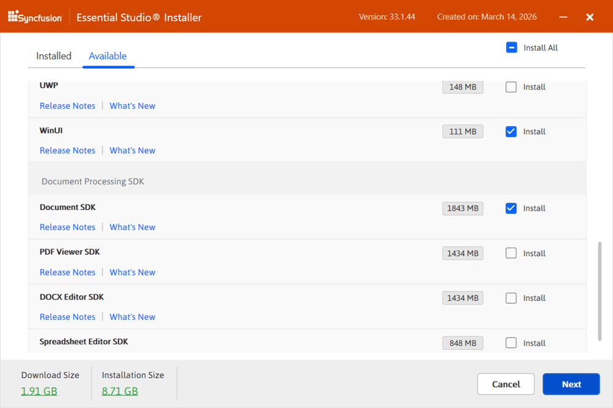
	
	If you have multiple products installed in the same version, they will be listed under the **Installed** tab. You can also select which products to uninstall from the same version. Click the Next button.
	
	<em>**Installed**</em>
	
	
	
	I> If the required software of the selected platform was not already installed, **Additional Software Required** alert will be displayed. However, you can continue the installation and install the required software later.
	
	<em>**Required Software**</em>
	
	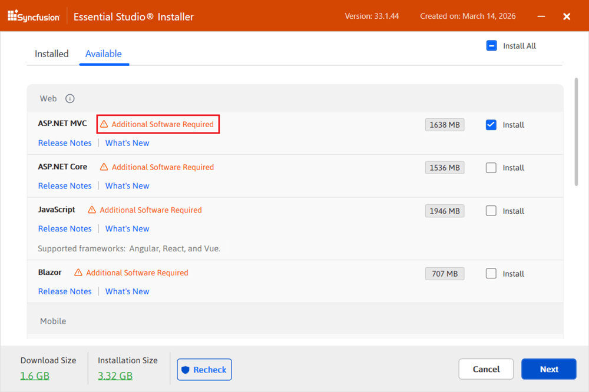
		
5.  If previous version(s) for the selected products are installed, the Uninstall previous version wizard will be displayed. You can see the list of previously installed versions for the products you’ve chosen here. To remove all versions, check the **Uninstall All** checkbox. Click the Next button.

    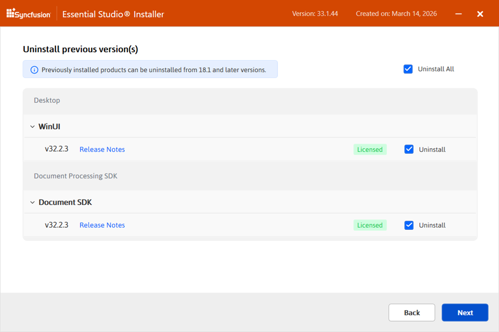

	N> From the 2021 Volume 1 release, Syncfusion&reg; has provided option to uninstall the previous versions from 18.1 while installing the new version.
	
	
6. 	Pop up screen will be displayed to get the confirmation to uninstall selected previous versions.

    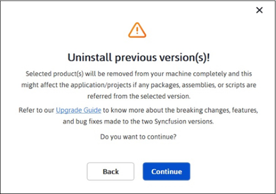

7.  The Confirmation Wizard will appear with the list of products to be installed/uninstalled. You can view and modify the list of products that will be installed and uninstalled from this page.

    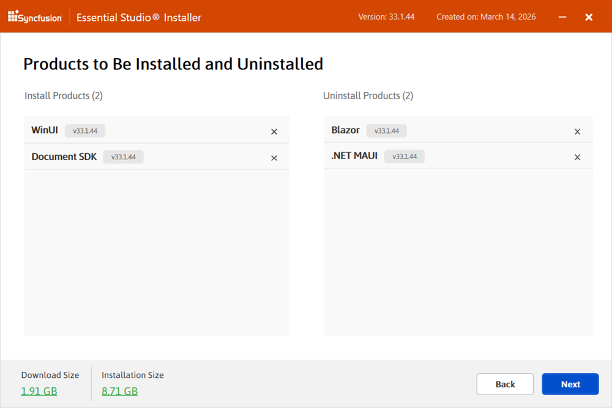
	
	N> By clicking the **Download Size and Installation Size** links, you can determine the approximate size of the download and installation.
	

8.  The Configuration Wizard will appear. You can change the Download, Install, and Demos locations from here. You can also change the Additional settings on a product-by-product basis. Click Install button to install with the default settings.

    
	
	**Additional settings**

    * Select the Install Demos check box to install Syncfusion&reg; samples, or leave the check box unchecked, if you do not want to install Syncfusion&reg; samples
    * Select the Configure Syncfusion&reg; controls in Visual Studio check box to configure the Syncfusion&reg; controls in the Visual Studio toolbox, or clear this check box when you do not want to configure the Syncfusion&reg; controls in the Visual Studio toolbox during installation. Note that you must also select the Register Syncfusion&reg; assemblies in GAC check box when you select this check box.
    * Select the Configure Syncfusion&reg; Extensions controls in Visual Studio checkbox to configure the Syncfusion&reg; Extensions in Visual Studio or clear this check box when you do not want to configure the Syncfusion&reg; Extensions in Visual Studio.
    * Check the Create Desktop Shortcut checkbox to add a desktop shortcut for Syncfusion&reg; Control Panel
    * Check the Create Start Menu Shortcut checkbox to add a shortcut to the start menu for Syncfusion&reg; Control Panel

9.  After reading the License Terms and Conditions, check the **I agree to the License Terms and Privacy Policy** check box. Click the Install button.
	
	I> The products you have chosen will be installed based on your Syncfusion&reg; License (Trial or Licensed).

10. The download and installation\uninstallation progress will be displayed as shown below.

    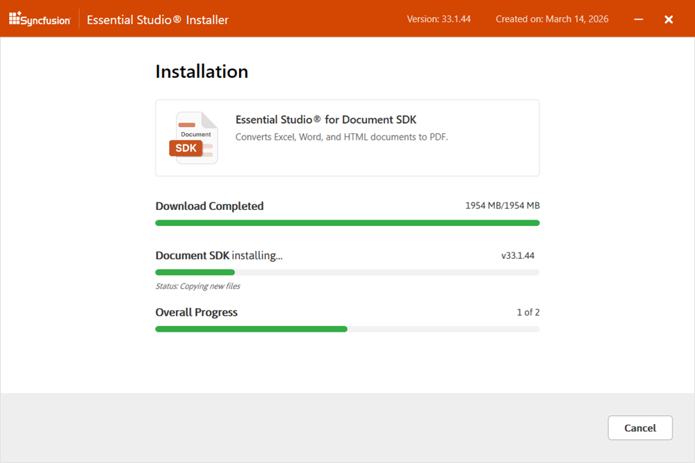

11. When the installation is finished, the **Summary** wizard will appear. It lists the products that were installed successfully and any that failed. To close the Summary wizard, click **Finish**.

    
	
	* To open the Syncfusion&reg; Control Panel, click **Launch Control Panel**.

12. After installation, two Syncfusion&reg; Control Panel entries will be available, as shown below. The **Essential Studio&reg;** entry manages all Syncfusion&reg; products installed in the same version, while the **Product** entry uninstall only the specific product setup.

    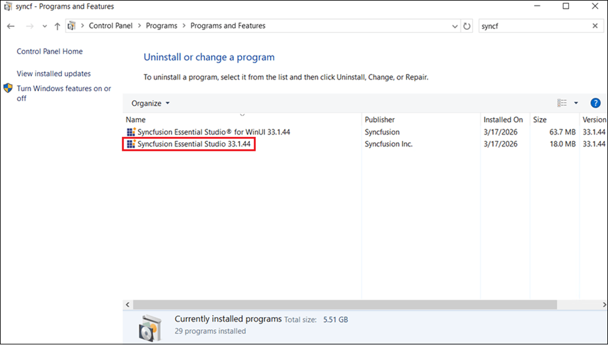

## Troubleshooting

* **Installer fails to launch:** Ensure you are running the installer with administrator privileges and that the downloaded file is not corrupted. Re-download the installer if necessary.
* **Login fails or account is locked:** Reset your password using the **Forgot Password** link, or contact [Syncfusion Support](https://www.syncfusion.com/support).
* **Installation is interrupted (network/disk issues):** Verify your internet connection and ensure there is sufficient disk space. Re-run the installer; the installation will resume from where it stopped.
* **Required software warning:** Close the installer, install the prerequisites listed in the **Additional Software Required** alert, and re-run the installer.
* **Product fails to install:** Check the Summary wizard for the specific error message, then refer to the [Syncfusion Support](https://www.syncfusion.com/support) page.

## Uninstallation

The Syncfusion&reg; installer can be uninstalled in two ways.

* Uninstall the Syncfusion&reg; installer from the Syncfusion&reg; Web Installer
* Uninstall the Syncfusion&reg; installer from Windows Control Panel

N> Administrator privileges are required to uninstall the products. Close any open Visual Studio instances before starting the uninstallation.

Follow either one of the options below to uninstall the Syncfusion&reg; Essential Studio&reg; installer.

**Option 1: Uninstall the Syncfusion&reg; installer from the Syncfusion&reg; Web Installer**

The Syncfusion&reg; Web Installer can also uninstall products of the same version directly. To do so:

1. Launch the Syncfusion&reg; Web Installer from the downloaded location, the desktop shortcut, or the Start menu.
2. Sign in with your Syncfusion&reg; account on the login wizard.
3. On the Platform Selection Wizard, switch to the **Installed** tab and select the products to uninstall. To uninstall every product, check the **Uninstall All** check box.
4. Click **Next** and follow the on-screen prompts to confirm and complete the uninstallation.

	
	
**Option 2: Uninstall the Syncfusion&reg; installer from Windows Control Panel**  
	
You can uninstall all the installed products by selecting the **Syncfusion&reg; Essential Studio&reg; {version}** entry (element 1 in the screenshot below) from the Windows Control Panel, or you can uninstall a specific product alone by selecting the **Syncfusion&reg; Essential Studio&reg; for {Product} {version}** entry (element 2 in the screenshot below) from the Windows Control Panel.

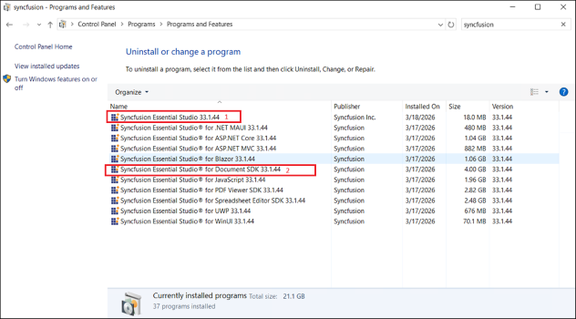
	
N> If the **Syncfusion&reg; Essential Studio&reg; for {Product} {version}** entry is selected from the Windows Control Panel, only that Syncfusion&reg; Essential Studio&reg; Product will be removed and the following default MSI uninstallation window will appear.	

The steps below describe the uninstallation flow once the Web Installer is launched from the Windows Control Panel.

1.	The login wizard will appear. Re-authenticate by entering your Syncfusion&reg; email address and password. If you do not already have an account, you can [create a new account](https://www.syncfusion.com/account/register) by clicking **Create an Account**. If you have forgotten your password, click **Forgot Password** to reset it. Click **Sign in** to continue.

    

2.  The Syncfusion&reg; Web Installer's welcome wizard will appear. Click **Next**.
	
    

3.  The Platform Selection Wizard will appear. From the **Installed** tab, select the products to uninstall. To select all products, check the **Uninstall All** check box. Click **Next**.
    
	<em>**Installed tab**</em>
	
	
	
	You can also select the products to install from the **Available** tab. Click **Next** to continue.
	
	<em>**Available tab**</em>
	
	
	
4.  If there are any other products selected for installation, the **Uninstall Previous Version** wizard will appear with the previous version(s) installed for the selected products. You can view the list of installed previous versions here. To select all the versions, check the **Uninstall All** check box. Click **Next**.

	
	
5.	A popup confirmation dialog will appear asking you to confirm the uninstallation of the selected previous versions.

		
	
6.  The Confirmation Wizard will appear with the list of products to be installed and uninstalled. You can view and modify the list from this page.

    
	
	N> Click the **Download Size** and **Installation Size** links to view the approximate size of the download and installation.
	
7.	The Configuration Wizard will appear. You can change the **Download**, **Install**, and **Demos** locations from here. You can also change the additional settings on a product-by-product basis. Click **Next** to continue with the default settings.

    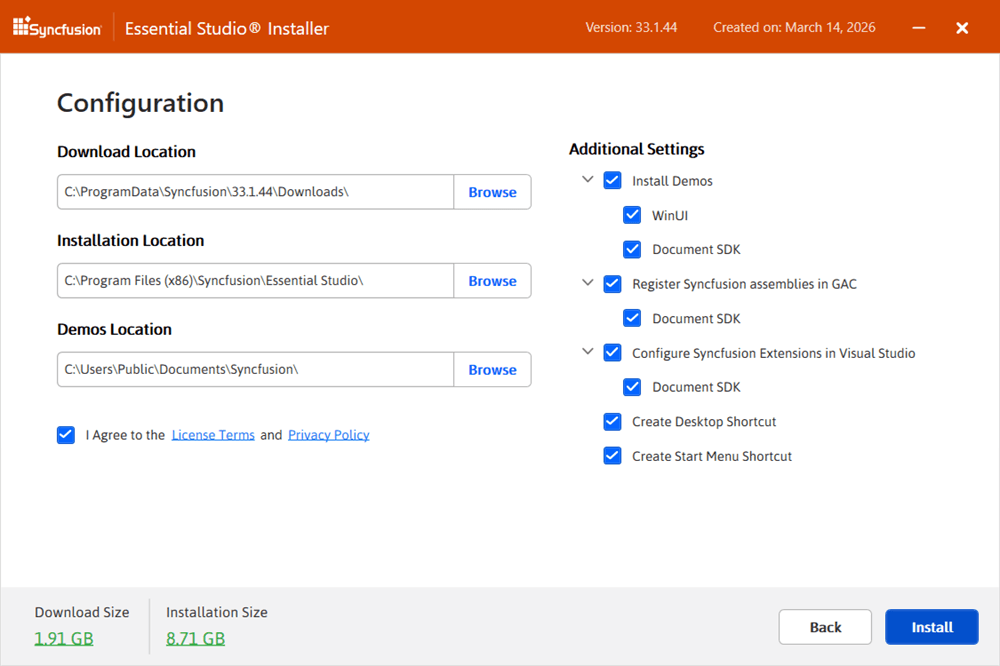
	
8.	Review the License Terms and Privacy Policy, then check the **I agree to the License Terms and Privacy Policy** check box. Click **Uninstall** to start the uninstallation.

	I> The products you have chosen will be uninstalled based on your Syncfusion&reg; License (Trial or Licensed). If the check box is not selected, the **Uninstall** button is disabled.

9.	The download, installation, and uninstallation progress will be displayed.

    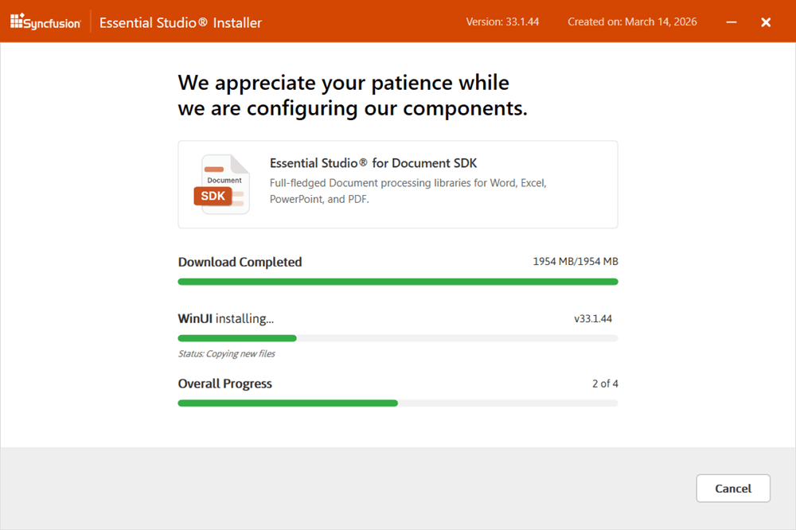

10.	When the uninstallation is finished, the **Summary** wizard will appear. It lists the products that were installed or uninstalled successfully and any that failed. To close the Summary wizard, click **Finish**.

    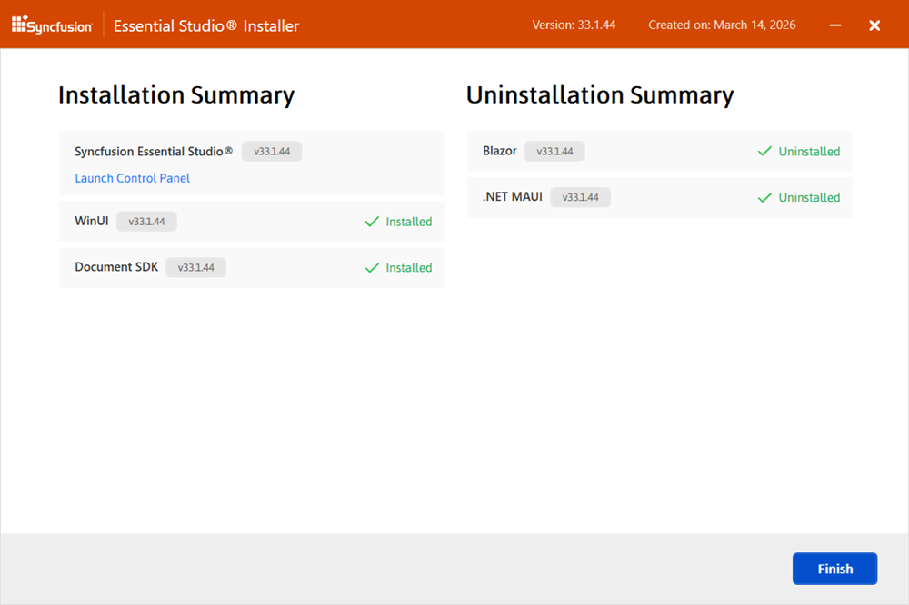
	
	* To open the Syncfusion&reg; Control Panel, click **Launch Control Panel**.

