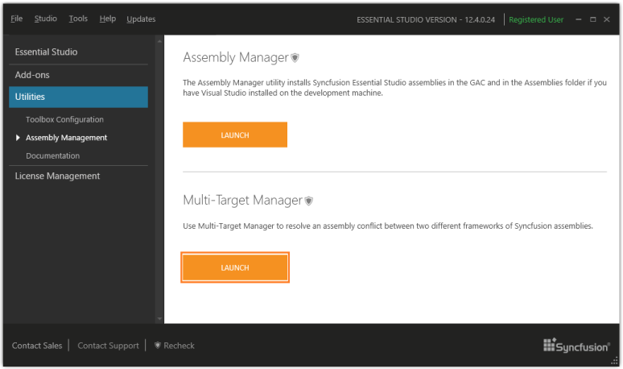
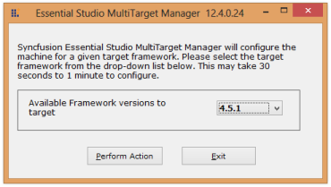
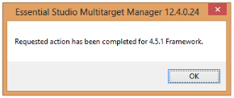

### Multi-Target Manager

Multi-Target Manager helps to manage multiple .NET frameworks in your Visual Studio 2008 project that is, switching between multiple frameworks.

> 
{:.image }
_Note: This is not essential for VS 2010 because Common Language Runtime (CLR) differs for both 3.5 and 4.0 frameworks. VS 2010 selects the required .NET framework assembly for the corresponding projects. 3.5 and 4.0 are the only frameworks configured; the MultiTarget Manager utility allows you to work on framework 2.0 with VS 2010._

When to Use Multi-Target Manager?

When Essential Studio is installed in a machine comprising both 2.0 and 3.5 frameworks, then, by default, the target framework is set to 3.5, and the following registry entry AssemblyFoldersEx is also set to 3.5 assembly. You can use the Multi-Target Manager tochange the target framework to 2.0. 

HKLM\Software\Microsoft\.NetFramework\v2.0.50727\AssemblyFoldersEx\Syncfusion Essential Studio 3.5

Launching MultiTarget Manager 

1. Open the Syncfusion Dashboard.
1. Click Utilities > Assembly Management.
2. Click the Launch button for Multi-Target Manager.

{:.image }

> 
{:.image }
_Note: You can also open the Multi-Target Manager from the following location:_

> _(Installed location)\Syncfusion\Essential Studio\x.x.x.x\Utilities\MultiTargetManager\ MultiTargetManager.exe_

3. The Essential Studio Multi-Target Manager x.x.x.x dialog box opens.

{:.image }

4. Select the required version from the drop-down list. The Multi-Target Manager dialog box opens.

{:.image }

5. Click OK.
6. Open an application.
7. Refresh the application before building.

> 
{:.image }
_Note: The target value and the registry value change according to the selected framework version._

