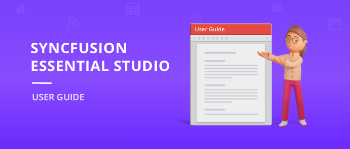

# Syncfusion Essential Studio Installer Overview

Welcome to the Syncfusion Essential Studio product’s user guide documentation. This will help you to get started with Essential Studio.

Essential Studio User Guide
{:.caption}

Syncfusion Essential Studio is a complete suite with 1,600+ UI components and frameworks that can be used for all your desktop, web, and mobile application development needs. Essential Studio consists of .NET libraries and UI controls that provide complete support for building modern Windows Forms, WPF, UWP, ASP.NET Web Forms, ASP.NET MVC, ASP.NET Core, Blazor, PHP, JSP, JavaScript, Angular, React, Vue, Flutter, WinUI and Xamarin applications. The packages can be used in any .NET environment including C#, VB.NET, and managed C++.

The platforms supported by Syncfusion Essential Studio are listed below.

Web
  
 -	[Blazor](https://www.syncfusion.com/blazor-components)
 -	[ASP.NET Core](https://www.syncfusion.com/aspnet-core-ui-controls)
 -	[ASP.NET MVC](https://www.syncfusion.com/aspnet-mvc-ui-controls)
 -	[JavaScript](https://www.syncfusion.com/javascript-ui-controls)
 -	[Angular](https://www.syncfusion.com/angular-ui-components)
 -	[Vue](https://www.syncfusion.com/vue-ui-components)
 -	[React](https://www.syncfusion.com/react-ui-components)

Mobile

 -	[Flutter](https://www.syncfusion.com/flutter-widgets)
 -	[Xamarin](https://www.syncfusion.com/xamarin-ui-controls)

Desktop
 
 -	[WinForms](https://www.syncfusion.com/winforms-ui-controls)
 -	[WPF](https://www.syncfusion.com/wpf-controls)
 -	[Universal Windows](https://www.syncfusion.com/uwp-ui-controls)
 -	[WinUI (Preview)](https://www.syncfusion.com/winui-controls)

FileFormats

 -	[Excel](https://www.syncfusion.com/excel-framework/net)
 -	[Word](https://www.syncfusion.com/word-framework/net)
 -	[PDF](https://www.syncfusion.com/pdf-framework/net)
 -	[PowerPoint](https://www.syncfusion.com/powerpoint-framework/net)

Web (Essential JS1)
 
 -	[ASP.NET Web Forms](https://www.syncfusion.com/jquery/aspnet-web-forms-ui-controls)
 -	[ASP.NET Core](https://www.syncfusion.com/jquery/aspnet-core-ui-controls)
 -	[ASP.NET MVC](https://www.syncfusion.com/jquery/aspnet-mvc-ui-controls)
 -	[JavaScript](https://www.syncfusion.com/jquery/javascript-ui-controls)
 -	[PHP](https://www.syncfusion.com/jquery/php-ui-controls)
 -	[JSP](https://www.syncfusion.com/jquery/jsp-ui-controls)

