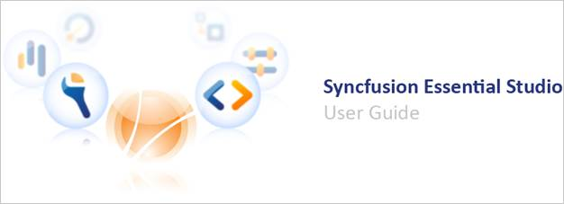

# Syncfusion Essential Studio Installer Overview

Welcome to the Syncfusion Essential Studio product documentation. The following content is to help you get started with Essential Studio.

Essential Studio User Guide
{:.caption}

Syncfusion Essential Studio is a complete suite with 1,600+ UI components and frameworks that can be used for all your desktop, web, and mobile application development needs. Essential Studio consists of .NET libraries and UI controls that provide complete support for building modern Windows Forms, WPF, UWP, ASP.NET Web Forms, ASP.NET MVC, ASP.NET Core, Blazor, PHP, JSP, JavaScript, Angular, React, Vue, Flutter, WinUI and Xamarin applications. The packages can be used in any .NET environment including C#, VB.NET, and managed C++.

 N> The Express Editions of Visual Studio .NET do not have support for toolbox.
