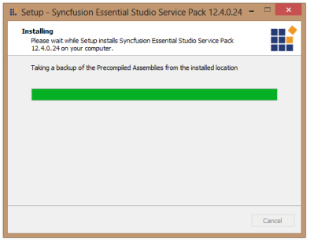
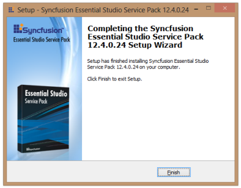

### Installing a Patch Setup

The following procedure illustrates how to install a patch.

_Note:_

> * _Before installing the patch, ensure that corresponding Essential Studio version and platforms to install the patch in your machine._
> * _If you installed Syncfusion WinRT platform alone then the Assembly Manager execution dialog will not appear during the patch installation. It will skip this dialog from step 1 to step 4. Because, Assembly Manager Utility is not shipped with WinRT platform._

1. Double-click the Syncfusion Essential Studio patch setup file. The Syncfusion Essential Studio Service Pack opens.
   
   

2. Click Next. The Assembly Manager screen opens.
   
   

3. Select the Run Assembly Manager check box to install the assemblies in GAC.

4. Click Next. The Ready To Install screen opens.
   
   

5. Click Install to continue installing.
   
   

   _Note: The patch is installed on your computer, and a dialog box appears when the installation is complete._

    

6. Click Finish. 

   The new assemblies are placed in the Pre-Compiled Assemblies folder. These new assemblies can be referenced in your project.

