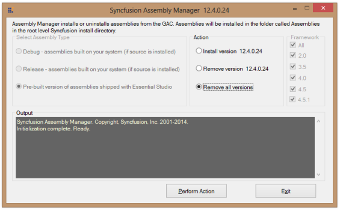

### Reverting a Patch

The Patch Install takes a backup of the Release Assemblies and stores them in the Backup Assemblies folder. The patch assemblies are also stored in the Patch folder. You can revert back when needed. 

Reverting back to Release Assemblies: 

The following steps help you revert to the Release Assemblies. 

1. Copy the Release Assemblies from the Backup Assemblies folder.
2. Paste them in the precompiledassemblies folder.
3. Open Dashboard > Utility > Assembly Management > Assembly Manager.

{:.image }

4. Select the Remove allversions radio button.
5. Click Perform Action. All versions are removed.
6. Select Install version x.x.x.x.
> 

{:.image }
_Note: x.x.x.x has to be replaced with the corresponding Essential Studio Version._

7. Click Perform Action. The assemblies for that specific version are configured in your machine.
> 

{:.image }
_Note: You can also revert to specific patch assemblies by copying the patch assemblies from the Patch folder and adding them in the precompiledassemblies folder._

