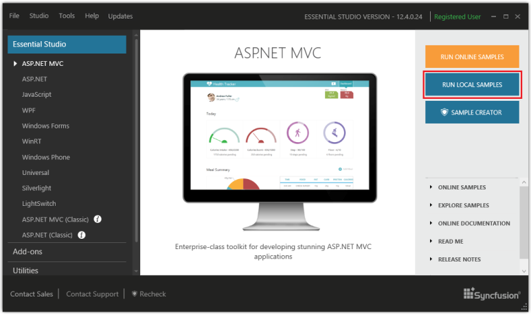
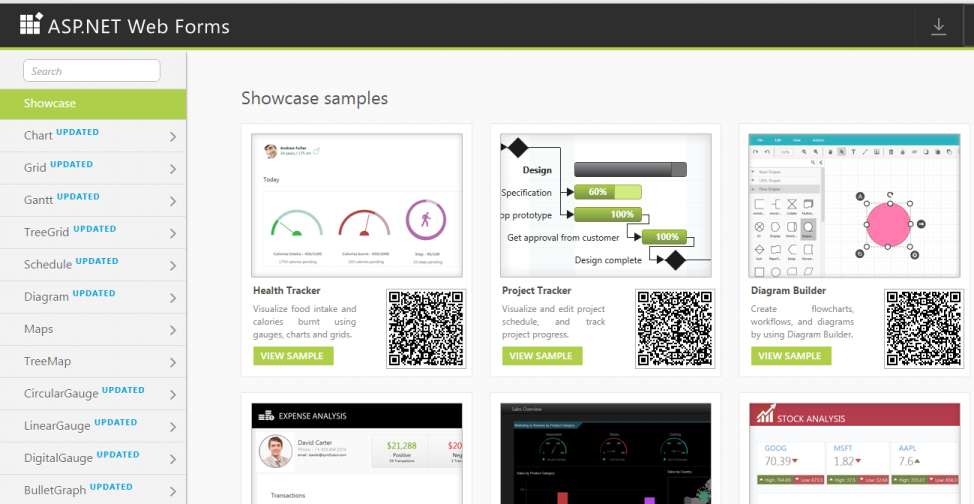
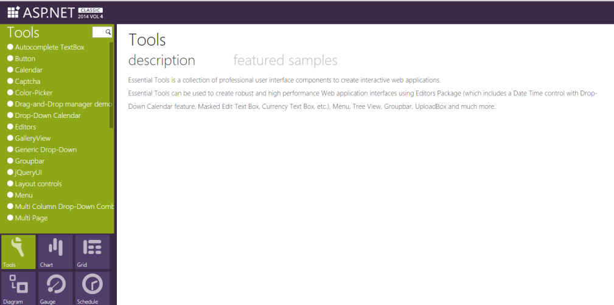
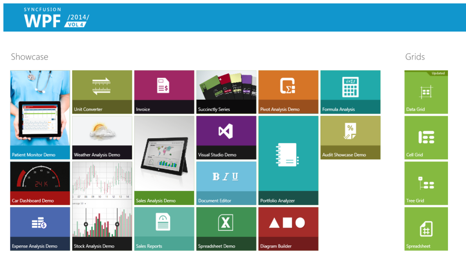
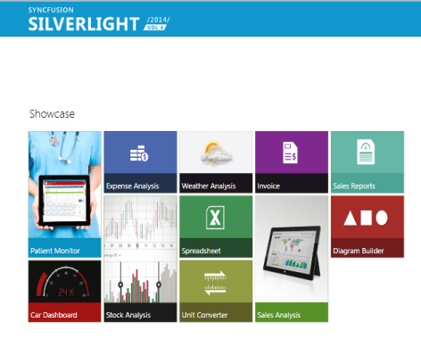
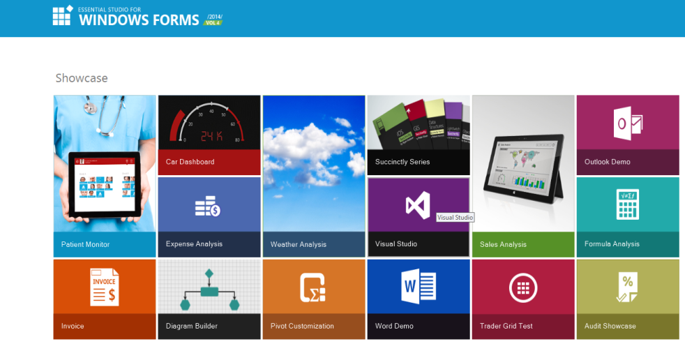
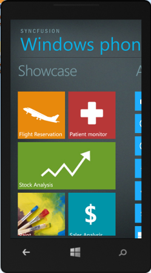
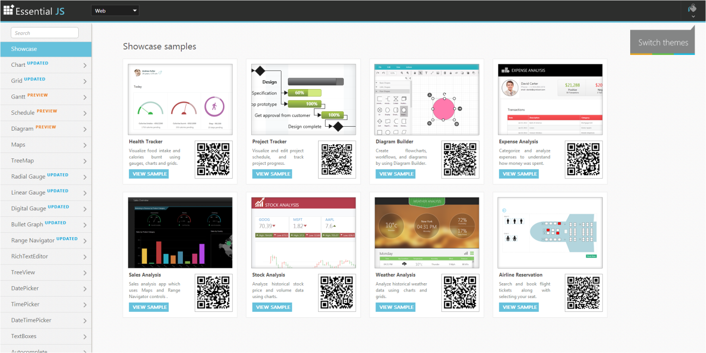
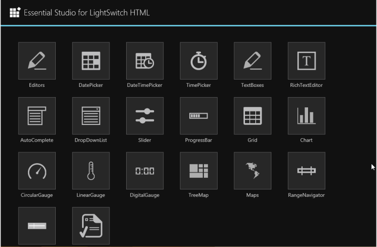

### Offline Samples

The samples from Syncfusion Essential Studio setup are provided. The samples are installed in the following location. The sample is run from IIS or Local server. The installed samples are configured for IIS 7.0 and IIS 7.5 installed machines, otherwise the samples run from the local server.

You can run the samples from the Dashboard’s Run Samples buttonfor each platform. 

{:.image }

The Sample Browser is an application provided by Syncfusion to help you browse through these installed samples easily. The sample browsers for the platforms are as follows.

1. ASP.NET

{:.image }

1. ASP.NET (Classic)

{:.image }

2. ASP.NET MVC

{:.image }

3. ASP.NET MVC (Classic)

{:.image }

4. WPF

{:.image }

5. Silverlight

{:.image }

6. Windows Forms

{:.image }

7. Windows Phone

{:.image }

8. WinRT

{:.image }

9. JavaScript

{:.image }

10. LightSwitch HTML

{:.image }

11. LightSwitch Silverlight

{:.image }

