# Samples

Provided here are the online and offline samples.

## Offline Samples

The samples from Syncfusion Essential Studio setup are provided. The samples are installed in the following location. The sample is run from IIS or Local server. The installed samples are configured for IIS 7.0 and IIS 7.5 installed machines, otherwise the samples run from the local server.

You can run the samples from the Dashboard’s Run Samples buttonfor each platform. 

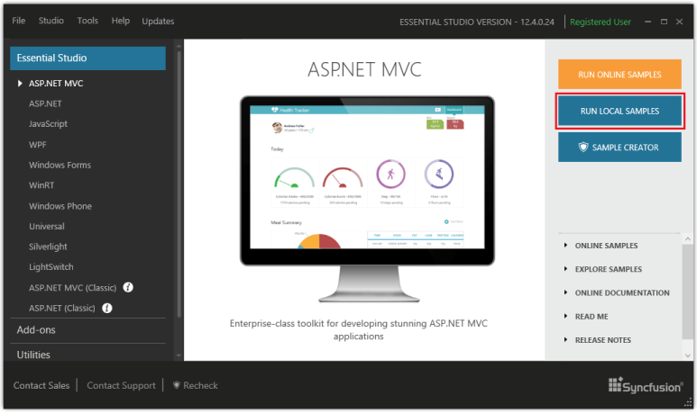

The Sample Browser is an application provided by Syncfusion to help you browse through these installed samples easily. The sample browsers for the platforms are as follows.

1.  ASP.NET

    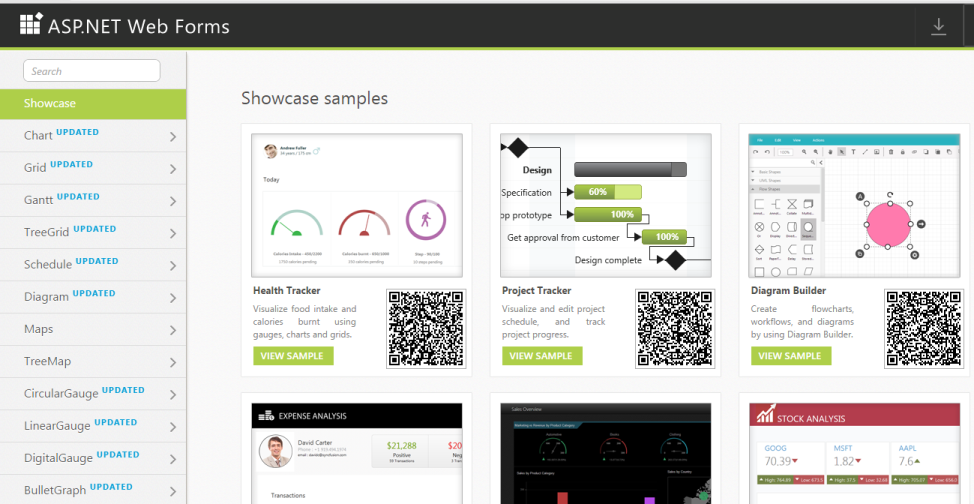

2.  ASP.NET (Classic)

    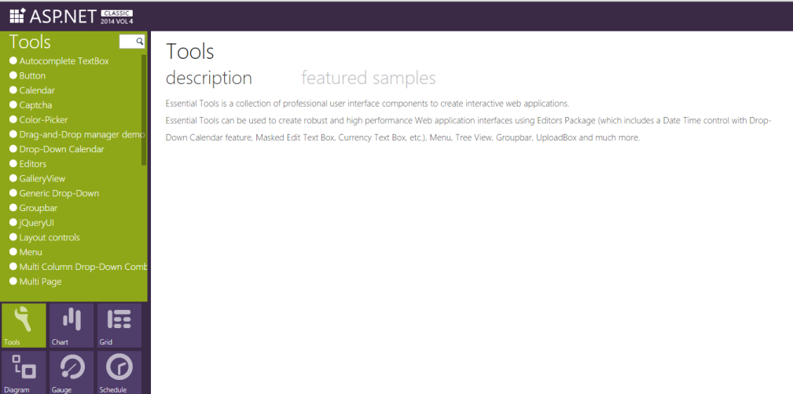

3.  ASP.NET MVC

    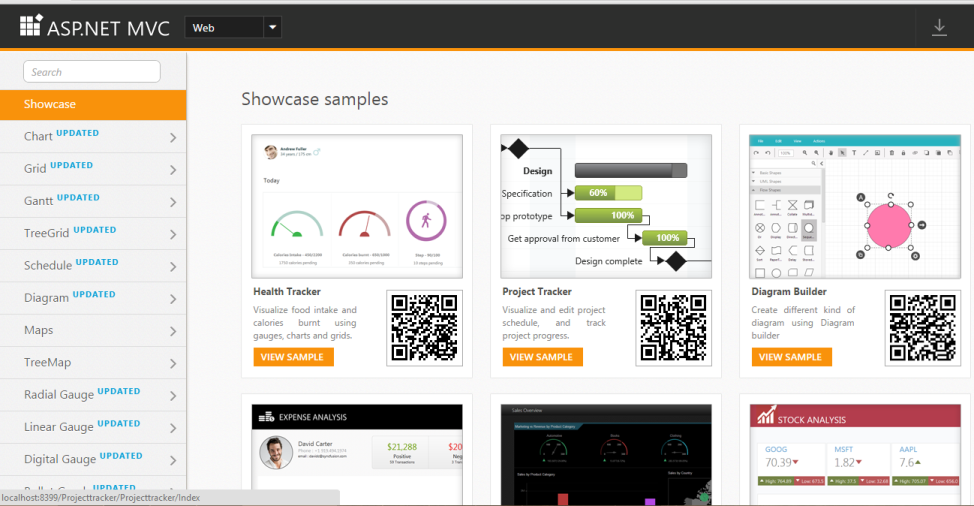

4.  ASP.NET MVC (Classic)

    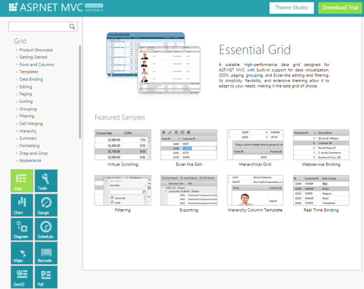

5.  WPF
    
    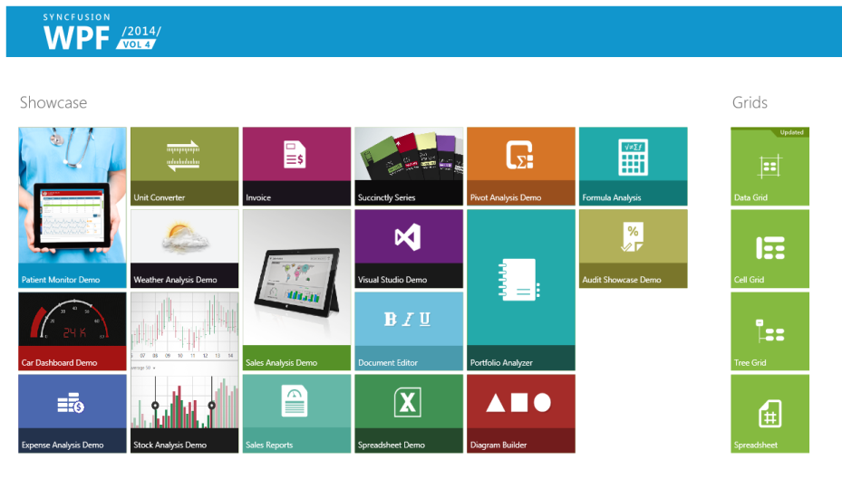

5.  Silverlight
   
    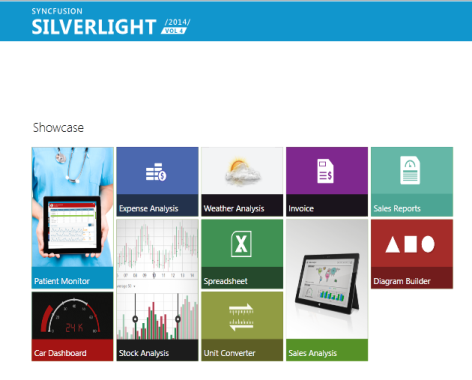

6.  Windows Forms

    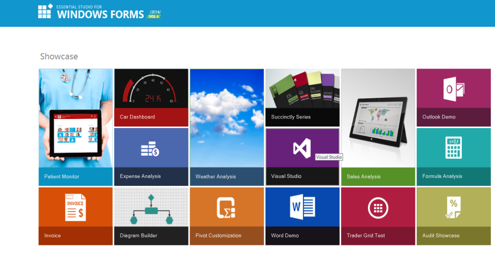

7.  Windows Phone

    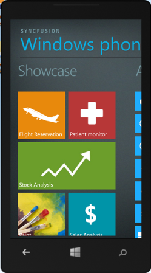

8.  WinRT

    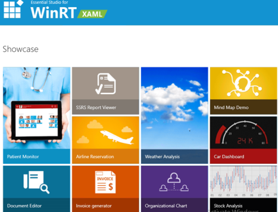

9.  JavaScript

    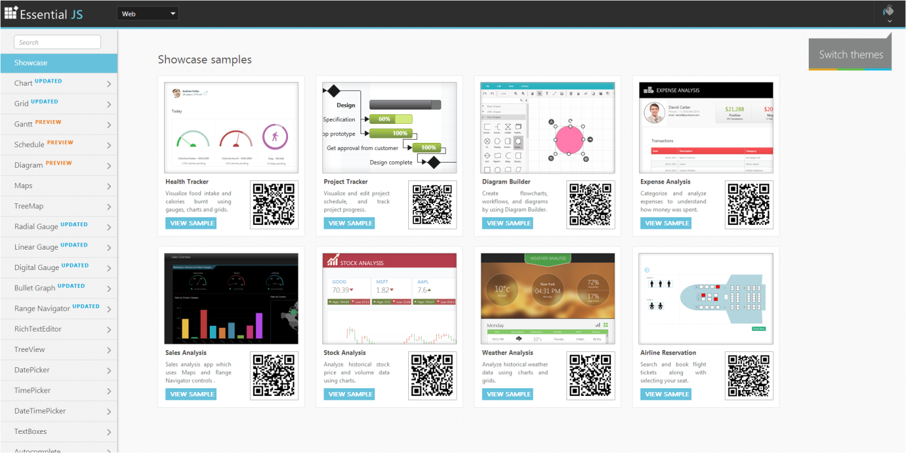

10. LightSwitch HTML
    
	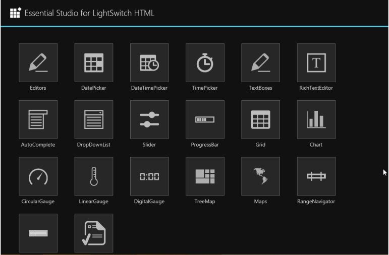

11. LightSwitch Silverlight

    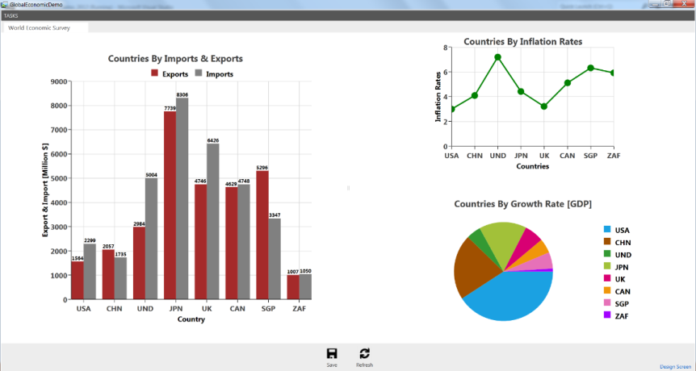
	
## Online Samples

Online samples are provided for ASP.NET, ASP.NET MVC, ASP.NET MVC (Classic), Silverlight, Windows Phone, WinRT, WPF, and JavaScript platforms.

The following table lists the links to the online samples.

_Table_ _3_: _Online samples_

<table>
<tr>
<th>
Platform</th><th>
Online link</th></tr>
<tr>
<td>
ASP.NET</td><td>
{{' [http://asp.syncfusion.com/demos](http://asp.syncfusion.com/demos)' | markdownify }}</td></tr>
<tr>
<td>
ASP.NET (Classic)</td><td>
{{ '[http://asp.syncfusion.com/demos/web](http://asp.syncfusion.com/demos/web)' | markdownify }}</td></tr>
<tr>
<td>
ASP.NET MVC</td><td>
{{ '[http://mvc.syncfusion.com/demos/web](http://mvc.syncfusion.com/demos/web)' | markdownify }}</td></tr>
<tr>
<td>
ASP.NET MVC (Classic)</td><td>
{{ '[http://mvc.syncfusion.com/demos/ui/tools](http://mvc.syncfusion.com/demos/ui/tools)' | markdownify }}</td></tr>
<tr>
<td>
Silverlight</td><td>
{{ '[http://silverlight.syncfusion.com/samples/silverlight/](http://silverlight.syncfusion.com/samples/silverlight/)' | markdownify }}</td></tr>
<tr>
<td>
Windows Phone</td><td>
{{ '[http://www.syncfusion.com/products/windows-phone](http://www.syncfusion.com/products/windows-phone)' | markdownify }}</td></tr>
<tr>
<td>
WinRT</td><td>
{{ '[http://www.syncfusion.com/products/winrt](http://www.syncfusion.com/products/winrt)' | markdownify }}</td></tr>
<tr>
<td>
WPF</td><td>
{{ '[http://silverlight.syncfusion.com/samples/WPF/Samples/WPFSampleBrowser/UI/Tools/Tools.htm](http://silverlight.syncfusion.com/samples/WPF/Samples/WPFSampleBrowser/UI/Tools/Tools.htm)' | markdownify }}</td></tr>
<tr>
<td>
JavaScript</td><td>
{{ '[http://js.syncfusion.com/demos/web](http://js.syncfusion.com/demos/web)' | markdownify }}</td></tr>
<tr>
<td>
LightSwitch HTML</td><td>
{{ '[http://js.syncfusion.com/demos/LightSwitch/HTMLClient/](http://js.syncfusion.com/demos/LightSwitch/HTMLClient/)' | markdownify }}</td></tr>
</table>

## Sample Creator

Sample Creator is provided for the platforms ASP.NET MVC and ASP.NET MVC (Classic) when the MVC Extension setup is installed. For more information about how to install Syncfusion Essential Studio MVC Extension setup, see [MVC Extension](http://www.syncfusion.com/kb/2350/how-to-install-syncfusion-essential-studio-mvc-extension-setup).

