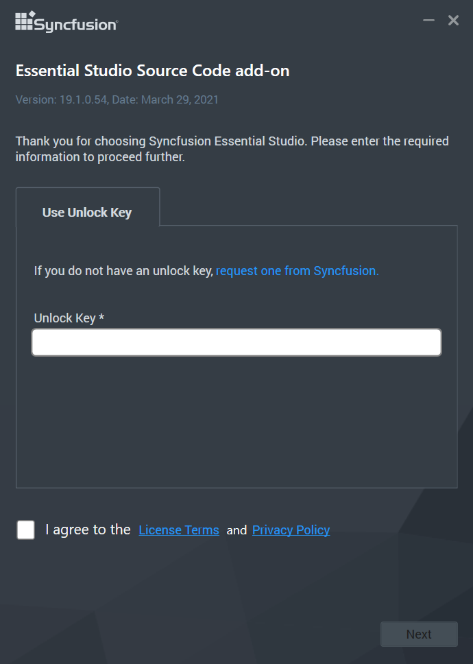
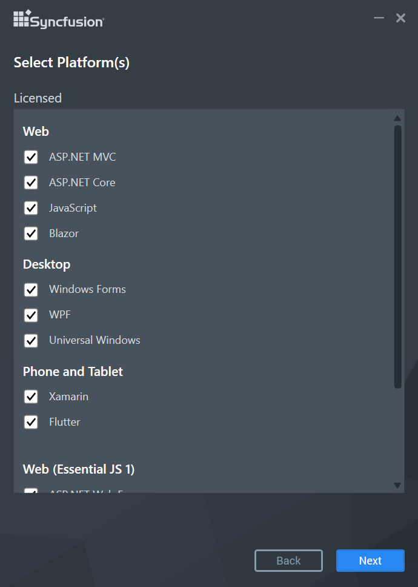
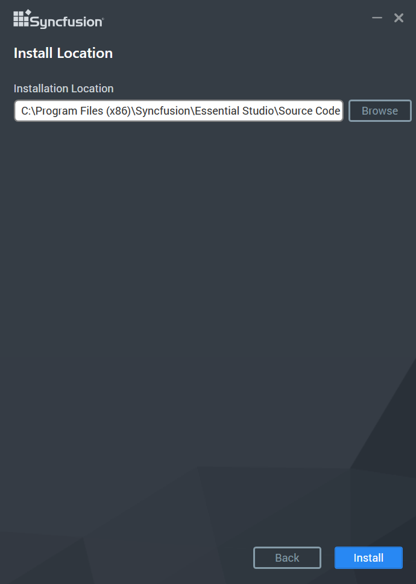
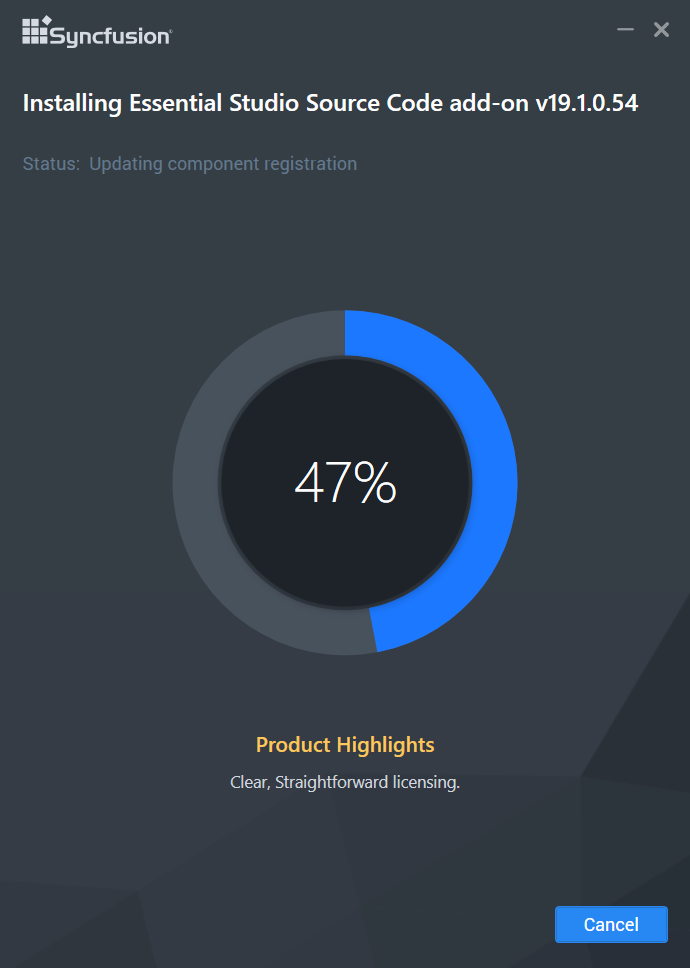
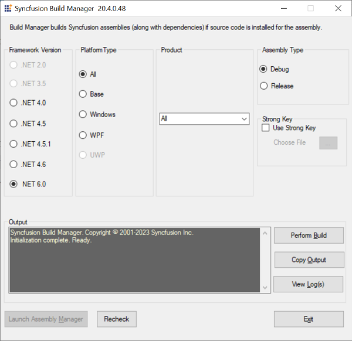

# Source Code 

## Overview

Syncfusion provides Source Code Add On setup in which you can modify the Syncfusion source and make use of the customized assemblies. All the Essential Studio sources will be packed in this setup and you can easily build the customized source. Source License is required for downloading and installing the Source Code Add-on setup.

## Step-by-Step Installation

The following steps show how you can install the Essential Studio Source Code Add-on Setup.

1. Double-click the Syncfusion Essential Studio Source code add-on installer setup file. The Setup Wizard opens and extracts the package automatically..
   
   

    N> The Setup extracts the syncfusionessentialsourcecodeaddon(version).exe dialog, displaying the unzip operation of the package.
	
   

2. Enter the Unlock Key in the corresponding text box provided and select the **I agree to the License Terms and Conditions** check box after reading the License Agreement.
   
   
   

3. Click Next. Select the platforms to be installed.

   
   

4. Click Next. The Source Code Add On installation location will be displayed

   

   N> From the 2018 Volume 2 release, Source Code Add On will be installed in below location.
      **Location:** {ProgramFilesFolder}\Syncfusion\Essential Studio\Source Code Add On\ {version}
      You can change the install location by clicking the Browse button.

5. Click Install. 

   

    N> The Completed screen is displayed once the selected platform is installed.
	

6. Select the Run Build Manager check box to launch the Build Manager after installing.

7. Click Finish. Essential Studio Source Code Add On is installed in your system.

   
   
   
## Build Manager

Build Manager allows you to build or debug the assemblies using Syncfusion source code. You can launch the Build Manager from the following location.

**Location:**{ProgramFilesFolder}\Syncfusion\Essential Studio\Source Code Add On\{version}\Utilities\Build Manager\Buildmanagerwindows.exe

   
   

The output assemblies of the Build Manager will be placed in the below location.

**Output Location:** {ProgramFilesFolder}\Syncfusion\Essential Studio\Source Code Add On\{version}\UserAssemblies\{version}\{framework}\{Debug\Release}

You can select the required setting in the Syncfusion Build Manager x.x.x.x window.

### Build Manager Settings

This window contains several sections. 

**1. Framework Version **

   The Framework Version group box has six options: .NET 2.0, .NET 3.5, .NET 4.0, .NET 4.5, .NET 4.5.1 and .NET 4.6. 
   
   * When Visual Studio 2015 is not installed in your system, the .NET 4.5.1 option is selected by default. 
   
   * When Visual Studio 2013 is not installed in your system, the .NET 4.5 option is selected by default. 
   
   * When Visual Studio 2012 is not installed in your system, the .NET 4.0 option is selected by default. 
   
   * When Visual Studio 2010 is not installed in your system, .NET 3.5 option is selected by default. 
   
   * When Visual Studio 2008 is not installed in your system, .NET 2.0 option is selected by default. 
   
   You can change the default option by clicking the other button. The version of the .NET Framework that the assemblies should be built with is specified here and is used automatically to rebuild the assemblies. 

**2. Product**

   The Product group box has a drop-down list box. By default, All is selected. You can change the default option by selecting one of the products from the drop-down list box. 

**3. Platform Type** 

   Syncfusion products typically have a common base library that forms the basis for the Windows and Web variants. The library category to be built is specified using the Product Type. This frame has eight options. All is selected by default. You can click the required product's button to perform the build operation.

   N> For assemblies that are not built and pre-compiled, assemblies that shipped with the product is automatically used.

**4. Assembly Type**

   This frame has two options: Debug and Release. Debug is selected by default. To choose the Release mode for assembly, select Release.

   You can switch between the Debug and Release mode of product configurations. Building the Debug version of the assemblies allows you to step into the Syncfusion assemblies when debugging applications. 

**5. Strong Key**

   This enables you to install the compiled assemblies in GAC. Select the **Use Strong Key** check box and choose a .snk file to achieve this. You can debug the assembly only when it is complied with the Strong Key. 

**6. Output**

   This frame shows the output, that is, the status of the build operation, in a text area. 

   After selecting the required options in the above-mentioned frames, click Perform Build inside the output frame.

N> The Build operation is performed and the status is updated in the text area, inside the output frame. On completion of the Build operation, an information message is displayed stating that the Build operation has been completed. It also asks you to review the Build output and log files for additional information.

## Assembly Manager

   Assembly Manager shipped in the Source Code Add On setup is used to **Install\Remove** the **Debug\Release** assemblies from GAC location and has its unique features. You can launch the Assembly Manager from the below Source Code Add On installed location.
   
   **Location:**{ProgramFilesFolder}\Syncfusion\Essential Studio\Source Code Add On\{version}\Utilities\Assembly Manager\AssemblyManagerWindows.exe 
   

   * Pre-built Assemblies - These are the assemblies shipped with Essential Studio. You can **only remove** the pre-built assemblies from the Assembly Manager shipped in Source Code Add-on setup.

   * Debug and Release Assemblies - This mode triggers the Assembly Manager to install custom assemblies built from the source code using Build Manager. The Debug\Release option will be enabled based on the **Assembly Type** selected in Build Manager during compilation.
   
   

   Refer [this](https://help.syncfusion.com/common/essential-studio/utilities#assembly-manager) link for the detailed information regarding the functionalities of Assembly Manager.
   
   
 

