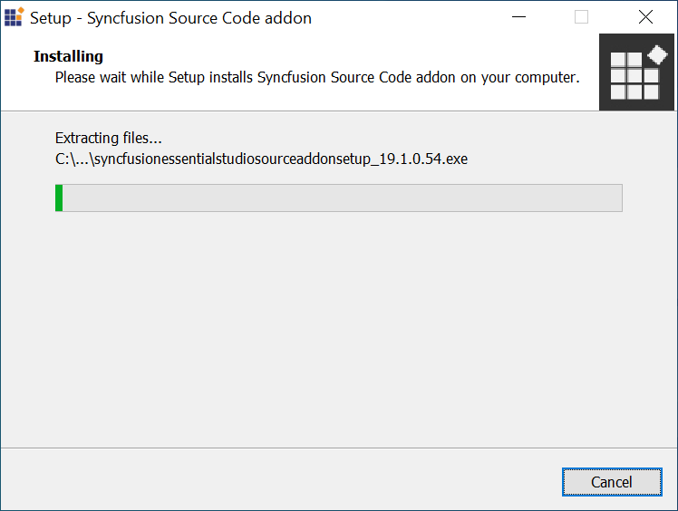

# Source Code 

## Overview

After 9.4.0.62, Essential Studio Source has been removed from the product setup. To access the source code, install the Essential Studio Source Code Add-on Setup. You can access the Essential Studio Source Code Add-on Setup from the dashboard. You can also access it from the Product Downloads and Keys page using your support account in Direct-Trac.

## Step-by-Step Installation

The following steps show how you can install the Essential Studio Source Code Add-on Setup.

1. Double-click the Syncfusion Essential Studio Source code add-on installer setup file. The Inno Script Wizard opens and extracts the package automatically..
   
   

    N> The Inno Script extracts the syncfusionessentialsourcecodeaddon(version).exe dialog, displaying the unzip operation of the package.
	
   

2. Enter the Unlock Key in the corresponding text box provided and select the I accept the terms and conditions check box after reading the License Agreement.
   
   
   

3. Click Next. Select the platforms to be installed.

   
   

4. Click Next. The Source Code Add On installation location will be displayed

    N> You can't change the install location. By default Essential Studio Install location will be displayed.

   

5. Click Install. 

   

    N> The Completed screen is displayed once the selected platform is installed.
	

8. Select the Run Build Manager check box to launch the Build Manager after installing.

9. Click Finish. Essential Studio Source Code Add On is installed in your system.

   

10. Once the Essential Studio Source Code add-on is installed, the Dashboard provides an option to explore source code.

   

