# Source Code 

## Overview

After 9.4.0.62, Essential Studio Source has been removed from the product setup. To access the source code, install the Essential Studio Source Code Add-on Setup. You can access the Essential Studio Source Code Add-on Setup fromthe dashboard. You can also access it from the Product Downloads and Keys page using your support account in Direct-Trac.

## Step-by-Step Installation

The following steps show how you can install the Essential Studio Source Code Add-on Setup.

1.  Double-click the Syncfusion Essential Studio Sourcecode add-on installer setup file. The Syncfusion Essential Studio Source Installer Wizard opens.

    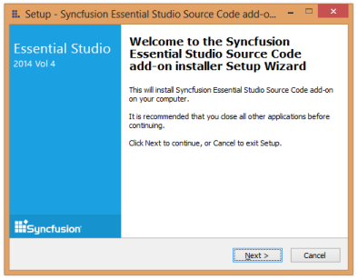

2.  Click Next.
   
    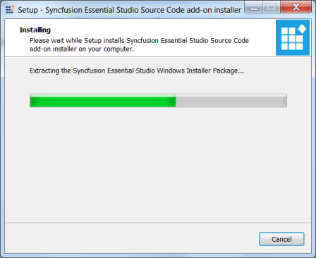

3.  On completion of the Unzip operation, the Setup - Syncfusion Essential Studio Source Code Add-on Installer window opens.

    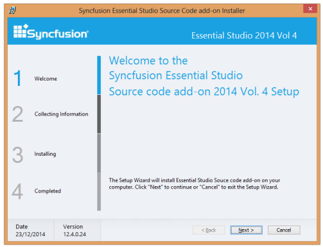

4.  Click Next. The User Information screen opens.

    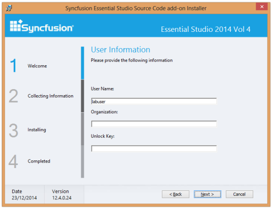

5.  Enter your User Name, Organization and Unlock Key in the corresponding text boxes provided.

6.  Click Next.

    > Note: The Unlock Key is validated and the Welcome screen opens.

    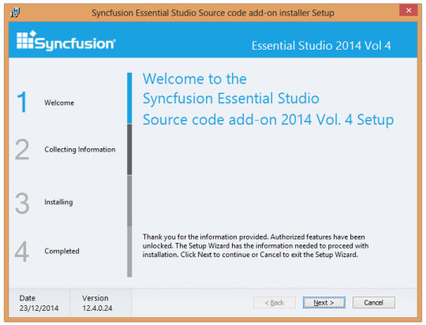

7.  Click Next. The License Agreement screen opens.

    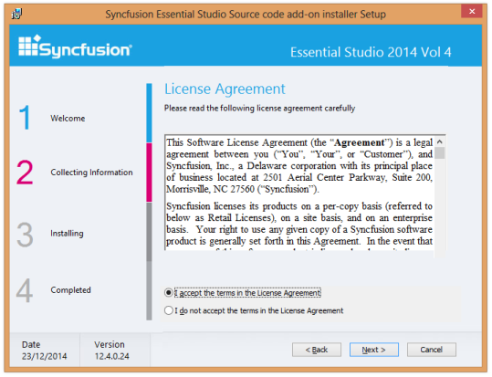

8.  After reading the terms, click the I accept the terms in the License Agreement option.

9.  Click Next. The Choose the Setup Type screen opens.

    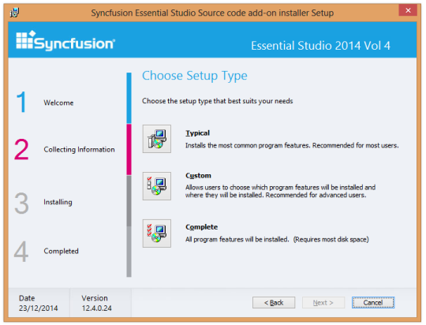

10. Choose your preferred setup type. For example, to install the complete setup, click Complete.

11. Click Next. The Ready to Install dialog opens.

    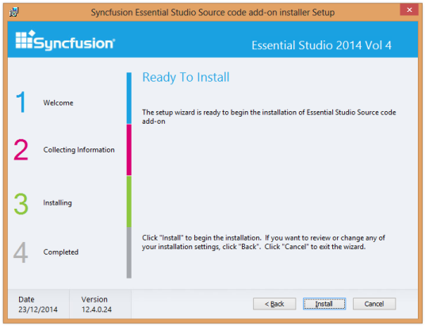

12. Click Install to continue with the installation.

    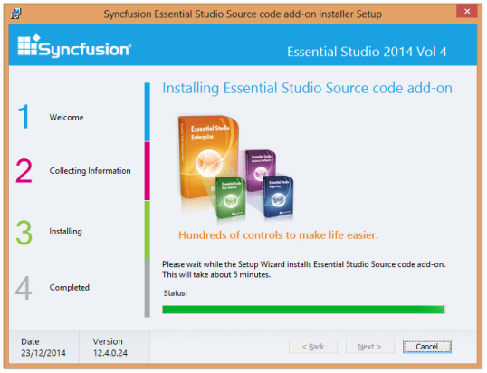

    > Note: The Completed screen is displayed once the selected package is installed.

    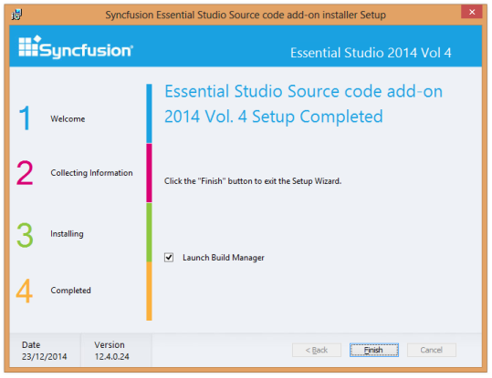

13. Click Finish to exit the Setup Wizard. This initiates the installation of the Syncfusion Essential Studio Source Installer on your computer.
    
	> Note: The Syncfusion Essential Studio Source Installer is installed on your computer, and you are informed once the installation is complete._

    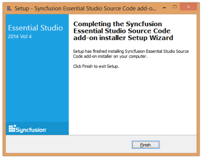

14. Once the Essential Studio Source Code add-on is installed, the Dashboard provides an option to explore source code.

    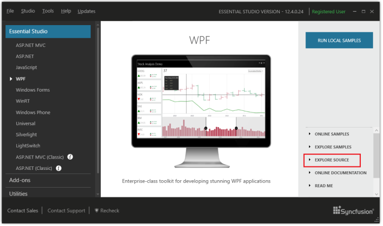