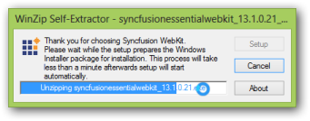
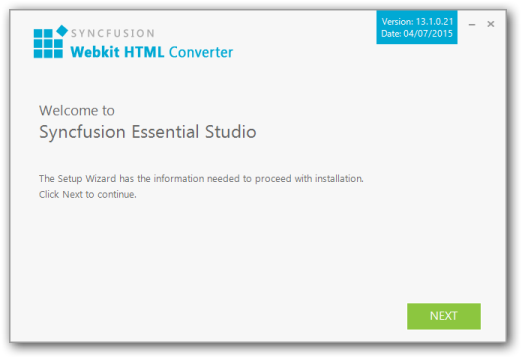
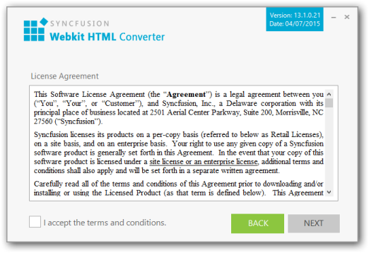
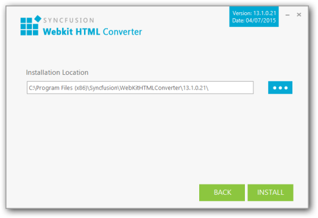
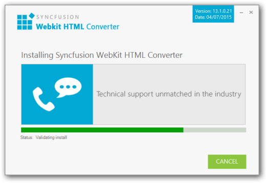
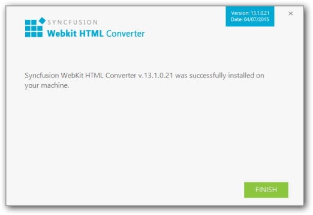

### Step-by-Step Installation

The following are the steps to install the WebKit Setup.

1. Double-click the Syncfusion WebKit Installer Setup file. The Syncfusion WebKit Installer Wizard opens.

{:.image }

> 
{:.image }
_Note: The WinZip Self-Extractor extracts the syncfusionessentialWebKit_(version).exe dialog, displaying the unzip operation of the package._ 

> 

{:.image }

_Figure 100__: Welcome dialog_

> 
{:.image }
_Note: No key is required for Syncfusion WebKit Installer._

1. Click Next.

{:.image }

2. After reading the terms, click the I accept the terms and conditions check box.
3. Click Next.

{:.image }

> 
{:.image }
_Note: You can also browse and choose a location by clicking Browse._

4. To install in the displayed default location, click Install.

{:.image }

{:.image }
_Note: The Completed screen is displayed once the WebKit is installed._

{:.image }

5. Click Finish. WebKit is installed in your system.

