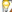

# Terminology

The Terminology section covers documentation conventions used in this manual. 

<table>
<tr>
<th>
Convention</th><th>
Example</th><th>
Description</th></tr>
<tr>
<td>
Essential Studio </td><td>
</td><td>
Essential Studio is a comprehensive library of controls targeting the .NET development platform. The packaging of the products within Essential Studio is such that the products share certain common features, such as design patterns, installation programs and several configuration utilities. The term Essential Studio is used in these sections, representing the entire package. </td></tr>
<tr>
<td>
Bold</td><td>
The Open dialog</td><td>
UI elements such as names of tabs, menus, buttons, dialog boxes and windows are set to bold. </td></tr>
<tr>
<td>
Italic</td><td>
The {{ 'IsEnable' | markdownify }} property</td><td>
The property, method and event name and text that must be typed exactly as shown are italicized. </td></tr>
<tr>
<td>
Plus sign</td><td>
Ctrl+Click</td><td>
Represents combination of keys. </td></tr>
<tr>
<td>
Version number</td><td>
x.x.x.x</td><td>
Represents version number. Replace this with the version installed in the machine. </td></tr>
<tr>
<td>
Note</td><td>

{{ 'Note:' | markdownify }}</td><td>
Represents important information.</td></tr>
<tr>
<td>
Example</td><td>
Example</td><td>
Represents an example.</td></tr>
<tr>
<td>
Tip</td><td>
{{ ' ' | markdownify }}

</td><td>
Represents useful hints that help you in using the controls/features.</td></tr>
<tr>
<td>
Additional Information</td><td>
{{ '' | markdownify }}

</td><td>
Represents additional information on the topic.</td></tr>
</table>

