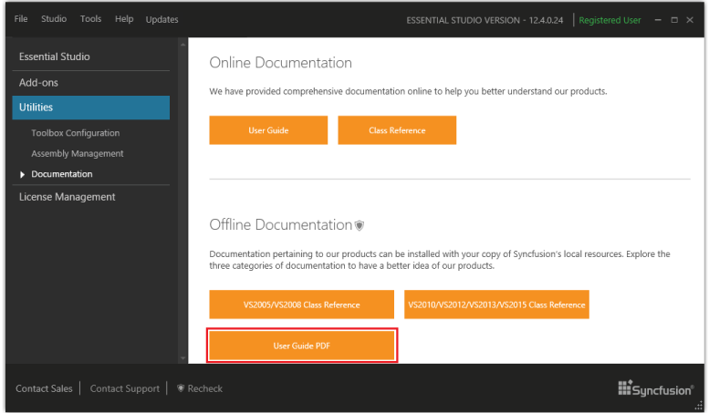
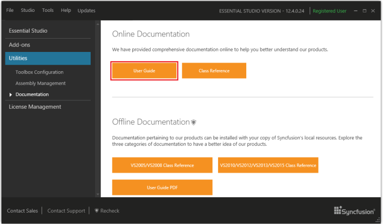

### User Guide

Local documentation - A complete set of documentation for the User Guide is provided under the following headers. 

Installed Documentation – Offline User Guide setup files have been removed for Essential Studio 11.4.0.26 and later; instead, the User Guides are provided in PDF file format. Documentation pertaining to Essential Studio can be installed with your copy of Syncfusion local resources. Explore the following to have a better idea of Essential Studio products.

* User Guide PDF

This local documentation can be accessed from the Dashboard > Utilities > Documentation > Local Documentation.

{:.image }

> 
{:.image }
_Note: When you have not installed local documentation, then a prompt opens to download the setup._

Online Documentation: Syncfusion provides comprehensive documentation online, to help you understand Essential Studio products, better. This can be accessed from the Utilities > Documentation > Online Documentation.

{:.image }

