# Utilities

## Syncfusion Control Panel

This section provides details on the structure and composition of the Syncfusion Control Panel. It also elaborates on navigating the Syncfusion Control Panel to access various utilities, add ons and product samples.

From the 2018 Volume 2 release, each Essential Studio platform has separate Syncfusion Control Panel. You can launch the Syncfusion Control Panel either from <b>Desktop Shortcut</b> or <b>Start Menu->Syncfusion Control Panel {version}</b>

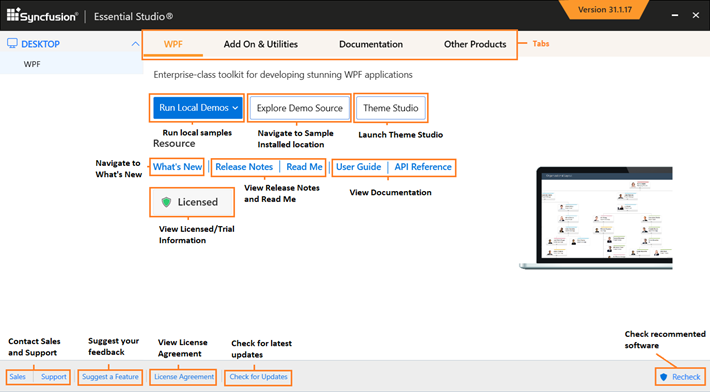

### Accessing Product Samples

Syncfusion provides lots of online and local samples for better understanding of the controls. You can access them using the following steps. 

1. Open the Syncfusion Control Panel.

   

2. Click any of the following to know more about the selected product.

   * **Run Local Demos** - To run the locally installed samples.
   * **Run Online Demos** - To view online samples.
   * **Explore Demos** - To open local installed location.
   * **Explore Source** - To view the source, when you have installed the source add-on setup.
   * **User Guide** - To view the user guide documentation for the respective products.
   * **API Reference** - To view the online documentation help contents for the respective products.
   * **Release Notes** - To view the “Release Notes” content.
   * **Read Me** - To view the “Read Me” content.
   * **What’s New** - To view the “What’s New” content.

    

### Checking Prerequisites

You need to install a list of prerequisites, for all of the products to work successfully. When some of the software is not installed, the Syncfusion Control Panel displays an alert. Click Additional Software Required, and a Missing Software dialog box opens.

### Missing Software 

Missing Software lists the prerequisites for all platforms. A 

symbol appears when any recommended software for a platform is not installed in your system.

The **Recheck** option rechecks the prerequisites list and refreshes the currently installed software list.

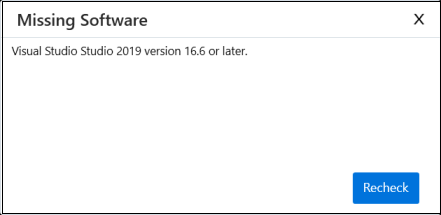	

### Purpose of Recheck button

**Recheck** option in Syncfusion Control Panel is used to update the recently installed software information in your machine. If you have installed any required software for Essential Studio platforms after installing the Syncfusion setup, those software information will not be updated in the Syncfusion Control Panel. In this case, you can just click the Recheck button in Syncfusion Control Panel which will update the recently installed software in your machine. 

### Other Utilities

This section allows you to access the following. 

1. **Add-ons** - This lists the add-on utilities that help you to utilize the additional product services from Syncfusion. 
2. [Utilities](http://help.syncfusion.com/common/essential-studio/utilities#dashboard ) - This accordion set displays the common utilities.
   * [Toolbox Configuration](http://help.syncfusion.com/common/essential-studio/utilities#toolbox-configuration )- This installer allows you to configure Syncfusion controls for various .NET Frameworks in combination with compatible Visual Studio versions.
   * [Assembly Manager](http://help.syncfusion.com/common/essential-studio/utilities#assembly-manager )- This utility allows you to manage installing or uninstalling Syncfusion Essential Studio assemblies in the GAC and in the Assemblies folders.
   * [License Manager](http://help.syncfusion.com/common/essential-studio/utilities#license-manager )- This allows you to manage the license information, such as the validity of license key and products that are licensed with this key.   
   * [Project Migration](https://help.syncfusion.com/common/essential-studio/utilities#project-migration )- This allows to migrate the project references to the given Essential Studio version.
   * [Extension Installer](https://help.syncfusion.com/common/essential-studio/utilities#vsix-installer )- This allows to configure the Syncfusion Visual Studio extensions in Visual Studio.
   * [NuGet Manager](https://help.syncfusion.com/common/essential-studio/utilities#nuget-manager )- This allows to configure the Syncfusion NuGet sources to NuGet Package Manager.

### Other Information

Other information available in the Syncfusion Control Panel includes:

* Messages- This section allows you to view the License information, like whether the user is Licensed or Trial. Syncfusion Trial expires in 30 days.

  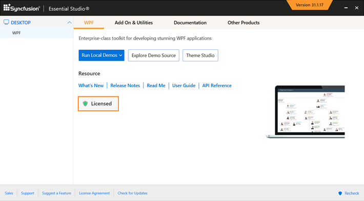

* [Sales FAQ](http://www.syncfusion.com/sales/faq) - Clicking this link directs you to the FAQ page that lists common sales-related queries and other sales contact information.
* [Contact Support](http://www.syncfusion.com/Account/Logon?ReturnUrl=%2fsupport%2fdirecttrac) - Clicking this link directs you to the Direct-Trac Login page to contact the Support Team.
* Check for updates - Shows the latest version of Syncfusion Essential Studio if available.
* License Agreement - Shows the License Agreement for the current version of Essential Studio.

## Assembly Manager

The Assembly Manager is used to install and uninstall the assemblies, to and from the GAC and Public Assemblies folder under the installed location.

### Launching the Assembly Manager 

Use the following steps to run the Assembly Manager.

1. Open Syncfusion Control Panel.
2. Click Add On and Utilities > Assembly Manager.
   
   

3. The Syncfusion {platform} Assembly Manager x.x.x.x window opens.

You can also open the Assembly Manager from {Installed location}\Syncfusion\Essential Studio\{Platform}\x.x.x.x\Utilities\Assembly Manager\AssemblyManagerWindows.exe

   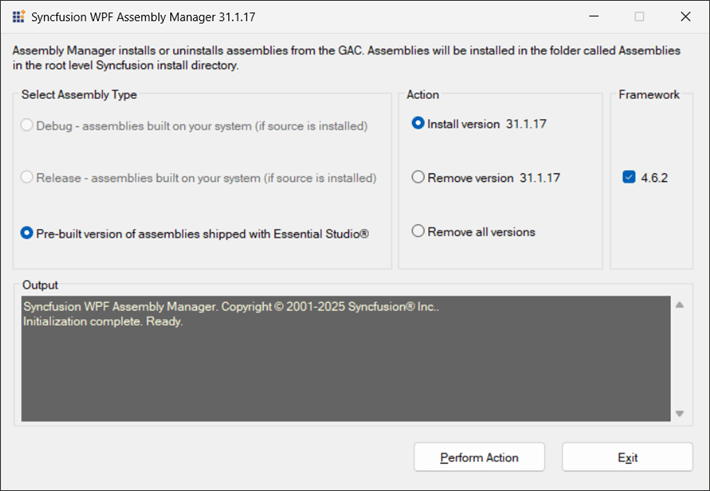

4. Select the required option from Select Assembly Type.

   * **Pre-built Assemblies** - These are the assemblies shipped with Essential Studio. Selecting this mode triggers the Assembly Manager to install the pre-built assemblies.    

    
5. Select the required option for the Action sections.

   **Action**

   The Assembly Manager can install or uninstall assemblies. To perform this action, select the **Install version x.x.x.x** or **Remove version x.x.x.x** radio button. To remove all, select the **Remove all versions** radio button.
   
    N> Remove All Versions must be used with caution in scenarios when one has applications depending on certain versions of the Syncfusion assemblies installed in the GAC. They may cease to function.

6. Select the required option for Framework sections. 

   **Framework**

   The Framework group box comprises of check boxes for the .NET Framework versions based on the Visual Studio SDK installed in the machine. The following check boxes are available:

   * 4.6 - Selecting **4.6** ensures installation of 4.6 assemblies into the GAC and assemblies folder. In cases where only Visual Studio 2015 SDK is installed, the 4.6 assemblies have to be deployed.
   * 4.5.1 - Selecting **4.5.1** ensures installation of 4.5.1 assemblies into the GAC and assemblies folder. In cases where only Visual Studio 2013 SDK is installed, the 4.5.1 assemblies have to be deployed.
   * 4.5 - Selecting **4.5** ensures installation of 4.5 assemblies into the GAC and assemblies folder. In cases where only Visual Studio 2012 SDK is installed, the 4.5 assemblies have to be deployed.
   * 4.0 - Selecting **4.0** ensures installation of 4.0 assemblies into the GAC and assemblies folder. In cases where only Visual Studio 2010 SDK is installed, the 4.0 assemblies have to be deployed.
   * 3.5 - Selecting **3.5** ensures installation of 3.5 assemblies into the GAC and assemblies folder. In cases where only Visual Studio 2008 SDK is installed, the 3.5, 2.0 assemblies can be deployed.
   * 2.0 - Selecting **2.0** ensures installation of 2.0 assemblies into the GAC and assemblies folder. In cases where only Visual Studio 2005 SDK is installed, the 2.0 assemblies have to be deployed.
   * All – Selecting **All** ensures installation of all Frameworks installed in the machine, and assemblies into the GAC and assemblies folder.

   N> By default 2.0 is enabled in a system where Visual Studio 2008 SDK is installed.

7. Click Perform Action. It starts processing.

   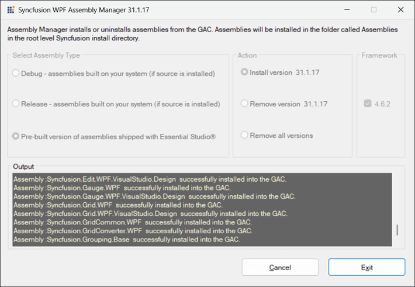

8. Once the action is completed, a confirmation message is displayed.

   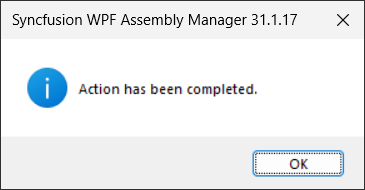

9. Click OK.

   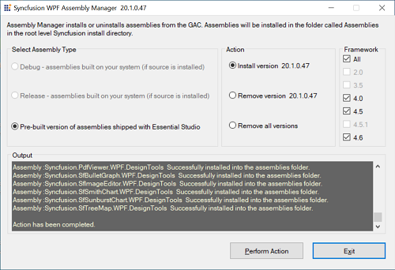

### Assembly Manager Console usage

You can also install the Syncfusion assemblies in GAC using the console version of Assembly Manager by passing the arguments. In order to do so, follow the below steps.

1. Open the command prompt in admin mode.

2. Navigate to the Assembly Manager location and pass the following arguments for AssemblyManagerConsole.exe.

**1. Installing particular version**
/version:{version} /compilemode:prebuilt /action:{action} /framework:{frameworkversions} /platform:"{platform}"

**Example**
/version:14.4.0.15 /compilemode:prebuilt /action:install /framework:46,451,45,40,35,20 /platform:"WPF"

   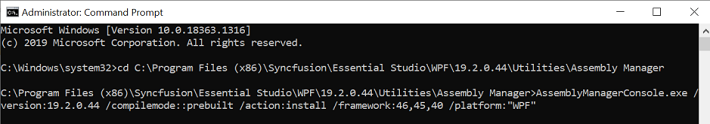
   

**2. Removing particular version**
/version:{version} /compilemode:prebuilt /action:{action} /framework:{frameworkversions} /platform:"{platform}"

**Example**
/version:14.4.0.15 /compilemode:prebuilt /action:remove /framework:46,451,45,40 /platform:"WPF"

**3. Removing all versions**
/version:{version} /compilemode:prebuilt /action:{action} /framework:{frameworkversions} /platform:"{platform}"

**Example**
/version:14.4.0.15 /compilemode:prebuilt /action:removeall /framework:46,451,45,40 /platform:"WPF"  

### Syncfusion Assemblies

The Syncfusion assemblies are installed in the following two locations: 

* Assemblies folder
* Global Assembly Cache (GAC)

**The Assemblies folder**

In the Assemblies folder, the assemblies are available in the following installation location:

 **Location:** {ProgramFilesFolder}\Syncfusion\Essential Studio\{Platform}\x.x.x.x\Assemblies

 N> * The sub-folder 3.5 is used with .NET 3.5 and the sub-folder 2.0 is used with .NET 2.0. In most cases, [System Drive]:\ is C:\.
 * In 2.0 and 3.5 GAC, the assemblies are available in {System Drive:}\WINDOWS\assembly. 
 * In 4.0, 4.5, 4.5.1 and 4.6 GAC, the assemblies are available in {System Drive:}\WINDOWS\ Microsoft.NET\assembly\GAC_MSIL.

Essential Studio ships the pre-built 2.0, 3.5, 4.0, 4.5, 4.5.1 and 4.6 .NET Framework versions of the Syncfusion assemblies. These assemblies are located in the PreCompiledAssemblies location.        

**Location**: {ProgramFilesFolder}\Syncfusion\Essential Studio\{Platform}\x.x.x.x\PreCompiledAssemblies\x.x.x.x\{Framework}

When you work with multiple target environments, you can see that each appropriate version is installed in the GAC, for side-by-side usage.

Working with Syncfusion assemblies that have been built and tested with specific .NET Framework versions, greatly increases the overall reliability. It also allows Syncfusion controls to take advantage of features that may be available in specific environments. For instance .NET 2.0 variants of the control offer features specific to the .NET 2.0 environment.

   
## License Manager

The License Manager helps to manage license key information, such as the validity of a Syncfusion key used on your system. 

### Launching License Manager

Follow the steps provided to launch the License Manager from the Dashboard.

1. Open the Syncfusion Control Panel.
2. Click Add On and Utilities->License Manager.
3. The Syncfusion License Manager dialog box opens. 
   
   

### Adding a Product Key

The following are the steps to add a product key.

1. Open the Syncfusion License Manager Dialog box.

   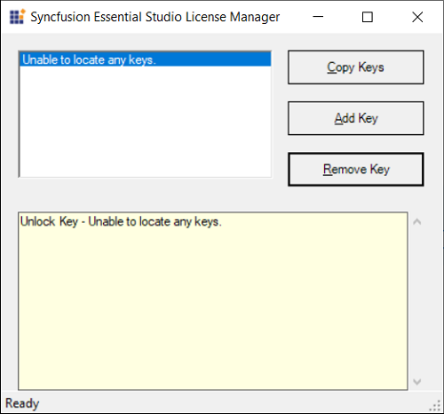

2. Click Add Key. The following dialog box opens.

   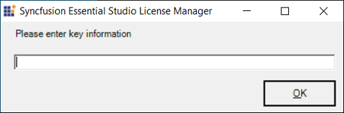

3. Enter the license key of the product in the space provided.

4. Click OK. The entered key is displayed in the log.

   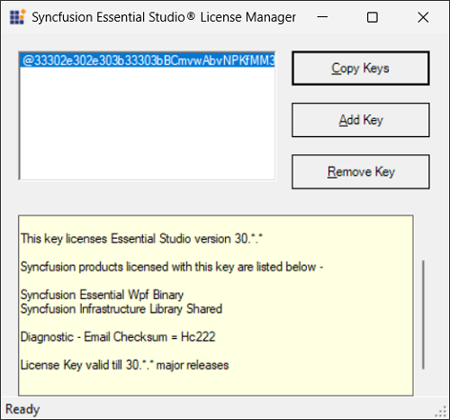

By adding an additional product key, you can also:

* Extend evaluation period. This is applicable for evaluation versions of EssentialStudio.
* Unlock additional products.

### Removing a Product Key

This option allows you to remove a product key from the License Manager window. It allows you to remove an incorrectly added or old license key.

The following are the steps to remove a license key:

1. Open the Syncfusion License Manager dialog box.
2. Select the key to be removed. The selected key is highlighted. 

   

3. Click Remove Key. The selected key is removed.

    N> The removal is reflected in the log, when the product key has already been added.

### Copying a Product Key

You can copy the product key from the License Manager window to the clipboard. The following are the steps to copy the license key.

1. Open the Syncfusion License Manager Dialog box.
2. Select the required key to be copied. The selected key is highlighted.
3. Click Copy Key. The selected key is copied. You can paste the key in the required place.

## Toolbox Configuration 

Syncfusion provides toolbox support for WPF, Windows Forms, ASP.NET, UWP and Xamarin platforms. The Syncfusion Toolbox Installer utility adds the Syncfusion controls into the Visual Studio .NET toolbox.

N> Toolbox configuration support is not available for the Visual Studio Express Edition. However, you can manually configure the Syncfusion controls into the Visual Studio Express Toolbox. To do so, refer the [Manual Toolbox Configuration](https://help.syncfusion.com/common/faq/how-to-configure-the-toolbox-of-visual-studio-manually) .

### Configuring Toolbox 

#### For Xamarin:

To configure the Syncfusion Xamarin controls to the Visual Studio toolbox, refer [this](https://help.syncfusion.com/extension/xamarin-extension/toolbox) link.

I> Syncfusion has started providing Toolbox support for Xamarin platform from v16.2.0.41

#### For UWP:

Syncfusion UWP controls will be automatically configured in Visual Studio toolbox while installing the Syncfusion UWP setup.

#### For WPF, Windows Forms and ASP.NET platforms:

1. Open the Syncfusion Control Panel.

2. Click Add On and Utilities > Toolbox Installer.
   
   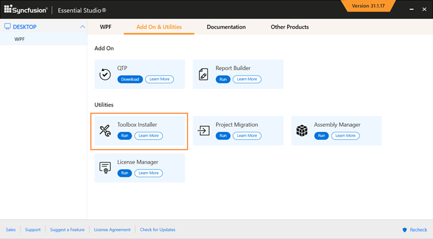

3. Toolbox Installer will be opened.

   

   The following options are available in Toolbox Configuration:

   * Install VS2005 – Configures Framework 2.0 Syncfusion controls in VS 2005 toolbox.
   * Install VS2008 – Configures Framework 3.5 Syncfusion controls in VS 2008 toolbox.
   * Install VS2010 – Configures Framework 4.0 Syncfusion controls in VS 2010 toolbox.
   * Install VS2012 – Configures Framework 4.5 Syncfusion controls in VS 2012 toolbox.
   * Install VS2013 – Configures Framework 4.5.1 Syncfusion controls in VS 2013 toolbox.
   * Install VS2015 – Configures Framework 4.6 Syncfusion controls in VS 2015 toolbox.
   * Install VS2017 – Configures Framework 4.6 Syncfusion controls in VS 2017 toolbox.
   
    N> You can also configure Syncfusion controls from a lower version Framework assembly to higher version of Visual Studio.
   
4. An Information message is displayed indicating the successful configuration of Toolbox. Click OK.

   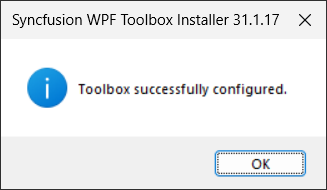
   
   
   N> * You must reset the toolbox, when the installed controls are not reflected properly in the Toolbox. * This tool configures only the controls that are located under {Installed Location}\Assemblies\{Framework version}.
   

   
## Multi-Target Manager

Multi-Target Manager helps to manage multiple .NET Frameworks in your Visual Studio 2008 project that is, switching between multiple Frameworks.

 N> This is not essential for VS 2010 because Common Language Runtime (CLR) differs for both 3.5 and 4.0 Frameworks. VS 2010 selects the required .NET Framework assembly for the corresponding projects. 3.5 and 4.0 are the only Frameworks configured; the MultiTarget Manager utility allows you to work on Framework 2.0 with VS 2010.

### When to Use Multi-Target Manager?

When Essential Studio is installed in a machine comprising both 2.0 and 3.5 Frameworks, then, by default, the target Framework is set to 3.5, and the following registry entry AssemblyFoldersEx is also set to 3.5 assembly. You can use the Multi-Target Manager to change the target Framework to 2.0. 

**Registry Location:** HKLM\Software\Microsoft\.NetFramework\v3.5\AssemblyFoldersEx\Syncfusion Essential {platform} 3.5

### Launching MultiTarget Manager 

1. Open the Multi-Target Manager from below location

   

   <b>Location:</b>{Installed location}\Syncfusion\Essential Studio\{platform}\x.x.x.x\Utilities\MultiTargetManager\MultiTargetManager.exe
   

2. The Essential Studio Multi-Target Manager x.x.x.x dialog box opens.

   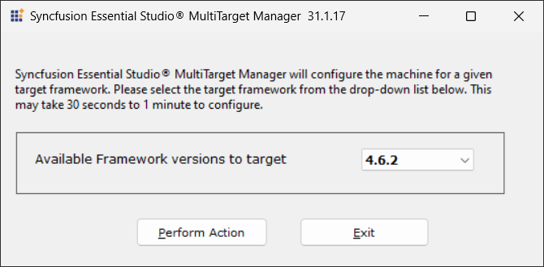

3. Select the required version from the drop-down list. The Multi-Target Manager dialog box opens.

   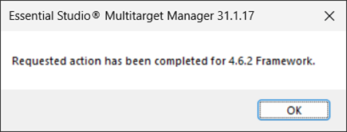

4. Click OK.

5. Open an application.

6. Refresh the application before building.

    N> The target value and the registry value change according to the selected Framework version.
   

## Project Migration

The Project Migration tool helps to upgrade the projects to the given Syncfusion Essential Studio Version.

Syncfusion Project Migration tool supports from, Syncfusion Essential Studio Version 3.2.1.0 to the latest version and the supported platforms are Windows Forms, WPF and Universal Windows Platform.

N> Project Migration utility will change the Visual Studio Target Framework version and Syncfusion assembly version alone in the .csproj files.

The following steps illustrate how to migrate a project.

### Windows Forms, WPF and Universal Windows Platform

1. Open the Project Migration Tool from the following location.

   

   <b>Location:</b> {Installed location}\Syncfusion\Essential Studio\{Platform}\x.x.x.x\Utilities\Project Migration\ProjectMigrationWindows.exe.
   

   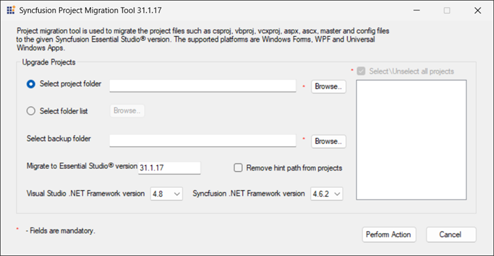

2. Select the project to be upgraded in the **Select Project Folder** field.

    N> If you have multiple projects in the same folder, you can select/deselect the projects of your choice. You can also select multiple projects location by using the **Select Folder List** option.

3. Select a folder to store a backup in the **Select backup folder** field. 

4. By default, corresponding Essential Studio version will be displayed in the **Migrate to Essential Studio Version** field.

5. Select the required **Visual Studio .NET Framework version** and **Syncfusion .NET Framework version** from the respective drop-down list.

6. When you refer the Syncfusion assemblies from Hint path instead of GAC location then, copy the latest assemblies to that location manually or select the Remove hint path from projects check box, to remove the hint from the project. If you are migrating UWP project and you are using the UWP assemblies in your projects instead of SDK, don't enable the **Remove hint path from projects** option. 

    N> If you have referred the Syncfusion assemblies to your project from hint path and you have selected the Remove hint path from projects check box in Project Migration utility, Syncfusion assemblies will be referred from GAC for Windows Forms and WPF platforms if the assemblies are installed in GAC

7. Click Perform Action. The utility upgrades the selected projects to the newer version. 

### For Web platforms.

For Web platforms, follow the steps suggested in the following documentation link to migrate the projects to the latest version. 

ASP.NET - [ASP.NET Migration](https://help.syncfusion.com/extension/aspnet-extension/project-migration) 

ASP.NET MVC - [ASP.NET MVC Migration](https://help.syncfusion.com/extension/aspnet-mvc-extension/project-migration)

ASP.NET Core - [ASP.NET Core Migration](https://help.syncfusion.com/extension/aspnetcore-extension/project-migration)

### Command Line

The following steps illustrate how to run the Project Migration tool through command line.

1. Open the Command Prompt in administrator mode and navigate to the following location.

   

   <b>Location:</b> {Installed Drive}\{ProgramFiles Folder}\Syncfusion\Essential Studio\{version}\Utilities\Project Migration\
   <b>Example:</b> C:\Program Files (x86)\Syncfusion\Essential Studio\{Platform}\16.1.0.24\Utilities\Project Migration\
   

2. Run “ProjectMigrationConsole.exe” with the following arguments.

   

   <b>Arguments:</b> /source:"sourcepath" /studio:"Essential Studio version" /framework:"[v3.5] / [v2.0] / [v4.0] / [v4.5] / [v4.5.1] / [v4.6]" /targetframework:"[v3.5] / [v2.0] / [v4.0] / [v4.5] / [v4.5.1] / [v4.6]" /backup:"Backupfolderpath" /hintpath:"[False] / [True]" /sourcefolder:"sourcefolderpath" /isfolderbackedup:"[False] / [True]"
   <b>Example:</b> /source:"C:\Users\syncfusion\Documents\Visual Studio 2017\Projects\SyncfusionWindowsFormsApplication1\SyncfusionWindowsFormsApplication1" /studio:"16.1.0.24" /framework:"v4.6" /targetframework:"v4.7" /backup:"C:\Syncfusion\backup\SyncfusionWindowsFormsApplication1_2018_02_27_022449\SyncfusionWindowsFormsApplication1" /hintpath:"False" /sourcefolder:"C:\Users\syncfusion\Documents\Visual Studio 2017\Projects\SyncfusionWindowsFormsApplication1" /isfolderbackedup:"False"
   

The following screenshot illustrates this.

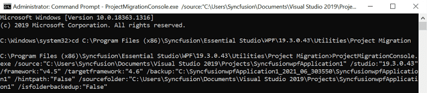

## VSIX Installer

Syncfusion provides VSIX Installer for configuring the Syncfusion extensions in Visual Studio. 

The following steps illustrate how to configure Syncfusion extensions in Visual Studio.

1. Open the SyncfusionVSIXInstallerWindows.exe from the following location.

    

    <b>Location:</b> {Installed Drive}\{ProgramFiles Folder}\Syncfusion\Essential Studio\{Platform}\{version}\Utilities\Extensions\VISX Installer\	
	<b>Example:</b> C:\Program Files (x86)\Syncfusion\Essential Studio\WPF\15.2.0.40\Utilities\Extensions\VSIX Installer
	

	
   	
   
2. Select the Syncfusion extensions to configure in Visual Studio and click the Configure button.

   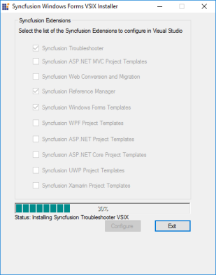
   
3. Now, the selected Syncfusion extensions will be configured in Visual Studio.  

4. Once the action is completed, a confirmation message is displayed. Click OK.

   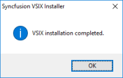

## NuGet Manager

Syncfusion NuGet Package Manager is the utility that allows you to add, remove and update the Syncfusion NuGet sources (available platforms) to NuGet Package Manager of Visual Studio. 

### Add Syncfusion NuGet Package Sources

The following steps directs you to add the Syncfusion NuGet Package sources from Syncfusion NuGet Manager.

1.	Open Syncfusion Control Panel.

2.	Choose Add On and Utilities Tab and click NuGet Manager.

    

3.	Syncfusion NuGet Manager Window will be opened.

    

4.	Select the required platforms needed to be configured from **Select platforms to add** (Left side of the window) column and click Add» button.
    
    

5.	Now selected platforms will be added under **Selected platforms to remove** (Right side of the window) column. Click “Configure” button to add the required Syncfusion Package sources to NuGet Package Manager.

    
	
6.	Once Syncfusion NuGet Manager added the Syncfusion NuGet sources, the changes will be reflected in package sources of your Visual Studio.

    

### Remove Syncfusion NuGet Package sources

1.	If any configured Syncfusion NuGet Package sources are no longer required, Select the unwanted platforms from **Select platforms to remove** (Right side of the window) column and click «Remove button.

    

2.	Now selected platforms will be added under **Selected platforms to add** (Left side of the window) column. Click “Configure” button to remove the required Syncfusion Package sources to NuGet Package Manager.

3.	Once Syncfusion NuGet Manager removed the Syncfusion NuGet sources, the changes will be reflected in NuGet.config file of your machine and updated the same in available package sources of your Visual Studio.

	
	

