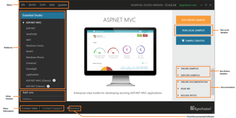
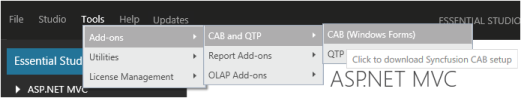
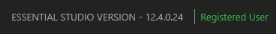

### Dashboard

This section provides details on the structure and composition of the Syncfusion Essential Studio dashboard. It also elaborates on navigating the dashboard to access various utilities and product samples.

{:.image }

The dashboard structure can be split as follows. 

Menu

The Menu includes the Menu Bar that accommodates five menus.

1. File - Allows you to exit the dashboard. Alternatively, this can be done by clicking 
{:.image }
 at the top right corner of the dashboard.

{:.image }

1. Studio - Allows you to access the products under each platform. Also provides access to view local and online product samples. It allows you to access the online documentation, release notes and ReadMe documents for the respective products. This can alternatively be accessed using the Product Platforms section in the dashboard.

{:.image }

2. Tools - Allow you to access the add-ons and utilities available for various platforms and products. Also allows you to manage assemblies and license. The Toolbox configuration allows you to choose from various Visual Studio versions to be installed, depending on your system’s configuration. This can alternatively be accessed from the Utilities & Documentation section.

{:.image }

3. Help - Allows you to access the information about the currently installed version by clicking About. You can also access the Direct-TracSupport Page online.

{:.image }

4. Updates – Shows the latest version of Syncfusion Essential Studio available. 

{:.image }

Product Platforms 

This section allows you to access the product samples available for each platform.

{:.image }

Accessing Product Samples

Syncfusion provides lots of online and local samples for better understanding of the controls. You can access them using the following steps. 

1. Open the Syncfusion Dashboard.

{:.image }

2. Select the required platform. Options for the selected platform are displayed on the right.
3. Click any of the following to know more about the selected product.
* Run Samples - To run the locally installed samples.
* Online Samples - To view online samples.
* Explore Samples - To open local installed location.
* Explore Source - To view the source, when you have installed the source add-on setup.
* Online Documentation - To view the online documentation help contents for the respective products.
* Release Notes - To view the “Release Notes” content.
* ReadMe - To view the “ReadMe” content.
* What’s New - To view the “What’s New” content.
> 

{:.image }
_Note: You can explore source only when you have source license and have installed the Source Add-on Setup._

Checking Prerequisites

You need to install a list of prerequisites, for all of the products to work successfully. When some of the software is not installed, the dashboard displays an alert. Click Missing Software, and a Recommended Software dialog box opens.

{:.image }

Recommended Software 

Recommended Software lists the prerequisites for all platforms. A 
{:.image }
 symbol appears when all the recommended software for the platform are installed in your system. A 
{:.image }
symbol appears when any recommended software for a platform is not installed in your system, before installing Essential Studio.

The Recheck option rechecks the prerequisites list and refreshes the currently installed software list.

{:.image }

Other Utilities

This section allows you to access the following. 

1. Add-ons - This lists the add-on utilities that help you to utilize the additional product services from Syncfusion. 
2. [Utilities](http://help.syncfusion.com/ug/common/documents/6dashboardutilities.htm)- This accordion set displays the common utilities.
* Toolbox Configuration- This installer allows you to configure Syncfusion controls for various .NET frameworks in combination with compatible Visual Studio versions.
* Assembly Manager- This utility allows you to manage installing or uninstalling Syncfusion Essential Studio assemblies in the GAC and in the Assemblies folders.
* Build Manager - This utility allows you to build and debug assemblies using the source installed in Essential Studio’s installed location.
* Documentation- This provides access to view the online documentation and installed documentation.
* License Manager- This allows you to manage the license information, such as the validity of license key and products that are licensed with this key.
* LicenseAgreement – This allows you to navigate to the Software License Agreement. 

Other Information

Other information available in the dashboard includes:

* Messages- This section allows you to view the user registration information, like whether the user is registered or not.

{:.image }

* [Sales FAQ](http://www.syncfusion.com/sales/faq) - Clicking this link directs you to the FAQ page that lists common sales-related queries and other sales contact information.
* [Contact Support](http://www.syncfusion.com/Account/Logon?ReturnUrl=%2fsupport%2fdirecttrac) - Clicking this link directs you to the Direct-Trac Login page to contact the Support Team.
