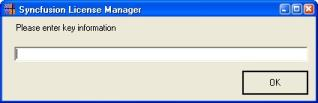

### License Manager

The License Manager helps you manage license key information, such as the validity of a Syncfusion key used on your system. 

Launching License Manager

Follow the steps provided to launch the LicenseManager from the Dashboard.

1. Open the Syncfusion Dashboard.
2. Click License Management.
3. Click the Launch button for License Manager. The Syncfusion License Manager dialog box opens. 

{:.image }

Adding a Product Key

The following are the steps to add a product key.

1. Open the Syncfusion License Manager Dialog box.

{:.image }

2. Click Add Key. The following dialog box opens.

{:.image }

3. Enter the license key of the product in the space provided.
4. Click OK. The entered key is displayed in the log.

{:.image }

By adding an additional product key, you can also:

* Extend evaluation period. This is applicable for evaluation versions of EssentialStudio.
* Unlock additional products.

Removing a Product Key

This option allows you to remove a product key from the LicenseManager window. It allows you to remove an incorrectly added or old license key.

The following are the steps to remove a license key:

1. Open the Syncfusion License Manager dialog box.
2. Select the key to be removed. The selected key is highlighted. 

{:.image }

3. Click Remove Key. The selected key is removed.

> 
{:.image }
_Note: The removal is reflected in the log, when the product key has already been added._

Copying a Product Key

You can copy the product key from the LicenseManager window to the clipboard. The following are the steps to copy the license key.

1. Open the Syncfusion License Manager Dialog box.
2. Select the required key to be removed. The selected key is highlighted.
3. Click Copy Key. The selected key is copied. You can paste the key in the required place. 
