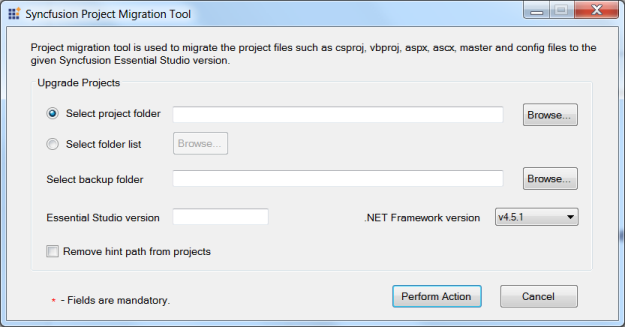

### Project Migration

The ProjectMigration tool enables you to move the project files to the given Syncfusion Essential Studio Version.

Syncfusion Project Migration tool supports from, Syncfusion Essential Studio Version 3.2.1.0 to the latest version and the supported platforms are Windows Forms, WPF, Silverlight and ASP.NET.

The following steps illustrate how to migrate a project.

1. You can open the Project Migration Tool from the following location: (Installed location)\Syncfusion\Essential Studio\x.x.x.x\Utilities\ Project Migration\ProjectMigrationWindows.exe.

   

2. Select the project to be upgraded in the Select Project Folder field.

   _Note: You can also select multiple projects_ by _using the Select Folder List option._

3. Select a folder to store a backup in the Select backup folder field. 
4. Enter the Essential Studio version to upgrade in the Essential Studio version field, for example, 13.1.0.21.
5. Select the required .NET version from the .NET Framework version drop-down list.
6. When you refer to the Syncfusion assemblies by Hint path instead of GAC location then, copy the latest assemblies to that location manually or select the Remove hint path from projects check box, to remove the hint from the project. 
7. Click Perform Action. The utility upgrades the selected projects to the newer versions.
