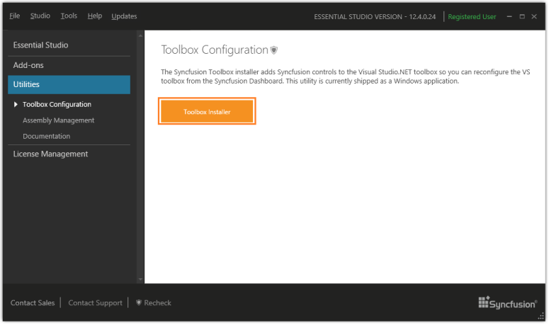

### Toolbox Configuration 

The Syncfusion Toolbox Installer adds the Syncfusion controls into the Visual Studio .NET toolbox. This utility is currently shipped as a console application.

Configuring Toolbox 

1. Open the Syncfusion Dashboard.
2. Click Utilities > Toolbox Configuration.
   
   

3. Select the Toolbox Installer.
   
   

   The following options are available in Toolbox Configuration:

   * Install VS2005 – Configures Framework 2.0 Syncfusion controls in VS 2005 toolbox.
   * Install VS2008 – Configures Framework 3.5 Syncfusion controls in VS 2008 toolbox.
   * Install VS2010 – Configures Framework 4.0 Syncfusion controls in VS 2010 toolbox.
   * Install VS2012 – Configures Framework 4.5 Syncfusion controls in VS 2012 toolbox.
   * Install VS2013 – Configures Framework 4.5.1 Syncfusion controls in VS 2013 toolbox.

4. An Information message is displayed indicating the successful configuration of Toolbox. Click OK.

   

   You can configure the Syncfusion controls from a lower framework assembly version to a higher one, by Command-Line mode. For information on configuring the toolbox through Command-Line mode, see [Toolbox command line configuration](http://www.syncfusion.com/support/kb/2336).

   _Note:_

   * _You must reset the toolbox, when the installed controls are not reflected properly in the Toolbox._
   * _This tool configures only the controls that are located under Installed Location\Assemblies\_ 

   _(Framework version)._

