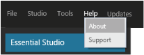
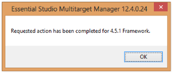
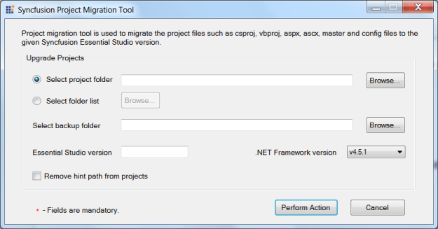

# Utilities

## Dashboard

This section provides details on the structure and composition of the Syncfusion Essential Studio dashboard. It also elaborates on navigating the dashboard to access various utilities and product samples.

The dashboard structure can be split as follows. 

### Menu

The Menu includes the Menu Bar that accommodates five menus.

1. File - Allows you to exit the dashboard. Alternatively, this can be done by clicking 

   at the top right corner of the dashboard.

   

2. Studio - Allows you to access the products under each platform. Also provides access to view local and online product samples. It allows you to access the online documentation, release notes and ReadMe documents for the respective products. This can alternatively be accessed using the Product Platforms section in the dashboard.

  

3. Tools - Allow you to access the add-ons and utilities available for various platforms and products. Also allows you to manage assemblies and license. The Toolbox configuration allows you to choose from various Visual Studio versions to be installed, depending on your system’s configuration. This can alternatively be accessed from the Utilities & Documentation section.

   

4. Help - Allows you to access the information about the currently installed version by clicking About. You can also access the Direct-TracSupport Page online.

   

5. Updates – Shows the latest version of Syncfusion Essential Studio available. 

   

### Product Platforms 

This section allows you to access the product samples available for each platform.

### Accessing Product Samples

Syncfusion provides lots of online and local samples for better understanding of the controls. You can access them using the following steps. 

1. Open the Syncfusion Dashboard.

   

2. Select the required platform. Options for the selected platform are displayed on the right.

3. Click any of the following to know more about the selected product.

   * Run Samples - To run the locally installed samples.
   * Online Samples - To view online samples.
   * Explore Samples - To open local installed location.
   * Explore Source - To view the source, when you have installed the source add-on setup.
   * Online Documentation - To view the online documentation help contents for the respective products.
   * Release Notes - To view the “Release Notes” content.
   * ReadMe - To view the “ReadMe” content.
   * What’s New - To view the “What’s New” content.

   > Note: You can explore source only when you have source license and have installed the Source Add-on Setup.

### Checking Prerequisites

You need to install a list of prerequisites, for all of the products to work successfully. When some of the software is not installed, the dashboard displays an alert. Click Missing Software, and a Recommended Software dialog box opens.

### Recommended Software 

Recommended Software lists the prerequisites for all platforms. A 

 symbol appears when all the recommended software for the platform are installed in your system. A 

symbol appears when any recommended software for a platform is not installed in your system, before installing Essential Studio.

The Recheck option rechecks the prerequisites list and refreshes the currently installed software list.

### Other Utilities

This section allows you to access the following. 

1. Add-ons - This lists the add-on utilities that help you to utilize the additional product services from Syncfusion. 
2. [Utilities](http://help.syncfusion.com/ug/common/documents/6dashboardutilities.htm)- This accordion set displays the common utilities.
   * Toolbox Configuration- This installer allows you to configure Syncfusion controls for various .NET frameworks in combination with compatible Visual Studio versions.
   * Assembly Manager- This utility allows you to manage installing or uninstalling Syncfusion Essential Studio assemblies in the GAC and in the Assemblies folders.
   * Build Manager - This utility allows you to build and debug assemblies using the source installed in Essential Studio’s installed location.
   * Documentation- This provides access to view the online documentation and installed documentation.
   * License Manager- This allows you to manage the license information, such as the validity of license key and products that are licensed with this key.
   * LicenseAgreement – This allows you to navigate to the Software License Agreement. 

### Other Information

Other information available in the dashboard includes:

* Messages- This section allows you to view the user registration information, like whether the user is registered or not.

  

* [Sales FAQ](http://www.syncfusion.com/sales/faq) - Clicking this link directs you to the FAQ page that lists common sales-related queries and other sales contact information.
* [Contact Support](http://www.syncfusion.com/Account/Logon?ReturnUrl=%2fsupport%2fdirecttrac) - Clicking this link directs you to the Direct-Trac Login page to contact the Support Team.

## Assembly Manager

The Assembly Manager is used to install and uninstall the assemblies, to and from the GAC and Public Assemblies folder under the installed location. It is used to install and uninstall the assemblies into the GAC.

### Launching the Assembly Manager 

Use the following steps to run the Assembly Manager.

1. Open Syncfusion Dashboard.
2. Click Utilities > Assembly Management.
3. Click Launch button for Assembly Manager.
   
   

4. The Syncfusion Assembly Manager x.x.x.x window opens.

   > Note: You can also open the Assembly Manager from the following location:

   > (Installed location)\Syncfusion\Essential Studio\x.x.x.x\Utilities\Assembly Manager\AssemblyManagerWindows.exe

   

5. Select the required option from Select Assembly Type.

   * Pre-built Assemblies - These are the assemblies shipped with Essential Studio. Selecting this mode triggers the AssemblyManager to install the pre-built assemblies. 

   * Debug and Release Assemblies - This mode triggers the AssemblyManager to install custom versions, built from the source code, using Build Manager. These assemblies can be used only when the source code for at least one of the Essential Studio products, has been installed. This triggers the AssemblyManager to install custom versions built from source code, installed on your machine. Applies only to versions of the product that come with the source code.

   > Note: The Build Manager application must be run to build, debug or release versions of the assemblies before the Assembly Manager can install the custom built assemblies._

6. Select the required option for the Action sections.

   ### Action

   The AssemblyManager can install or uninstall assemblies. To perform this action, select the Install version x.x.x.x or Remove version x.x.x.x radio button. To remove all, select the Remove All Versions radio button.
   
   > Note: Remove All Versions must be used with caution in scenarios when one has applications depending on certain versions of the Syncfusion assemblies installed in the GAC. They may cease to function._

7. Select the required option for Framework sections. 

   ### Framework

   The Framework group box comprises of checkboxes for the .NET framework versions based on the Visual Studio SDK installed in the machine. The following checkboxes are available:

   * 4.5.1 - Selecting 4.5.1 ensures installation of 4.5.1 assemblies into the GAC and assemblies folder. In cases where only Visual Studio 2013 SDK is installed, the 4.5.1 assemblies have to be deployed.
   * 4.5 - Selecting 4.5 ensures installation of 4.5 assemblies into the GAC and assemblies folder. In cases where only Visual Studio 2012 SDK is installed, the 4.5 assemblies have to be deployed.
   * 4.0 - Selecting 4.0 ensures installation of 4.0 assemblies into the GAC and assemblies folder. In cases where only Visual Studio 2010 SDK is installed, the 4.0 assemblies have to be deployed.
   * 3.5 - Selecting 3.5 ensures installation of 3.5 assemblies into the GAC and assemblies folder. In cases where only Visual Studio 2008 SDK is installed, the 3.5, 2.0 assemblies can be deployed.
   * 2.0 - Selecting 2.0 ensures installation of 2.0 assemblies into the GAC and assemblies folder. In cases where only Visual Studio 2005 SDK is installed, the 2.0 assemblies have to be deployed.
   * All – Selecting All ensures installation of all frameworks, or the frameworks installed in the machine, and assemblies into the GAC and assemblies folder.

   > Note: By default 2.0 is enabled in a system where Visual Studio 2008 SDK is installed._

8. Click Perform Action. It starts processing.

   

9. Once the action is completed, a confirmation message is displayed.

   

10. Click OK.

   

>   
> Important Note: In earlier versions, the Assembly Manager also served as Build Manager to build custom versions of the Syncfusion assemblies. Now, this function has been moved to a separate BuildManager utility. Installation of assemblies to the Visual Studio.NET toolbox is now handled by a separate utility called the ToolboxInstaller. The new Assembly Manager just handles installation of assemblies to the GAC and the assemblies’ folder; the Assemblies folder is applicable only when Visual Studio.NET is installed.

In previous versions, the Assembly Manager allowed switching to any version of the Syncfusion assemblies, installed on the system. This causes compatibility issues and also restricts the overall structure of the utility. To switch to another version from the current version, you must run the Assembly Manager of the respective version.It is preferable to have the Assembly Manager do a Remove All operation before it installs the latest assemblies. 

The console version of the Assembly Manager runs at the end of the installation process, to add the default, pre-built version of the Syncfusion assemblies to the Global Assembly Cache (GAC) and the Visual Studio .NET Public Assemblies folders. The need to run the Assembly Manager arises, only when changes have been made to the GAC, or when custom versions have been built for controls for debugging purposes.

> Note: The version number in the tags have to be changed to the version you are linking it to.

### Syncfusion Assemblies

The Syncfusion assemblies are installed in the following two locations: 

* Assemblies folder
* Global Assembly Cache (GAC)

The Assemblies folder

In the Assemblies folder, the assemblies are available in the following installation path:

 [System Drive]:\Program Files\Syncfusion\Essential Studio\x.x.x.x\Assemblies

> Note:
>
> •The sub-folder 3.5 is used with .NET 3.5 and the sub-folder 2.0 is used with .NET 2.0. In most cases, [System Drive]:\ is C:\.

> •In 2.0 and 3.5 GAC, the assemblies are available in the installation path [System Drive]:\WINDOWS\assembly.

> •In 4.0, 4.5, and 4.5.1 GAC, the assemblies are available in the installation path [System Drive]:\WINDOWS\ Microsoft.NET\assembly\GAC_MSIL.

Essential Studio ships the pre-built 2.0, 3.5, 4.0, 4.5, and 4.5.1 .NET Framework versions of the Syncfusion assemblies. These assemblies are located in the PreCompiledAssemblies folder.        

[System Drive]:\Program Files\Syncfusion\Essential Studio\x.x.x.x\PreCompiledAssemblies\x.x.x.x\2.0 

When you work with multiple target environments, you can see that each appropriate version is installed in the GAC, for true side-by-side use.

Working with Syncfusion assemblies that have been built and tested with specific .NET Framework versions, greatly increases the overall reliability. It also allows Syncfusion controls to take advantage of features that may be available in specific environments. For instance .NET 2.0 variants of the control offer features specific to the .NET 2.0 environment.

## Build Manager

Build Manager allows you to build or debug the assemblies using Syncfusion source code. 

### Launching Build Manager 

The following steps help you launch the Build Manager. 

1. Open the Syncfusion Dashboard.

1. Click Utilities > Build Management.

2. Click the Launch button for Build Manager.

3. The Syncfusion Build Manager x.x.x.x window opens.

   > Note: Build Manager is available in the Dashboard only when Source code is installed. You can also launch the Build Manager from the following location: C:\Program Files\Syncfusion\Essential Studio\x.x.x.x\Utilities\Build Manager\buildmanagerwindows.exe_

   

4. Select the required setting in the Syncfusion Build Manager x.x.x.x window.

### Build Manager Settings

This window contains seven sections. 

1. Framework Version 

   The Framework Version group box has five options: .NET 2.0, .NET 3.5, .NET 4.0, .NET 4.5 and .NET 4.5.1. When Visual Studio 2013 is not installed in your system, the .NET 4.5 option is selected by default. When Visual Studio 2012 is not installed in your system, the .NET 4.0 option is selected by default. When Visual Studio 2010 is not installed in your system, .NET 3.5 option is selected by default. When Visual Studio 2008 is not installed in your system, .NET 2.0 option is selected by default. You can change the default option by clicking the Other button. The version of the .NET framework that the assemblies should be built with is specified here and is used automatically to rebuild the assemblies. 

2. Product

   The Product group box has a drop-down list box. By default, All is selected. You can change the default option by selecting one of the products from the drop-down list box. 

3. Platform Type

   Syncfusion products typically have a common base library that forms the basis for the Windows and Web variants. The library category to be built is specified using the Product Type. This frame has eight options. All is selected by default. You can click the required product's button to perform the build operation.

   > Note: For assemblies that are not built and pre-compiled, assemblies that ship with the product is automatically used.

4. Assembly Type

   This frame has two options: Debug and Release. Debug is selected by default. To choose the Release mode for assembly, select Release.

   You can switch between the Debug and Release mode of product configurations. Building the Debug version of the assemblies allows you to step into the Syncfusion assemblies when debugging applications. 

5. Dependencies

   This enables you to specify whether the dependent assemblies of the product need to be used or not. When the Use Pre-Built Dependencies check box is selected, the dependent assemblies of the product under the selected product frame are taken from the Pre-Compiled Assemblies folder that exists under the installed location. Rebuilding assemblies can be restricted to specific assemblies, by enabling the pre-built dependencies. In that case, the other assemblies would be just precompiled variants, installed with the product. 

6. Strong Key

   This enables you to install the compiled assemblies in GAC. Select the Use Strong Key check box and choose a .snk file to achieve this. 

7. Output

   This frame shows the output, that is, the status of the build operation, in a text area. 

   After selecting the required options in the above-mentioned frames, click Perform Build inside the output frame.

   > Note: The Build operation is performed and the status is updated in the text area, inside the output frame. On completion of the Build operation, an information message is displayed stating that the Build operation has been completed. It also asks you to review the Build output and log files for additional information.
   
   
## License Manager

The License Manager helps you manage license key information, such as the validity of a Syncfusion key used on your system. 

### Launching License Manager

Follow the steps provided to launch the LicenseManager from the Dashboard.

1. Open the Syncfusion Dashboard.
2. Click License Management.
3. Click the Launch button for License Manager. The Syncfusion License Manager dialog box opens. 
   
   

### Adding a Product Key

The following are the steps to add a product key.

1. Open the Syncfusion License Manager Dialog box.

   

2. Click Add Key. The following dialog box opens.

   

3. Enter the license key of the product in the space provided.

4. Click OK. The entered key is displayed in the log.

   

By adding an additional product key, you can also:

* Extend evaluation period. This is applicable for evaluation versions of EssentialStudio.
* Unlock additional products.

### Removing a Product Key

This option allows you to remove a product key from the LicenseManager window. It allows you to remove an incorrectly added or old license key.

The following are the steps to remove a license key:

1. Open the Syncfusion License Manager dialog box.
2. Select the key to be removed. The selected key is highlighted. 

   

3. Click Remove Key. The selected key is removed.

   > Note: The removal is reflected in the log, when the product key has already been added._

### Copying a Product Key

You can copy the product key from the LicenseManager window to the clipboard. The following are the steps to copy the license key.

1. Open the Syncfusion License Manager Dialog box.
2. Select the required key to be removed. The selected key is highlighted.
3. Click Copy Key. The selected key is copied. You can paste the key in the required place.

## Toolbox Configuration 

The Syncfusion Toolbox Installer adds the Syncfusion controls into the Visual Studio .NET toolbox. This utility is currently shipped as a console application.

### Configuring Toolbox 

1. Open the Syncfusion Dashboard.

2. Click Utilities > Toolbox Configuration.
   
   

3. Select the Toolbox Installer.

   

   The following options are available in Toolbox Configuration:

   * Install VS2005 – Configures Framework 2.0 Syncfusion controls in VS 2005 toolbox.
   * Install VS2008 – Configures Framework 3.5 Syncfusion controls in VS 2008 toolbox.
   * Install VS2010 – Configures Framework 4.0 Syncfusion controls in VS 2010 toolbox.
   * Install VS2012 – Configures Framework 4.5 Syncfusion controls in VS 2012 toolbox.
   * Install VS2013 – Configures Framework 4.5.1 Syncfusion controls in VS 2013 toolbox.
   
4. An Information message is displayed indicating the successful configuration of Toolbox. Click OK.

   

   You can configure the Syncfusion controls from a lower framework assembly version to a higher one, by Command-Line mode. For information on configuring the toolbox through Command-Line mode, see [Toolbox command line configuration](http://www.syncfusion.com/support/kb/2336).
   
   > Note:
   > * You must reset the toolbox, when the installed controls are not reflected properly in the Toolbox.
   > * This tool configures only the controls that are located under Installed Location\Assemblies\

   _(Framework version)._
   

   
## Multi-Target Manager

Multi-Target Manager helps to manage multiple .NET frameworks in your Visual Studio 2008 project that is, switching between multiple frameworks.

> Note: This is not essential for VS 2010 because Common Language Runtime (CLR) differs for both 3.5 and 4.0 frameworks. VS 2010 selects the required .NET framework assembly for the corresponding projects. 3.5 and 4.0 are the only frameworks configured; the MultiTarget Manager utility allows you to work on framework 2.0 with VS 2010.

### When to Use Multi-Target Manager?

When Essential Studio is installed in a machine comprising both 2.0 and 3.5 frameworks, then, by default, the target framework is set to 3.5, and the following registry entry AssemblyFoldersEx is also set to 3.5 assembly. You can use the Multi-Target Manager tochange the target framework to 2.0. 

HKLM\Software\Microsoft\.NetFramework\v2.0.50727\AssemblyFoldersEx\Syncfusion Essential Studio 3.5

### Launching MultiTarget Manager 

1. Open the Syncfusion Dashboard.

2. Click Utilities > Assembly Management.

3. Click the Launch button for Multi-Target Manager. 

   

   > Note: You can also open the Multi-Target Manager from the following location:
   >
   > (Installed location)\Syncfusion\Essential Studio\x.x.x.x\Utilities\MultiTargetManager\ MultiTargetManager.exe

4. The Essential Studio Multi-Target Manager x.x.x.x dialog box opens.

   

5. Select the required version from the drop-down list. The Multi-Target Manager dialog box opens.

   

6. Click OK.

7. Open an application.

8. Refresh the application before building.

   > Note: The target value and the registry value change according to the selected framework version.
   

## Project Migration

The ProjectMigration tool enables you to move the project files to the given Syncfusion Essential Studio Version.

Syncfusion Project Migration tool supports from, Syncfusion Essential Studio Version 3.2.1.0 to the latest version and the supported platforms are Windows Forms, WPF, Silverlight and ASP.NET.

The following steps illustrate how to migrate a project.

1. You can open the Project Migration Tool from the following location: (Installed location)\Syncfusion\Essential Studio\x.x.x.x\Utilities\ Project Migration\ProjectMigrationWindows.exe.

   

2. Select the project to be upgraded in the Select Project Folder field.

   > Note: You can also select multiple projects_ by _using the Select Folder List option.

3. Select a folder to store a backup in the Select backup folder field. 

4. Enter the Essential Studio version to upgrade in the Essential Studio version field, for example, 13.1.0.21.

5. Select the required .NET version from the .NET Framework version drop-down list.

6. When you refer to the Syncfusion assemblies by Hint path instead of GAC location then, copy the latest assemblies to that location manually or select the Remove hint path from projects check box, to remove the hint from the project. 

7. Click Perform Action. The utility upgrades the selected projects to the newer versions.

### Command Line

The following steps illustrate how to run the Project Migration tool through command line.

1. Open the Command Prompt in administrator mode and navigate to the following location:

   {Installed Drive}\{ProgramFiles Folder}\Syncfusion\Essential Studio\{version}\Utilities\Project Migration\

   Example: C:\Program Files (x86)\Syncfusion\Essential Studio\12.1.0.43\Utilities\Project Migration\

2. Run “ProjectMigrationConsole.exe” with the following arguments:

   /source:"sourcepath" /studio:"Essential Studio version" /framework:"[v3.5] / [v2.0] / [v4.0] / [v4.5] / [v4.5.1]" /backup:"Backupfolderpath" /hintpath:"[False] / [True]"

   Example: /source:"C:\Users\Vadivel\Documents\Visual Studio 2012\Projects\WindowsFormsApplication3" /studio:"11.2.0.25" /framework:"v4.0" /backup:"E:\ProjectMigrationBackup\WindowsFormsApplication3" /hintpath:"False"

The following screenshot illustrates this.

## Project Templates

Syncfusion provides Project Templates for the ASP.NET MVC platform to automatically refer the necessary reference and resource files in an application. However, this is not applicable to other platforms. In the other platforms, such as Windows Forms, WPF, Silverlight, and ASP.NET, the Syncfusion controls are automatically configured in the Microsoft Visual Studio Toolbox after the setup has been installed, and the controls can be used in the application by simply dragging them from the toolbox.

