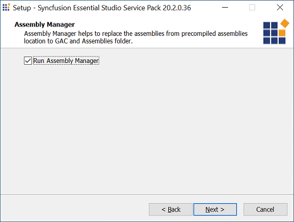
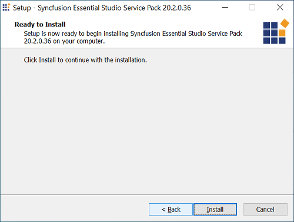
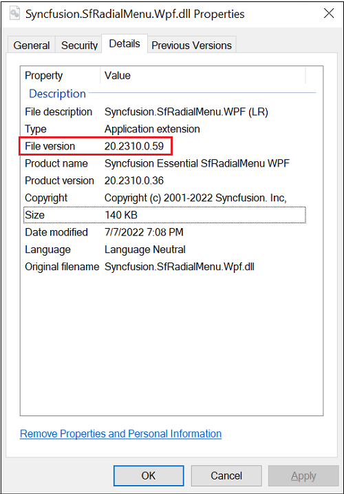
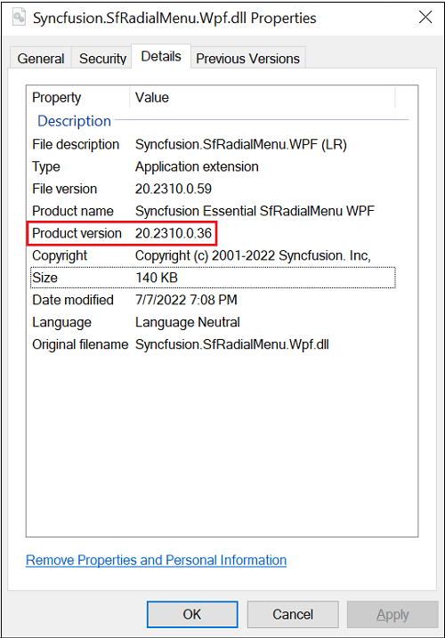

# Applying the Patches

Syncfusion&reg; provides patch installer for major versions or service pack versions, either to add new features or to fix issues. You must install the patches in the order you have received.

## Installing the Patch installer

The steps below show how to install a patch installer.

I> Before installing the patch, ensure that corresponding Essential Studio&reg; version platform has been installed in your machine.

1.  Run the Syncfusion&reg; Essential Studio&reg; patch installer by double-clicking it. The Syncfusion&reg; Essential Studio&reg; Service Pack welcome wizard appears.
   
    

2.  Click Next. The confirmation to the Run Assembly Manager screen opens.
   
    

3.  Select the Run Assembly Manager check box to install the assemblies in GAC.

4.  Click Next. The Ready To Install screen opens.
   
    

5.  Click Install. Installation process begins.
   
    

    N> The patch is installed on your computer, and a dialog box appears when the installation is complete.

    

6.  Click Finish. The new assemblies are placed in the Pre-Compiled Assemblies folder. These new assemblies can be referenced in your project.
   
N> When using the Patch setup NuGet packages, please clear the NuGet cache. To learn about clearing the NuGet cache, refer to [this](https://support.syncfusion.com/kb/article/6265/how-to-clear-nuget-cache) KB article.
	
## Patch Assembly Version Format
   
In the patch assembly, the **File Version** and **Product Version** will be different. Product Version will be the release version and File Version will be the increment of the release version's **revision** number. For each patch, the File Version will be a different one. You can differentiate between the build and patch assemblies by File Version. 
   
**File Version of the assembly shipped in build:**
   

   
**Product Version of the assembly shipped in patch:**
   

