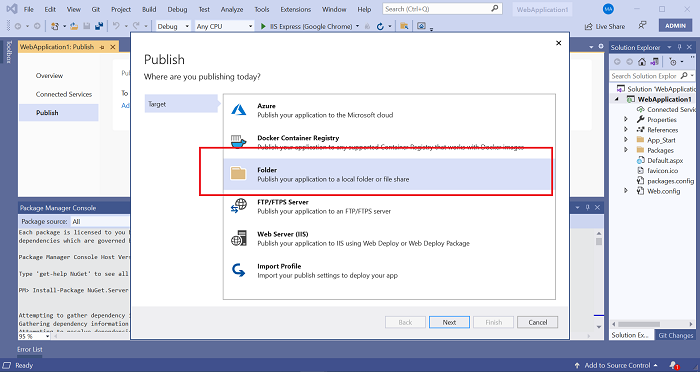
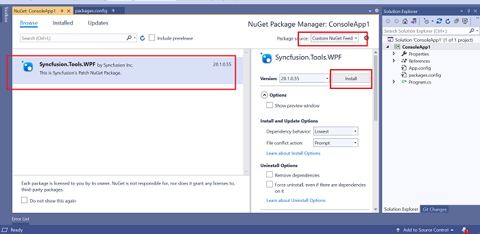

# Setup Private NuGet Server

## Overview

This document will explain the steps for configuring a private NuGet server, pushing or removing the NuGet packages from the private NuGet server, and configuring the private NuGet feed in Visual Studio.

## Private NuGet server and package usage

Setup the private NuGet and perform the NuGet CLI to publish the custom NuGet packages into the private NuGet server. CI/CD uses this to refer to the assemblies from private NuGet server. 

## How to prepare a private NuGet server

Set up a **Private NuGet Server** using IIS and publish the NuGet packages. To build a Private NuGet server, please follow these steps.

* Create an ASP.NET Web application with NuGet Server.
* Host the application in Internet Information Services (IIS).
* Add Syncfusion<sup style="font-size:70%">&reg;</sup> packages to the feed.
* Remove Syncfusion<sup style="font-size:70%">&reg;</sup> packages from the feed.
* Configure the private NuGet feed to Visual Studio.

### Create an ASP.NET Web application with NuGet Server

1.	 Open the Visual Studio, select **Create a New Project**, search for **ASP.NET Web Application (.NET Framework)**, and click **Next**.

     
	 
	 
	 
	
2.	 Select **.NET Framework 4.6** in the Framework dropdown, give the project a suitable name, and click **Create**.

     
	 
	 
3.	Select **Empty project** template and click **Create**.

	 
	 
	 
4.	Once project created, right-click on the project, and select **Manage NuGet Packages**.

	 


5.	Go to the **Browse** tab, search for **NuGet.Server** and install the most recent version. NuGet.Server can also be installed using the **Package Manager Console** with the command **Install-Package NuGet.Server**.

	 
	 
	 

	**Package Manager Console**

	 
	 
	 

	N> When the NuGet.Server package installation is finished, it may not overwrite the existing elements but instead, create duplicates. When you try to run the project later, the duplicates will cause an **Internal Server Error**.

	**For example:** If your web.config contains **<compilation debug="true" targetFramework="4.5.2" />** before installing NuGet.Server, the package does not overwrite it but instead inserts a new one **<compilation debug="true" targetFramework="4.6" />**. In that case, remove the element with an older framework version.

6.	After installing the NuGet.Server package, **web.config** contains an empty **appSetting/apiKey** value. Pushing packages to the feed is disabled when **apiKey** is omitted or blank. Set the **apiKey** to a value (ideally a strong password) and add a key called **appSettings/requireApiKey** with the value true to enable this capability.

	 


7.  Set **requireApiKey** to false if your server is already secured or if you don't need an API key for any other reason (for example, when using a private server on a local team network). After that, any user with access to the server can push packages.

	 


8.	The packages are**(.nupkg files)** placed where the application was published. You can also change the packages folder by providing a specific path to **packagesPath** in web.config.

	 


9.	To overwrite the package without deleting it, enable the **allowOverrideExistingPackageOnPush** as true.

	 


10.	Run the application in Visual Studio. The URLs for the package feed are provided on the home page as follows.

	 


11.	Right-click on the project and select **Publish**.

	 


12.	Click **Next** after selecting the **Folder** target for publishing.

	 


13.	Enter a specific location for the Folder and click **Finish**.

	 


14.	Host the application to **Internet Information Services (IIS)** after testing your local deployment.


### Hosting the application in Internet Information Services (IIS)

Follow these steps to configure the application in IIS.

1.	Go to **Control Panel**, then **Programs and Features**, and then **Turn Windows Features on or off**. Select **Internet Information Services** completely and click **Ok**.

	 


2.	Open **Internet Information Service (IIS) Manager**. Select **Add Website** from the **Sites** list by right-clicking on it.

	 


3.	Enter the following details and create a Website.

	a.  Site Name. 
	b.  Physical Path (Above ASP.NET web application published folder). 
	c.  Binding Type (HTTPS\HTTPS). 
	d.  IP address. 
	e.  Port Number and Host Name (Use your internal or private host name or domain name), then click Ok.


	**HTTPS Binding:**

	N> You must provide your organization's **SSL certificate** for HTTPS binding type.

	   
	 
	 


	**HTTP Binding:**

	   
	   


4.	Your site will be hosted in the **Sites** list.

	 


### Publish the NuGet package to the feed

Use **NuGet.exe** to push NuGet packages in the private feed. The URL for pushing packages is <http://<domain>/nuget> using the **NuGet push** command.
	 
 
	 
	 

**Example:** NuGet.exe push "D:\NuGet\Syncfusion.Tools.WPF.20.1.0.55.nupkg" B2C4E73388C94E38ACDC4D28E0787DE0 -Source <http://localhost:81/nuget>
	 
 
	 
	 

N> The APIkey is stored in the web.config file.

 
### Remove the NuGet package from the feed

Use **NuGet.exe** to delete the NuGet packages from the feed. The **NuGet delete** command removes the package from the private NuGet feed.


**Example:** NuGet.exe delete Syncfusion.Tools.WPF 20.1.0.55 -Source <http://localhost:81/NuGet/> -apikey B2C4E73388C94E38ACDC4D28E0787DE0

 
	 
	 

### Add private NuGet feed

To add the private NuGet feed link using Visual Studio.

1.	Launch **Visual Studio**, right-click the project, and choose **Manage NuGet Packages**.

	 

2.	Click + after selecting the **Package Manager** setting and select **Okay** after providing your NuGet Feed's Name and Source (URL).

	 

	N>
	<br>
	* Make the **Private NuGet feed listed as the first package source** before NuGet.org as shown in the following image **(If NuGet.org is listed first, the NuGet packages you add to your private NuGet feed are referred from NuGet.org instead of the private NuGet feed)**.
	* So, make sure you have provided the Private NuGet Feed as the first in the package source list to use the NuGet packages from the private NuGet feed configured.
	* If the NuGet package pushed to a private feed has any other NuGet package as dependency, and if it's not present in any of the private feeds, it will be automatically restored from NuGet.org.

	   
	   
	 

3.	Select the **Browse** tab, and your NuGet packages from your Private NuGet feed will now be listed. Click **Install** to install the Syncfusion<sup style="font-size:70%">&reg;</sup> packages from your Private NuGet feed.

	 


### Add private NuGet feed to the project

The private NuGet feed link requires only for a specific project. Add this private feed link in your application location.

For that, create a **NuGet.config** file in the root location of the application with the following content.

```html
<?xml version="1.0" encoding="utf-8"?>
<configuration>
  <packageRestore>
    <add key="enabled" value="True" />
    <add key="automatic" value="True" />
  </packageRestore>
  <packageSources>
    <add key="CustomNuGet" value=" http://localhost:81/nuget/" />
    <add key="nuget.org" value="https://api.nuget.org/v3/index.json" protocolVersion="3" />
  </packageSources>
  <bindingRedirects>
    <add key="skip" value="False" />
  </bindingRedirects>
</configuration>
```

N> Replace the actual private server feed link for the CustomNuGet.
