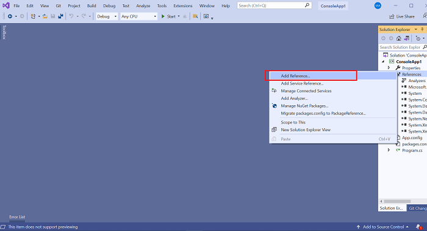
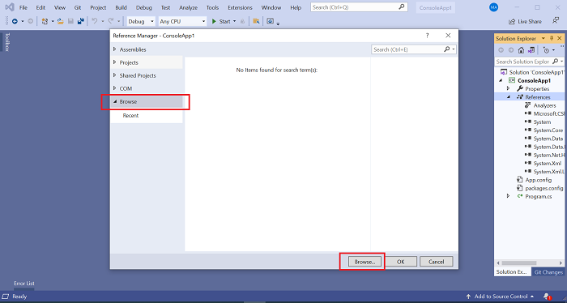
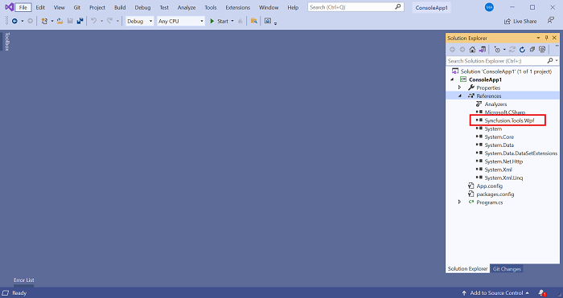

---
layout: post
title: Refer local assemblies in VS instead of private NuGet server | Syncfusion
description: Learn here about the Refer local assemblies in VS instead of private NuGet server.
platform: common
documentation: ug
--- 

# How to refer to the Local Assemblies in the Visual Studio Project Instead of Private NuGet Server

Refer to the following steps to add the assemblies to the project reference from the local location instead of configuring the private NuGet server and feed.

1.	Create a folder like **Dependent Assemblies** in the application root folder and place the required assemblies. Also move or commit the assemblies if you are compiling or running outside the machine like CI/CD.

2.	Open the application and select **Add References** by right-clicking References.

	 

3.	Select **Browse** from the **Browse tab**.

	 

4.	Browser assemblies in the Dependent Assemblies folder and add them to the project. 

5.	The selected assemblies will be added to the project reference.

	 
	 

6.	The assemblies are referred to the Dependent Assemblies folder. Replace the assemblies if they are modified. 
