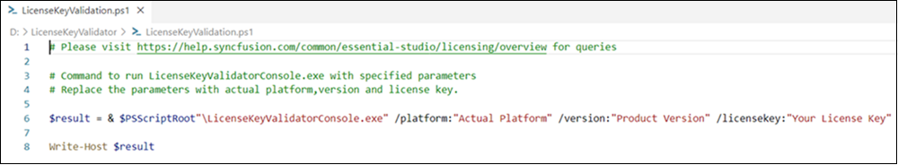
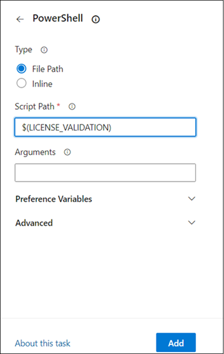

<style>
#license {
    font-size: .88em!important;
margin-top: 1.5em;     margin-bottom: 1.5em;
    background-color: #fbefca;
    padding: 10px 17px 14px
}
</style>


# Syncfusion license key validation in CI services

The following section shows how to validate syncfusion license key in CI services.

* Download and extract the LicenseKeyValidator.zip utility from the following link: [LicenseKeyValidator](https://s3.amazonaws.com/files2.syncfusion.com/Installs/LicenseKeyValidation/LicenseKeyValidator.zip).

* Open the LicenseKeyValidation.ps1 PowerShell script in a text\code editor.



* Update the parameters in the LicenseKeyValidation.ps1 script file as described below. 

  **Platform:** Modify the value for /platform: to the desired platform (e.g., "Windows Forms").
  
  **Version:**  Change the value for /version: to the required version (e.g., "25.2.3").
  
  **License Key:** Replace the value for /licensekey: with your actual license key (e.g., "Your License Key"). 
  
  N> This feature is supported only from the **16.2.X.X** version of the Essential Studio Desktop and Mobile platform.

## Azure Pipelines (YAML)

* Create a new [User-defined Variable](https://docs.microsoft.com/en-us/azure/devops/pipelines/process/variables?view=azure-devops&tabs=yaml%2Cbatch) named `LICENSE_VALIDATION`. Use the path of the LicenseKeyValidation.ps1 script file as a value (e.g., D:\LicenseKeyValidator\LicenseKeyValidation.ps1).

* Integrate the PowerShell task in pipeline and execute the script to validate the license key. 

The following example shows the syntax for Windows build agents.

```bash
pool:
  vmImage: 'windows-latest'

steps:

- task: PowerShell@2
  inputs:
    targetType: filePath
    filePath: $(LICENSE_VALIDATION) #Or the actual path to the script.
  
  displayName: Syncfusion License Validation 
```

## Azure Pipelines (Classic)

* Create a new [User-defined Variable](https://docs.microsoft.com/en-us/azure/devops/pipelines/process/variables?view=azure-devops&tabs=yaml%2Cbatch) named `LICENSE_VALIDATION`. Use the path of the LicenseKeyValidation.ps1 script file as a value (e.g., D:\LicenseKeyValidator\LicenseKeyValidation.ps1).

* Include the PowerShell task in pipeline and execute the script to validate the license key. 



## GitHub actions

* Create a [new Repository Secret](https://docs.github.com/en/actions/security-guides/encrypted-secrets#creating-encrypted-secrets-for-a-repository) or an [Organization Secret](https://docs.github.com/en/actions/security-guides/encrypted-secrets#creating-encrypted-secrets-for-an-organization). Set the name of the secret to `LICENSE_VALIDATION` and use the path of the LicenseKeyValidation.ps1 script file as a value (e.g., D:\LicenseKeyValidator\LicenseKeyValidation.ps1).

* Add a step in GitHub Actions to execute the LicenseKeyValidation.ps1 PowerShell script to validate the license key. 

```bash
  steps:
  - name: Syncfusion License Validation
    shell: pwsh
    run: |
	  ./path/LicenseKeyValidator/LicenseKeyValidation.ps1
```

## Jenkins

* Create a [Environment Variable](https://www.jenkins.io/doc/pipeline/tour/environment) named 'LICENSE_VALIDATION'. Use Use the path of the LicenseKeyValidation.ps1 script file as a value (e.g., D:\LicenseKeyValidator\LicenseKeyValidation.ps1).

* Include a stage in Jenkins to execute the LicenseKeyValidation.ps1 script in PowerShell. 

The following example shows the syntax for validating Syncfusion license key in Jenkins pipeline.

```bash
pipeline {
	agent any
	environment {
		LICENSE_VALIDATION = 'path\\to\\LicenseKeyValidator\\LicenseKeyValidation.ps1'
	}
	stages {
		stage('Syncfusion License Validation') {
			steps {
				sh 'pwsh ${LICENSE_VALIDATION}'
			}
		}
	}
}
```

## See also

* [Licensing FAQ](https://help.syncfusion.com/common/essential-studio/licensing/overview/)
