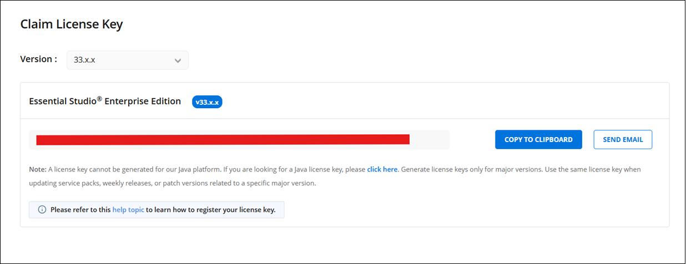
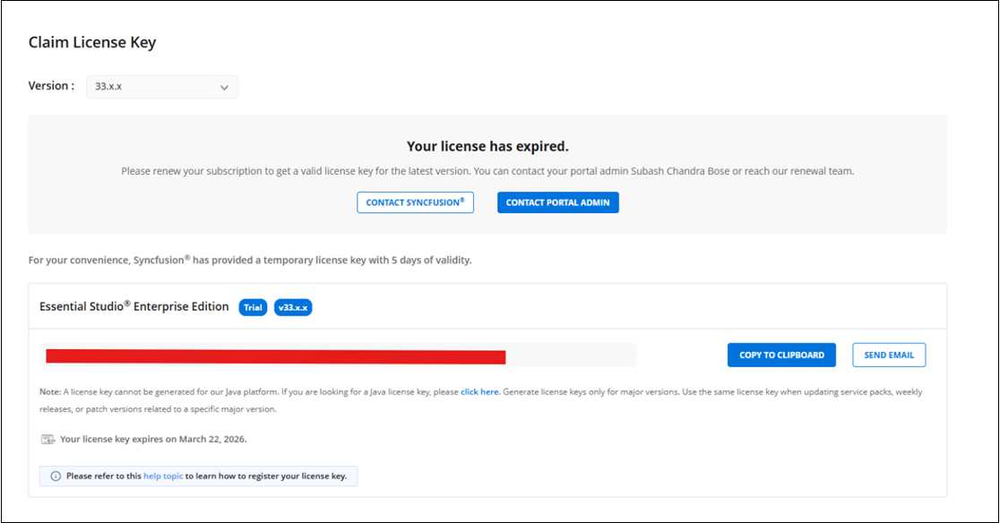
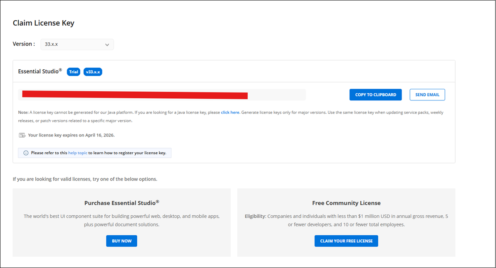
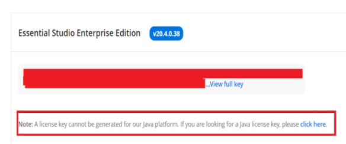
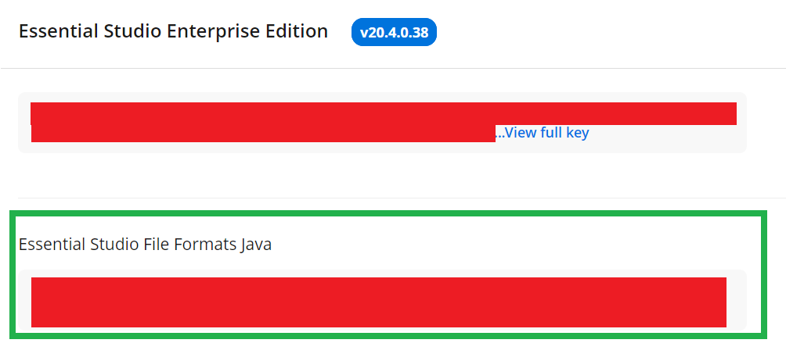

# Claim License key

Syncfusion License keys can be generated from the Claim License Key page based on the trial or valid license associated with your Syncfusion account.

You can get the license key, based on license availability in your Syncfusion account.

## Active license

If you have a Syncfusion account associated with valid license, license key will be generated from claim license key page.

## Active license

If you have a Syncfusion account associated with trial license, license key will be generated from claim license key page with expiry date.

## Expired license

If you have a Syncfusion account with an expired license, your license subscription must be renewed in order to obtain a valid license key for the latest Essential Studio version. Meanwhile, a temporary license key with a 5-day validity period will be generated.

## No Trial or No License or Expired trial

If the Syncfusion account is not associated with a trial, license, or expired trial, you can try to claim either a trial or a valid license from claim license page.

N> Java platform license key cannot be generated with other platforms. So if you need to get Java platform license key, check the additional action given in the note portion from license key section.

Once you click the click here action from note portion, Java platform license key will be generated.

